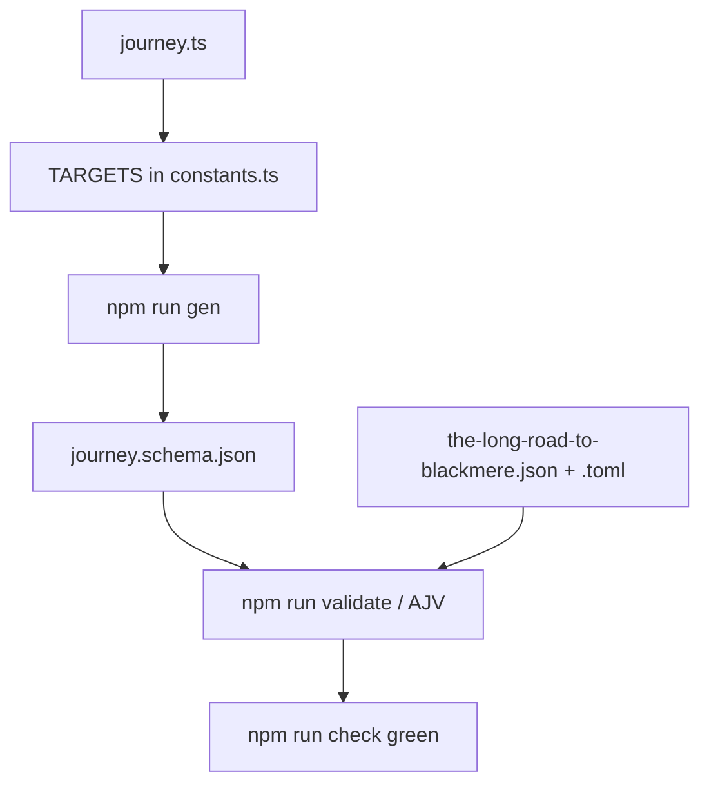

# Instruction: Ship the `journey` target

## Architecture projection

```txt
.
├── src/zod/
│   ├── constants.ts                              ✏️ import + TARGETS entry
│   └── legend-in-the-mist/
│       └── journey.ts                            ✅ Zod source, self-contained
├── schemas/legend-in-the-mist/
│   └── journey.schema.json                       ✅ generated, never hand-edited
└── examples/legend-in-the-mist/journey/
    ├── the-long-road-to-blackmere.json           ✅
    └── the-long-road-to-blackmere.toml           ✅
```

## User Journey



## Tasks to do

### `1)` Write `src/zod/legend-in-the-mist/journey.ts`

> One self-contained file. `challenge.ts` is the model here, not `story-theme.ts`: it is the only target that already nests a named subschema holding a non-empty consequence list.

1. Keep the four comment banners of the sibling files: Enums, Subschemas, Root schema, Exported TS types.
2. Declare `JourneyTypeEnum` as `z.enum(["landscape", "occasion", "undertaking"])` with a `.meta({ description, examples })`. No `.default()` on the enum declaration itself.
3. Redefine `PublicationTypeEnum` and `MetaSchema` locally, copied from `challenge.ts`, with the `description` texts reworded to say Journey. Keep `publication_type`'s `.default("homebrew")` exactly as copied — do not strip it.
4. Add `VignetteSchema`, modelled on `ThreatSchema` in `challenge.ts`:
   - `name`: `.string().trim().min(1, "Vignette name is required")` — required, bare.
   - `trigger`: `.string().trim().optional()`. Describe it as what brings the vignette into play. `ThreatSchema` has no `trigger`; the closest precedent is `SpecialFeatureSchema`, whose description carries the trigger as prose inside the text. It is the only field in this target with no sibling to copy, so the `description` text is the whole contract — phase 2 asks the issue author to confirm it. Note also that `ThreatSchema.description`, its structural counterpart, is *required* with a 100-character cap; `trigger` is optional and uncapped, per the issue's `trigger?`.
   - `consequences`: an array of trimmed non-empty strings with `.min(1, "At least one Consequence is required")` — **required and non-empty**, exactly as `ThreatSchema.consequences`.
5. Root `LegendInTheMistJourneySchema` fields, in this order: `name`, `type`, `description`, `tags`, `benefits`, `consequences`, `vignettes`, `meta`.
6. `name`: `.string().trim().min(1, "Journey name is required").default("Untitled Journey")` — matches `challenge.name` and `theme-kit.name`. This is not in tension with step 7: `Untitled Journey` is the only value the default could invent and it asserts nothing about the Journey, whereas defaulting `type` would pick arbitrarily among three values that each mean something, and would be wrong for the two thirds of Journeys that are not the value picked.
7. `type`: `JourneyTypeEnum` with **no** `.default()` and **no** `.optional()`. This is the plan's decision and it is deliberate: an enum in that state already lands in `required`, so a default would add nothing but a `"default"` key and a silently invented value on malformed input. Known and accepted consequence: `LegendInTheMistJourneySchema.parse({})` throws, where all four existing targets return their defaults. Do not "fix" that by adding a default.
8. `description`: `.string().trim().optional()` — one string, not an array. `benefits`: `.string().trim().optional()`.
9. `tags`: array of trimmed non-empty strings, `.optional()`, with a per-item `.meta()`. State in the item description that entries are written without braces, as `story-theme`'s tag fields do.
10. `consequences` (root): array of trimmed non-empty strings, `.optional()`. Its description must say these apply anywhere in the Journey, as opposed to a vignette's own list. Model the wording on `challenge.general_consequences`, which draws the same distinction against `threats[].consequences`. Two deliberate divergences from that model, neither of them to be aligned back: the field is named `consequences`, not `general_consequences`, because the issue's table says so — which puts the whole disambiguation burden on the two `description` strings, so write them to carry it; and the items are `.trim().min(1)` where `general_consequences` uses a bare `z.string()`, matching the stricter `ThreatSchema.consequences` instead.
11. `vignettes`: `z.array(VignetteSchema).optional()`.
12. `meta`: `MetaSchema.optional()`.
13. Every field and every array item carries `.meta({ description, examples })` where meaningful, as `CONTRIBUTING.md` requires.
14. Export the TS types at the bottom: `JourneyType`, `PublicationType`, `JourneyMeta`, `Vignette`, `LegendInTheMistJourney`.

### `2)` Register the target in `src/zod/constants.ts`

> Without this entry neither `gen` nor `validate` sees the schema.

1. Import `LegendInTheMistJourneySchema` next to the other three Legend in the Mist imports.
2. Append a `TARGETS` entry with `zod: LegendInTheMistJourneySchema`, `game: GAMES.litm`, `name: "journey"`, placed after the `theme-kit` entry and before the `danger` one, keeping the file's game grouping.
3. Change nothing else — `GAMES` and the `SchemaTarget` type stay as they are.

### `3)` Generate the JSON Schema

> Generated output only. Never hand-edit `schemas/`.

1. Run `npm run gen`. This repo uses npm, not pnpm. Under the Bash tool on this machine the binary resolves only as `npm.cmd`, and `rtk npm run` fails with `program not found`; call `npm.cmd run gen` there.
2. Confirm `schemas/legend-in-the-mist/journey.schema.json` appeared and that the other four schema files are unchanged. A `M` on a regenerated file whose `git diff` is empty is an index stat-cache artifact, not drift — settle it by comparing `git hash-object --path <f> <f>` with `git rev-parse HEAD:<f>`.
3. Confirm the generated root `required` is exactly `["name", "type"]`. Any extra entry means a root field carrying a `.default()` or missing its `.optional()` — both land in `required` under the output view. Fix the Zod source, never the JSON.
4. Confirm `vignettes.items.required` is exactly `["name", "consequences"]` and that `vignettes.items.properties.consequences.minItems` is `1`.
5. Confirm `type` carries **no** `"default"` key in the generated JSON. Its presence would mean a `.default()` slipped in.

### `4)` Write the example, in both formats

> One Journey, two encodings, exercising every field including two vignettes.

1. Create `examples/legend-in-the-mist/journey/` — flat, no subdirectory: `listExampleFiles` in `tools/validate-examples.ts` reads one level and filters on `isFile()`, so a nested file is silently never validated.
2. Write `the-long-road-to-blackmere.json` and `the-long-road-to-blackmere.toml` holding the same Journey. The name is illustrative, not published material — `publication_type` says `homebrew` for that reason.
3. Do **not** put a `"$schema"` key in the JSON example. `README.md` shows one, but the generated schemas carry `"additionalProperties": false` at the root, so that key fails validation. The eight existing examples all omit it; follow them, not the README.
4. In the TOML file, `vignettes` is an array of tables, written as repeated `[[vignettes]]` blocks with `consequences` as an inline array inside each. `examples/legend-in-the-mist/challenge/lantern-warden-of-the-wilds.toml` already encodes `[[threats]]` that way and validates — copy that layout.
5. TOML binds every key/value pair to the most recent table header, so the order is forced: all root scalars and root arrays first, then the `[[vignettes]]` blocks, then `[meta]` last. A scalar written after a header silently lands in the wrong table.
6. Populate every field, `type` included, plus `meta` with `publication_type` set to `homebrew` and an `authors` list.
7. Give `vignettes` **at least two entries**, one carrying a `trigger` and one without, each with at least one consequence. Give the root `consequences` at least one entry, so the example shows both consequence levels side by side — that distinction is the one a reader is most likely to get wrong.

### `5)` Verify

1. Run `npm run check` (`npm.cmd run check` under the Bash tool on this machine).
2. Both new example files must appear with a `✓`, and the eight pre-existing ones must still pass.
3. Confirm the TOML example parses to the same object as the JSON one, `meta` and both vignettes included.
4. Re-run `npm run gen` and confirm `git diff HEAD -- schemas/` is empty — generation must be idempotent.
5. Do not touch `README.md`: it describes directories, not individual targets. Do not touch `CONTRIBUTING.md` or `CHANGELOG.md` either — the changelog is written at release time, not here.
6. Commit the phase per the implement step's convention. Do not push, and do not open a pull request.

## Test acceptance criteria

| Task | Acceptance criteria |
| ---- | ------------------- |
| 1 | `journey.ts` exports a `z.object` root; every root field and array item carries a `description` and, where meaningful, `examples`; `name` is the only *root* field with a `.default()`, and `MetaSchema.publication_type` still carries its own. |
| 1 | `LegendInTheMistJourneySchema.safeParse({})` fails on a missing `type`, and the failure is the intended behaviour, not a defect to patch. |
| 1 | A vignette cannot exist without a name and at least one consequence, while a Journey with no vignette at all is valid. |
| 2 | `TARGETS` holds five entries and `gen` reports five written schema files. |
| 3 | `schemas/legend-in-the-mist/journey.schema.json` exists, is draft-7, its root `required` is exactly `["name", "type"]`, and its `type` property carries an `enum` of the three values but no `default`. |
| 3 | `vignettes.items` requires `name` and `consequences`, and its `consequences` rejects an empty array. |
| 4 | `examples/legend-in-the-mist/journey/` holds one `.json` and one `.toml` describing the same Journey, each with two or more vignettes — one with a `trigger`, one without — and a non-empty root `consequences`. Parsing the TOML yields the same object as the JSON, and neither file carries a `$schema` key. |
| 5 | `npm run check` exits 0 with 10 files validated, and a second `npm run gen` leaves `schemas/` unchanged. |
