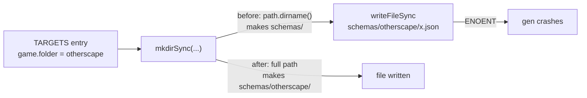

# Phase 1 — Make `npm run gen` able to create a new game directory

Measured, not suspected: `tools/gen-schemas.ts:8` calls

```ts
fs.mkdirSync(path.dirname(`schemas/${t.game.folder}`), { recursive: true });
```

and `path.dirname("schemas/otherscape")` returns `"schemas"`. The game subdirectory is therefore **never** created, and the `writeFileSync` two lines below fails with ENOENT. The bug has been invisible because `schemas/legend-in-the-mist/` and `schemas/city-of-mist/` are already tracked by git — `ls schemas/` lists exactly those two. The first :Otherscape target hits it on its first `npm run gen`, so this phase comes before any target, not after.

It is its own phase, and its own commit, for a second reason: this is a defect in the upstream tool, not in anything :Otherscape adds. A standalone commit touching one line of `tools/` can be cherry-picked into a pull request against `4rtamis/schema-in-the-mist`; the same fix buried in the commit that adds `otherscape/challenge` cannot.

## Architecture projection

```
tools/
├── gen-schemas.ts                        ✏️  one call fixed, one import dropped
├── validate-examples.ts                  ✅  untouched
└── toml2json.ts                          ✅  untouched
src/                                      ✅  untouched
schemas/                                  ✅  untouched, byte for byte
examples/                                 ✅  untouched
```

## Dataflow



## Tasks to do

1. **Replace the call with `fs.mkdirSync(\`schemas/${t.game.folder}\`, { recursive: true })`.** `recursive: true` already covers creating `schemas/` itself, so nothing is lost by dropping the `path.dirname` wrapper — it was the wrapper that did the damage.

2. **Remove the now-unused `node:path` import.** It is the only use of `path` in the file, and leaving a dead import invites someone to reintroduce the same call.

3. **Prove the fix against a directory that does not exist,** rather than against the two that do. The honest test is a temporary target pointed at `GAMES.otherscape`, run once, then reverted — or simply deferring the proof to phase 2, whose criterion 1 cannot pass unless this phase worked. Prefer the deferral: it needs no throwaway code.

4. **Do not touch `validate-examples.ts` in this phase,** even though it has two silent-skip paths of its own (`⚠️  Missing schema for target` at line 49, `⚠️  No example files found` at line 60). Those are handled by making every later phase assert that no `⚠️` line is printed, which needs no code change and keeps this commit to the single line a pull request would carry.

## Test acceptance criteria

| # | Criterion | How it is observed |
| - | --------- | ------------------ |
| 1 | The defect is gone | `grep -n "path.dirname\|node:path" tools/gen-schemas.ts` returns nothing: the truncating call is replaced and the now-unused import is removed |
| 2 | Nothing regenerated changed | `npm run gen` rewrites the five existing schemas and `git diff` is empty. On Windows a stat-cache `M` with an empty diff is not drift; settle it with `git hash-object --path <f> <f>` against `git rev-parse HEAD:<f>` |
| 3 | The chain still passes | `npm run check` exits 0, prints ten `✓` lines and no `⚠️` line |
| 4 | The commit is cherry-pickable | The commit touches `tools/gen-schemas.ts` and nothing else |
