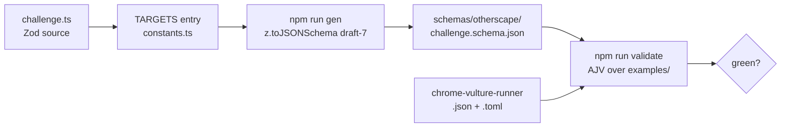

# Phase 2 — Ship the `challenge` target

The first :Otherscape target, and the one that answers the question the rest of the plan assumes: can an :Otherscape record reuse the Legend in the Mist sub-schema shapes, or does the Mist Engine diverge enough that each game needs its own? A Challenge Profile is where the two games have the most vocabulary in common and the most measured differences, so it is the honest test. It also creates `schemas/otherscape/` and `examples/otherscape/`, which no target has ever caused to exist.

## Architecture projection

```
src/zod/
├── constants.ts                          ✏️  import + a sixth TARGETS entry
├── legend-in-the-mist/                   ✅  untouched
├── city-of-mist/                         ✅  untouched
└── otherscape/                           ❌  new directory
    └── challenge.ts                      ❌  new
schemas/otherscape/
└── challenge.schema.json                 ❌  generated, committed
examples/otherscape/challenge/
├── chrome-vulture-runner.json            ❌  new
└── chrome-vulture-runner.toml            ❌  new
```

## Dataflow



## Tasks to do

1. **Create `src/zod/otherscape/challenge.ts`** with, at the root: `name`, `description`, `scale`, `tags_and_statuses`, `limits`, `specials`, `threats`, `general_consequences`, `meta`. `tags_and_statuses` keeps the Legend in the Mist spelling exactly, because it holds the same thing — the tags and statuses the Challenge owns by default — and an identical spelling is what lets a value be copied between the two games without a mapping table. `name` takes `.default("Untitled Challenge")`: an untitled placeholder asserts nothing about the Challenge, which is the criterion this repo already applies to `journey.name`.

2. **Give the root no `rating`, no `mights` and no `roles`.** The first two exist on `litm/challenge` and neither exists in :Otherscape — "rating" appears twice in the whole Metro Core Book and never as a statistic. `roles` is dropped for a softer reason, recorded here rather than left silent: the creation walkthrough opens on the Challenge's role in the scene, but no published profile prints a role slot, so it is guidance to the author rather than a field on the fiche. `LimitSchema.is_immune`, also on `litm/challenge`, goes the same way: immunity is not a Limit property in :Otherscape. A field no producer can fill is worse than a missing one — it invites a consumer to branch on it.

3. **Add `scale` as an optional integer.** Scale is printed as a property of an entity, not only as an effect applied in play. Optional rather than defaulted to `0`, because a published profile omits the line entirely unless the Challenge is bigger than a person, and `0` is what absent already means.

4. **Write `LimitSchema` with `name`, `level`, `is_polar`, `is_progress` and `on_max`.** `is_progress` and `on_max` carry the progress Limit, whose Special fires when the track fills — the same pair `litm/challenge` already uses. `is_polar` is the new one: a polar Limit is printed as a single label with both poles joined by a slash, `catch/outrun:3`, so `name` holds the printed string and the boolean says how to read it. Two pole sub-fields would nest a shape the books print flat, and flat is what survives the TOML encoding and the editor autocomplete intact.

5. **Write `ThreatSchema` with `name`, `description` and an *optional* `consequences`.** This is a deliberate divergence from `litm/challenge`, where the list is `.min(1)`: :Otherscape prints paired Threats *and* standalone Threats, and a standalone Threat has no consequence list of its own to require. Record the divergence in the field description so the next reader does not "harmonise" it away.

6. **Name the root-level list `general_consequences`.** `litm/challenge` already renamed it for exactly this reason — to stop it colliding with `threats[].consequences` — and the same collision exists here. `litm/journey` went the other way and kept both lists named `consequences`; that divergence is documented and does not extend to Challenges.

7. **Write `SpecialSchema` with `name` and `description`,** and name the root field `specials`. The books say "Specials", not "special features"; the Legend in the Mist field is `special_features`, so this one does not copy across, and its description should say so.

8. **Register the target in `src/zod/constants.ts`,** importing `OtherscapeChallengeSchema` and appending `{ zod: ..., game: GAMES.otherscape, name: "challenge" }`. `GAMES.otherscape` is already declared, so no games entry is added. Append rather than insert, to keep the existing five entries and the generated file order stable.

9. **Write the example pair** `examples/otherscape/challenge/chrome-vulture-runner.{json,toml}`, invented rather than transcribed, with `publication_type: "homebrew"`. It must exercise a polar Limit, a progress Limit with its `on_max`, a paired Threat, a standalone Threat with no consequences, and at least one root-level `general_consequences` entry — otherwise the phase ships branches no example has ever validated. Both files sit directly in the target directory: `listExampleFiles` reads one level and silently ignores anything nested. Neither file carries a `$schema` key, which the root `additionalProperties: false` rejects.

10. **Write the TOML twin in the order the format forces:** root scalars and arrays first, then the `[[limits]]`, `[[specials]]` and `[[threats]]` blocks, then `[meta]` last. A root scalar written after a table header is silently absorbed into that table — no parse error, just a file that no longer matches its JSON twin.

11. **Run `npm run check` and read the validate output line by line.** A green exit is not the assertion; see the criteria below.

## Test acceptance criteria

| # | Criterion | How it is observed |
| - | --------- | ------------------ |
| 1 | The generated schema exists and is committed | `schemas/otherscape/challenge.schema.json` is present and `git status` shows it as a new file |
| 2 | Both example files are actually validated, not skipped | The `validate` output prints a `✓` line naming `chrome-vulture-runner.json` **and** one naming `chrome-vulture-runner.toml`. This is the real check: a target with zero examples only emits a `⚠️  No example files found` warning and `continue`s, so `npm run check` exits green either way. Counting the `✓` lines, they rise from 10 to 12. |
| 3 | The whole chain passes | `npm run check` exits 0 with no `✗` line |
| 4 | The five existing schemas are byte-identical | After `npm run gen`, `git diff --stat` reports no change under `schemas/legend-in-the-mist/` or `schemas/city-of-mist/`. On Windows a stat-cache `M` with an empty diff is not drift; settle it with `git hash-object --path <f> <f>` against `git rev-parse HEAD:<f>` |
| 5 | Every field carries documentation | No property in the generated schema lacks a `description`, as `CONTRIBUTING.md` requires |
| 6 | The example exercises every branch | The JSON example contains a limit with `is_polar: true`, a limit with `is_progress: true` and an `on_max`, a threat with a non-empty `consequences`, a threat without one, and a non-empty `general_consequences` |
| 7 | The JSON and TOML twins agree | `npm run toml:one -- <toml> <tmp.json>` yields an object equal to the JSON example |
| 8 | No target was silently skipped | The `validate` output contains no `⚠️` line. There are two such paths — `Missing schema for target` at `validate-examples.ts:49` and `No example files found` at line 60 — and either one lets `npm run check` exit green while this phase's target is never exercised |
