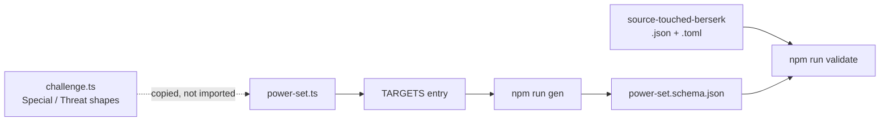

# Phase 3 — Ship the `power-set` target

A Power Set is a Challenge fragment that the books publish standalone and graft onto any Challenge: Metro prints them under Self, Mythos and Noise headings, and Cairo alone publishes twelve. It is the smallest target in the plan, and it exists to prove that phase 2's sub-schemas were shaped well enough to be reused rather than re-derived. If `SpecialSchema` and `ThreatSchema` cannot be lifted into this file unchanged, phase 2 got them wrong, and that is worth knowing after one target rather than five.

## Architecture projection

```
src/zod/
├── constants.ts                          ✏️  import + a seventh TARGETS entry
└── otherscape/
    ├── challenge.ts                      ✅  untouched, read for its shapes
    └── power-set.ts                      ❌  new
schemas/otherscape/
└── power-set.schema.json                 ❌  generated, committed
examples/otherscape/power-set/
├── source-touched-berserk.json           ❌  new
└── source-touched-berserk.toml           ❌  new
```

## Dataflow



## Tasks to do

1. **Create `src/zod/otherscape/power-set.ts`** with a root of `name`, `type`, `description`, `specials`, `threats`, `general_consequences` and `meta`. That is a Challenge minus its Limits, its Scale and its base tags, which is exactly what the books print, because a Power Set attaches to a Challenge that already has those.

2. **Make `type` a required enum of `self`, `mythos`, `noise`.** The three headings are how the books file Power Sets, and every published one sits under exactly one. No default: none of the three is a neutral starting value, so inventing one would assert something false about two thirds of the entries. This is the rule `litm/journey.type` already established in this repo.

3. **Copy `SpecialSchema` and `ThreatSchema` from phase 2 rather than importing them.** Every existing target here is self-contained: five files, five private `MetaSchema` definitions. Cross-file sub-schema sharing is a repo-wide refactor already deferred on issue #2, and doing it here would turn a new target into an architecture change. The cost of copying is drift between the two files later; it is recorded here rather than discovered.

4. **Include `general_consequences` for the same reason as phase 2:** standalone Consequences are printed on Power Sets too, and the name still has to survive next to `threats[].consequences`.

5. **Do not add `scale` or `limits`.** A Power Set has no size of its own and imposes no Limits; both belong to the Challenge it is grafted onto. Adding them for symmetry would let a producer write a Scale that no rule ever reads.

6. **Register the target and write the example pair** `examples/otherscape/power-set/source-touched-berserk.{json,toml}`, invented rather than transcribed, `publication_type: "homebrew"`, exercising a bare tag-style Special, a named Special with a description, and a Threat with its consequences.

## Test acceptance criteria

| # | Criterion | How it is observed |
| - | --------- | ------------------ |
| 1 | The generated schema exists and is committed | `schemas/otherscape/power-set.schema.json` is present |
| 2 | Both examples are validated, not skipped | The `validate` output names `source-touched-berserk.json` and `.toml` with a `✓`; the total `✓` count rises from 12 to 14 |
| 3 | `type` is genuinely required | Removing `type` from the JSON example makes `npm run validate` fail with an AJV `required` error, then it is restored |
| 4 | The whole chain passes | `npm run check` exits 0 with no `✗` line |
| 5 | Phase 2 stayed untouched | `git diff` reports no change to `src/zod/otherscape/challenge.ts` or `schemas/otherscape/challenge.schema.json` |
| 6 | The JSON and TOML twins agree | `npm run toml:one -- <toml> <tmp.json>` yields an object equal to the JSON example |
| 7 | No target was silently skipped | The `validate` output contains no `⚠️` line. There are two such paths — `Missing schema for target` at `validate-examples.ts:49` and `No example files found` at line 60 — and either one lets `npm run check` exit green while this phase's target is never exercised |
