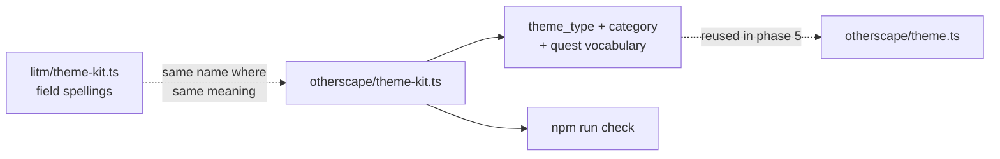

# Phase 4 — Ship the `theme-kit` target

The books print a theme kit as a `THEMEBOOK THEMETYPE` header — "AFFILIATION SELF", "ARTIFACT MYTHOS" — then ten power tags, four weakness tags, and one line labelled Identity, Ritual or Itch depending on the type. This phase settles the vocabulary phase 5 then reuses, so the expensive decisions are all here; phase 5 adds only two tracks on top.

## Architecture projection

```
src/zod/
├── constants.ts                          ✏️  import + an eighth TARGETS entry
├── legend-in-the-mist/theme-kit.ts       ✅  untouched, read for field spellings
└── otherscape/
    └── theme-kit.ts                      ❌  new
schemas/otherscape/
└── theme-kit.schema.json                 ❌  generated, committed
examples/otherscape/theme-kit/
├── back-alley-ripperdoc.json             ❌  new
└── back-alley-ripperdoc.toml             ❌  new
```

## Dataflow



## Tasks to do

1. **Create `src/zod/otherscape/theme-kit.ts`** with a root of `title_tag`, `theme_type`, `category`, `power_tags`, `weakness_tags`, `quest` and `meta`. There is deliberately **no** `name` field; task 4 says why.

2. **Make `theme_type` a required enum of `self`, `mythos`, `noise`, `crew`,** with no default. The three character types plus `crew`, because Crew Theme Kits are printed with the identical anatomy — power tags, weakness tags, an Identity — and a second target for the same shape would split the catalog for nothing. No default, for the same reason as `power-set.type`: none of the four is a neutral start.

3. **Keep `category` a free string, holding the themebook name.** Not an enum. `litm/theme-kit` and `litm/story-theme` both made this call explicitly, so that homebrew themebooks stay expressible, and both note that the identical spelling lets the value copy across between targets unchanged. Every :Otherscape setting book adds themebooks, so a closed set would be stale on the day it shipped.

4. **Add `title_tag` as its own field, separate from `power_tags`, and give the kit no `name`.** The printed block is a `THEMEBOOK THEMETYPE` header, then the first power tag alone on its line: `AFFILIATION SELF` / `CORPORATE CITIZENSHIP`. Two kits share the header `AFFILIATION SELF` and are told apart only by that first tag, so the title tag **is** the kit's name — there is no second, separate name to record. A `name` beside `title_tag` would be two fields always holding the same string with no rule saying which wins. This is where :Otherscape and Legend in the Mist diverge in spelling for the same idea: `litm/theme-kit` calls the slot `name` and maps it onto `story-theme.title_tag`; here both ends are called `title_tag`, so kit and theme line up without a mapping. The description must add that the title tag is not repeated inside `power_tags`, which therefore holds the nine others.

5. **Write `quest` as a single optional string,** with a description naming all three labels: Identity for a Self theme, Ritual for a Mythos theme, Itch for a Noise theme. Not three mutually exclusive fields, and not a union: the README announces editor autocomplete over JSON and TOML, and a root-level `oneOf` is what editor schema support handles least evenly. The cost is stated plainly in the description — the field name does not say which of the three it holds, so a consumer reads `theme_type`. `quest` is also the spelling `litm/theme-kit` uses for the same slot, which preserves the copy-across property.

6. **Add no `improvements`, no `level`, no `upgrade`, no `decay`.** `improvements` has no counterpart, because Theme Specials are printed on the **themebook**, not on the kit — verified on the Affiliation themebook — and `themebook` is out of scope. `level` has none, because :Otherscape has no theme tiers, which is also why `litm/theme-kit` has no `level`. `upgrade` and `decay` carry the state of a played theme, which a blank kit does not have; they arrive in phase 5.

7. **Register the target and write the example pair** `examples/otherscape/theme-kit/back-alley-ripperdoc.{json,toml}`, invented, `publication_type: "homebrew"`: a Self kit with a `category`, a `title_tag`, nine further power tags, four weakness tags, and an Identity-flavoured `quest`.

## Test acceptance criteria

| # | Criterion | How it is observed |
| - | --------- | ------------------ |
| 1 | The generated schema exists and is committed | `schemas/otherscape/theme-kit.schema.json` is present |
| 2 | Both examples are validated, not skipped | The `validate` output names `back-alley-ripperdoc.json` and `.toml` with a `✓`; the total `✓` count rises from 14 to 16 |
| 3 | `category` accepts an invented themebook | The example's `category` names a themebook the books do not publish, and validation still passes — the free string is doing its job |
| 4 | `theme_type` accepts `crew` | Setting the example's `theme_type` to `crew` validates, then it is restored |
| 5 | No union at the root | The generated schema contains no `oneOf`, `anyOf` or `allOf` at its top level |
| 6 | The whole chain passes | `npm run check` exits 0 with no `✗` line |
| 7 | The JSON and TOML twins agree | `npm run toml:one -- <toml> <tmp.json>` yields an object equal to the JSON example |
| 8 | No target was silently skipped | The `validate` output contains no `⚠️` line. There are two such paths — `Missing schema for target` at `validate-examples.ts:49` and `No example files found` at line 60 — and either one lets `npm run check` exit green while this phase's target is never exercised |
