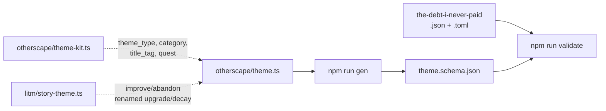

# Phase 5 — Ship the `theme` target

Phase 4 modelled the blank kit; this one models the theme a character actually plays, which is the kit after creation — the title tag gained, two power tags chosen out of the nine, one weakness tag chosen out of the four, the Identity/Ritual/Itch taken as written — plus the two three-box tracks the sheet prints beside it. It is the exact counterpart of `litm/story-theme`, which describes itself as "one of the themes a Hero is built from", and the two schemas should read as siblings.

## Architecture projection

```
src/zod/
├── constants.ts                          ✏️  import + a ninth TARGETS entry
├── legend-in-the-mist/story-theme.ts     ✅  untouched, read as the sibling
└── otherscape/
    ├── theme-kit.ts                      ✅  untouched, read for the vocabulary
    └── theme.ts                          ❌  new
schemas/otherscape/
└── theme.schema.json                     ❌  generated, committed
examples/otherscape/theme/
├── the-debt-i-never-paid.json            ❌  new
└── the-debt-i-never-paid.toml            ❌  new
```

## Dataflow



## Tasks to do

1. **Name the target `theme`, not `story-theme`.** `litm/story-theme` holds the same object, but "Story Theme" is Legend in the Mist vocabulary and :Otherscape says "theme" throughout its three books. The folders already namespace the two, so each game keeps its own word and neither has to adopt the other's.

2. **Create `src/zod/otherscape/theme.ts`** with a root of `title_tag`, `theme_type`, `category`, `power_tags`, `weakness_tags`, `quest`, `upgrade`, `decay` and `meta`. `title_tag` leads, as it does on `litm/story-theme`, because it is what the sheet writes at the top of the card.

3. **Reuse phase 4's `theme_type` enum values and its free-string `category` verbatim,** including the four values with `crew`. The reasoning is settled in phase 4 and is not reopened here; what matters is that a kit and the theme built from it agree field for field, so a tool can turn one into the other without a mapping table.

4. **Name the two tracks `upgrade` and `decay`, as non-negative integers capped at 3.** The books print Upgrade and Decay as three-box tracks: three Upgrade boxes reset the track and grant an upgrade, three Decay boxes replace the theme. They count what `litm/story-theme` calls `improve` and `abandon`, but keeping that spelling would make the field name say something the :Otherscape sheet never says. The cap is 3 because the fourth box does not exist — the track resets instead.

5. **Add no `level` and no `milestone`.** :Otherscape has no theme tiers: nothing corresponds to origin, adventure or greatness, and there is no milestone track anywhere in the three books. `litm/story-theme` has both; this is the sharpest measured divergence between the two games' theme sheets, and the root description should say so, so that the absence reads as a finding rather than an oversight.

6. **Register the target and write the example pair** `examples/otherscape/theme/the-debt-i-never-paid.{json,toml}`, invented, `publication_type: "homebrew"`: a played Self theme carrying a `title_tag`, two power tags, one weakness tag, a `quest`, and non-zero values on both tracks so neither is left untested at its default.

## Test acceptance criteria

| # | Criterion | How it is observed |
| - | --------- | ------------------ |
| 1 | The generated schema exists and is committed | `schemas/otherscape/theme.schema.json` is present |
| 2 | Both examples are validated, not skipped | The `validate` output names `the-debt-i-never-paid.json` and `.toml` with a `✓`; the total `✓` count rises from 16 to 18 |
| 3 | The tracks are bounded | Setting `upgrade` to `4` in the JSON example makes `npm run validate` fail on a `maximum` error, then it is restored |
| 4 | Kit and theme agree | `theme_type`, `category`, `title_tag`, `power_tags`, `weakness_tags` and `quest` have identical names and identical types in `schemas/otherscape/theme-kit.schema.json` and `schemas/otherscape/theme.schema.json` |
| 5 | No `level`, no `milestone` | Neither key appears anywhere in the generated schema |
| 6 | The whole chain passes | `npm run check` exits 0 with no `✗` line |
| 7 | The JSON and TOML twins agree | `npm run toml:one -- <toml> <tmp.json>` yields an object equal to the JSON example |
| 8 | No target was silently skipped | The `validate` output contains no `⚠️` line. There are two such paths — `Missing schema for target` at `validate-examples.ts:49` and `No example files found` at line 60 — and either one lets `npm run check` exit green while this phase's target is never exercised |
