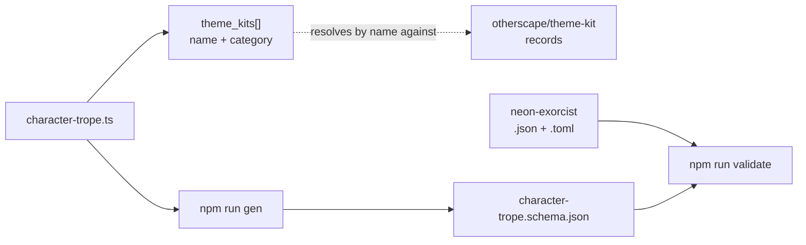

# Phase 6 — Ship the `character-trope` target

A Character Trope is the first step of character creation: the books print a category heading, the trope name, a prose description, three theme kits each named with its themebook in parentheses, three "choose one" options, and a starting `Loadout:` line. It has no counterpart in Legend in the Mist, so nothing here copies across — this is the phase with the most invention and therefore the one whose field names deserve the most caution.

## Architecture projection

```
src/zod/
├── constants.ts                          ✏️  import + a tenth TARGETS entry
└── otherscape/
    ├── theme-kit.ts                      ✅  untouched, read for the reference shape
    └── character-trope.ts                ❌  new
schemas/otherscape/
└── character-trope.schema.json           ❌  generated, committed
examples/otherscape/character-trope/
├── neon-exorcist.json                    ❌  new
└── neon-exorcist.toml                    ❌  new
```

## Dataflow



## Tasks to do

1. **Create `src/zod/otherscape/character-trope.ts`** with a root of `name`, `category`, `description`, `theme_kits`, `choices`, `loadout` and `meta`.

2. **Beware the `category` collision.** On a theme kit, `category` holds the themebook. On a trope, the printed heading is a grouping of tropes — "ASSASSINS & SPIES" — which is a different thing entirely. Keep the name `category`, because it is the trope's own category and the word is right, but say in the description that it does not hold a themebook and does not resolve against `theme-kit.category`. This repo has already been bitten by two near-homonyms with unrelated meanings, `theme-kit.improvements` against `story-theme.improve`; naming the trap in the schema is what stops the third.

3. **Make `theme_kits` an array of `{ title_tag, category }` objects, not an array of strings.** Measured on the printed tropes: `Chipped Weapon Mastery (AUGMENTATION)`, `Corporate Citizenship (AFFILIATION)`. The unparenthesised half is the kit's title tag — the same string phase 4 stores as `title_tag` — and the parenthesised half is its themebook. Both are needed, because the same title tag can appear under more than one themebook across settings. The two field names are `title_tag` and `category` precisely so the pair is a lookup key into `otherscape/theme-kit` rather than a fresh vocabulary; do not call the first one `name`, since the kit has no such field.

4. **Make `choices` an array of the same `{ title_tag, category }` shape, not an array of strings.** The `Choose One:` block is printed in the identical form to the imposed kits — `Corporate Citizenship (AFFILIATION)`, `Invisibility Helm (ARTIFACT)`, `Zeroed Identity (CYBERSPACE)` — so it is three more kit references, not prose. Reading them as free strings would throw away the structured half of a datum that has one, and would leave a consumer parsing parentheses to find the themebook.

5. **Make `loadout` an array of plain strings, transcribed as printed.** The starting `Loadout:` line names items with their qualifiers inline — `sniper rifle (requires setup) with AR sight`, and group-wide riders such as `concealed pistol (all: incriminating)`. Keep the parentheticals inside the string rather than splitting them out: the line is prose about gear, not a list of catalog keys. Say in the description that these strings do **not** resolve against `otherscape/loadout-item`. A full item record is the subject of phase 7, and keeping the two unlinked is what lets this phase ship without waiting on it.

6. **Register the target and write the example pair** `examples/otherscape/character-trope/neon-exorcist.{json,toml}`, invented, `publication_type: "homebrew"`: a trope with a category, three theme kits each carrying its themebook, three choices, and a short loadout. In the TOML twin, `[[theme_kits]]` is a table-array block and `[meta]` still comes last.

## Test acceptance criteria

| # | Criterion | How it is observed |
| - | --------- | ------------------ |
| 1 | The generated schema exists and is committed | `schemas/otherscape/character-trope.schema.json` is present |
| 2 | Both examples are validated, not skipped | The `validate` output names `neon-exorcist.json` and `.toml` with a `✓`; the total `✓` count rises from 18 to 20 |
| 3 | The `category` trap is documented | The generated schema's `category` description says explicitly that it is not a themebook |
| 4 | Kit references resolve as a pair | Every entry of `theme_kits` **and** of `choices` carries both `title_tag` and `category`, and both keys are spelled exactly as they are on `otherscape/theme-kit` |
| 5 | The whole chain passes | `npm run check` exits 0 with no `✗` line |
| 6 | The JSON and TOML twins agree | `npm run toml:one -- <toml> <tmp.json>` yields an object equal to the JSON example |
| 7 | No target was silently skipped | The `validate` output contains no `⚠️` line. There are two such paths — `Missing schema for target` at `validate-examples.ts:49` and `No example files found` at line 60 — and either one lets `npm run check` exit green while this phase's target is never exercised |
