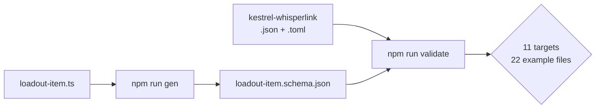

# Phase 7 — Ship the `loadout-item` target

The Street Catalog files gear under thirteen rubrics — Access & Perks, Ammo, Armor, Cybernetics, Drones, Source-Touched Items, Vehicles, Weapons and the rest — and prints two shapes under each. A **specific item** is a record: a name, a description, three or four feature tags of which the first is the item's own name, and one weakness tag. A **general items** block is three lists of suggestion words attached to the rubric. Only the first is a fiche, and only the first is modelled here.

## Architecture projection

```
src/zod/
├── constants.ts                          ✏️  import + an eleventh TARGETS entry
└── otherscape/
    └── loadout-item.ts                   ❌  new
schemas/otherscape/
└── loadout-item.schema.json              ❌  generated, committed
examples/otherscape/loadout-item/
├── kestrel-whisperlink.json              ❌  new
└── kestrel-whisperlink.toml              ❌  new
```

## Dataflow



## Tasks to do

1. **Create `src/zod/otherscape/loadout-item.ts`** with a root of `name`, `category`, `description`, `feature_tags`, `weakness_tag` and `meta`.

2. **Keep `category` a free string, holding the Street Catalog rubric.** The thirteen rubrics look closed enough to enum, and that is exactly the trap: each setting book prints its own catalog under its own headings, and Cairo's are not Metro's. The house rule already applied to `theme-kit.category` covers this for the same reason, and it keeps homebrew rubrics expressible.

3. **Make `weakness_tag` a single optional string, not an array.** The books print one weakness tag per specific item. A one-element array would invite producers to write two and consumers to handle a case the rules do not have. Optional rather than required, because a few catalog entries print none.

4. **Make `feature_tags` an array of strings and say in its description that the first is the item's own name,** which is how the catalog prints it — the same convention as a theme kit's title tag. Unlike the theme kit, do **not** split it into its own field: on a kit the title tag is a distinct game object that a played theme carries separately, whereas here it is only a naming convention inside the list, and lifting it out would create a field with nothing on the other side to receive it.

5. **Model only specific items; leave the general-items blocks out.** A general-items block is three lists of suggestion words hanging off a rubric — a lookup table, not a record — and it serves none of the three uses the README announces. If it is ever wanted, it is its own target with its own design discussion, per `CONTRIBUTING.md` step 2.

6. **Register the target and write the example pair** `examples/otherscape/loadout-item/kestrel-whisperlink.{json,toml}`, invented, `publication_type: "homebrew"`: a Weapons-rubric item with four feature tags whose first is the item's name, and one weakness tag.

7. **Close the plan out.** With this target registered, `TARGETS` holds eleven entries across three games (the five it started with plus six), `schemas/otherscape/` holds six files, and `examples/otherscape/` holds six directories of two files each. Confirm those three counts explicitly rather than trusting a green exit code.

## Test acceptance criteria

| # | Criterion | How it is observed |
| - | --------- | ------------------ |
| 1 | The generated schema exists and is committed | `schemas/otherscape/loadout-item.schema.json` is present |
| 2 | Both examples are validated, not skipped | The `validate` output names `kestrel-whisperlink.json` and `.toml` with a `✓`; the total `✓` count rises from 20 to 22 |
| 3 | `weakness_tag` is a string | The generated schema types it as `"type": "string"`, not as an array |
| 4 | The six targets are all registered | `TARGETS` has eleven entries; `ls schemas/otherscape/` lists six files; `ls examples/otherscape/` lists six directories, each holding exactly two files |
| 5 | The five pre-existing schemas never changed | `git diff c83717f --stat` — the release commit this plan starts from, pinned rather than counted backwards, so an extra commit cannot shift the base — reports no change under `schemas/legend-in-the-mist/`, `schemas/city-of-mist/`, `src/zod/legend-in-the-mist/` or `src/zod/city-of-mist/`. The only files changed outside `otherscape` are `src/zod/constants.ts` and `tools/gen-schemas.ts` from phase 1 |
| 6 | The whole chain passes, and no target was silently skipped | `npm run check` exits 0 with no `✗` line and no `⚠️` line at all. There are two such paths — `Missing schema for target` at `validate-examples.ts:49` and `No example files found` at line 60 — and either one lets the run exit green while a target is never exercised. This is the last phase, so the assertion covers all six :Otherscape targets at once |
| 7 | The JSON and TOML twins agree | `npm run toml:one -- <toml> <tmp.json>` yields an object equal to the JSON example |
