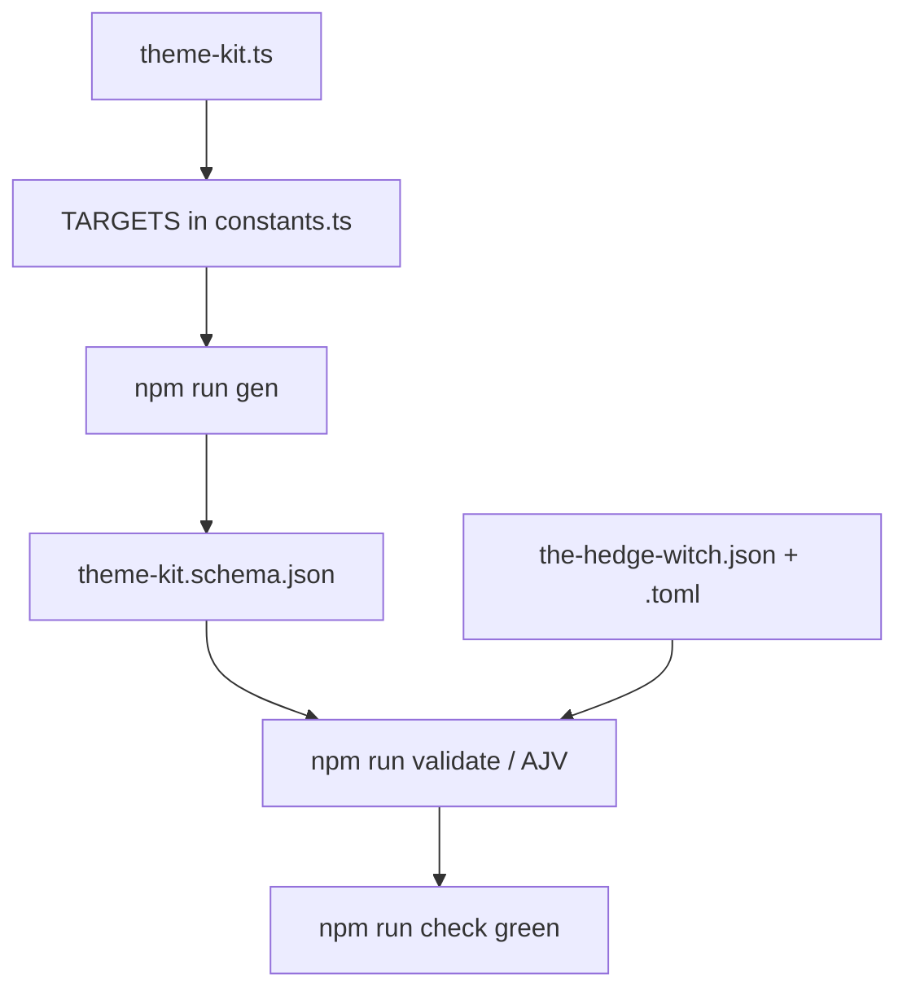

# Instruction: Ship the `theme-kit` target

## Architecture projection

```txt
.
├── src/zod/
│   ├── constants.ts                              ✏️ import + TARGETS entry
│   └── legend-in-the-mist/
│       └── theme-kit.ts                          ✅ Zod source, self-contained
├── schemas/legend-in-the-mist/
│   └── theme-kit.schema.json                     ✅ generated, never hand-edited
└── examples/legend-in-the-mist/theme-kit/
    ├── the-hedge-witch.json                      ✅
    └── the-hedge-witch.toml                      ✅
```

## User Journey



## Tasks to do

### `1)` Write `src/zod/legend-in-the-mist/theme-kit.ts`

> One self-contained file, modelled on `story-theme.ts` section for section.

1. Keep the four comment banners of `story-theme.ts`: Enums, Subschemas, Root schema, Exported TS types.
2. Redefine `PublicationTypeEnum` and `MetaSchema` locally, copied from `story-theme.ts`, with `description` text reworded to say Theme Kit instead of Story Theme.
3. Add an `ImprovementSchema` subschema: `name` required and bare — `.string().trim().min(1, "Improvement name is required")`, no `.default()`, no `.optional()` — plus `effect` as `.string().trim().optional()`. Mirror `MightSchema`'s shape in `challenge.ts`.
4. Root `LegendInTheMistThemeKitSchema` fields, in this order: `name`, `category`, `power_tags`, `weakness_tags`, `quest`, `improvements`, `meta`.
5. `name`: `.string().trim().min(1, "Theme Kit name is required").default("Untitled Theme Kit")`. It is the only **root** field carrying a `.default()`. Inside `MetaSchema`, `publication_type` keeps its `.default("homebrew")` exactly as copied — do not strip it.
6. `category`, `quest`: `.string().trim().optional()`. `power_tags`, `weakness_tags`: arrays of trimmed non-empty strings, `.optional()`, with per-item `.meta()` — copy the wording from `story-theme.ts` and say the kit *offers* the tag rather than *grants* it. `improvements`: `z.array(ImprovementSchema).optional()`. `meta`: `MetaSchema.optional()`.
7. Every field and every array item carries `.meta({ description, examples })`, as `CONTRIBUTING.md` requires. In the `power_tags` and `weakness_tags` descriptions, state that entries are written without braces.
8. In the `improvements` description, say explicitly that this field lists the improvement options the kit offers, and is unrelated to `story-theme`'s `improve`, which counts marks on a track. The two names are close enough to be mixed up.
9. Export the TS types at the bottom: `PublicationType`, `ThemeKitMeta`, `ThemeKitImprovement`, `LegendInTheMistThemeKit`.
10. Do not carry over `improve`, `abandon`, `milestone` or `level` from `story-theme.ts`. The first three hold a Hero's track state, which a blank kit has none of; `level` is left out because the issue's table omits it. This is a decision, not an omission.
11. Spell `category`, `power_tags`, `weakness_tags`, `quest` and `meta` **identically** to `story-theme.ts`. This is the issue's one hard constraint: a tool must be able to fill a Story Theme from a kit by copying those fields rather than mapping them. `name` is the deliberate exception, mapping to `title_tag`.

### `2)` Register the target in `src/zod/constants.ts`

> Without this entry neither `gen` nor `validate` sees the schema.

1. Import `LegendInTheMistThemeKitSchema` next to the other two Legend in the Mist imports.
2. Append `{ zod: LegendInTheMistThemeKitSchema, game: GAMES.litm, name: "theme-kit" }` to `TARGETS`, after the `story-theme` entry.
3. Change nothing else in the file — `GAMES` and the `SchemaTarget` type stay as they are.

### `3)` Generate the JSON Schema

> Generated output only. Never hand-edit `schemas/`.

1. Run `npm run gen` (this repo uses npm, not pnpm — `package-lock.json` is the committed lockfile). On this machine the binary resolves only as `npm.cmd` under the Bash tool, and `rtk npm run` fails with `program not found`; call `npm.cmd run gen` there.
2. Confirm `schemas/legend-in-the-mist/theme-kit.schema.json` appeared and that the other three schema files are unchanged.
3. Confirm the generated root carries `"required": ["name"]` and nothing else. Any extra entry means a root field that carries a `.default()` or that is missing its `.optional()` — both land in `required` under the output view. Fix the Zod source, never the JSON.

### `4)` Write the example, in both formats

> One kit, two encodings, exercising every field.

1. Create `examples/legend-in-the-mist/theme-kit/` — flat, no subdirectory: `listExampleFiles` in `tools/validate-examples.ts` does not recurse.
2. Write `the-hedge-witch.json` and `the-hedge-witch.toml` holding the same homebrew kit, mirroring how `the-village-i-left-behind` is written for `story-theme`. The name is illustrative, not a published kit — `publication_type` says `homebrew` for that reason.
3. Do **not** put a `"$schema"` key in the JSON example. `README.md` shows one, but the generated schemas carry `"additionalProperties": false` at the root, so that key fails validation. The six existing examples all omit it; follow them, not the README.
4. In the TOML file, `improvements` is an array of tables, written as repeated `[[improvements]]` blocks. TOML binds every key/value pair to the most recent table header, so the order is forced: all root scalars first, then the `[[improvements]]` blocks, then `[meta]` last. A scalar written after a header silently lands in the wrong table.
5. Populate every field, including `meta` with `publication_type = "homebrew"` and `authors = ["schema-in-the-mist contributors"]`.
6. Give `improvements` **at least two entries**, one of them with no `effect`. The example is what demonstrates the array decision; a single-entry example would prove nothing.

### `5)` Verify

1. Run `npm run check` (`npm.cmd run check` under the Bash tool on this machine).
2. Both new example files must appear with a `✓`, and the six pre-existing ones must still pass.
3. Re-run `npm run gen` and confirm `git status --porcelain` reports no change to `schemas/` — generation must be idempotent.
4. Do not touch `README.md`: it describes directories, not individual targets, so a new target needs no entry. Do not touch `CONTRIBUTING.md` or `CHANGELOG.md` either — the changelog is written at release time, not here.
5. Commit the phase per the implement step's convention. Do not push, and do not open a pull request.

## Test acceptance criteria

| Task | Acceptance criteria |
| ---- | ------------------- |
| 1 | `theme-kit.ts` exports a `z.object` root; every root field and array item carries a `description` and, where meaningful, `examples`; `name` is the only *root* field with a `.default()`, and `MetaSchema.publication_type` still carries its own. |
| 1 | A Story Theme can be filled from a kit by copying `category`, `power_tags`, `weakness_tags`, `quest` and `meta` across unchanged: the five names are identical in both files. `name` → `title_tag` is the only field a tool has to map. |
| 2 | `TARGETS` holds four entries and `gen` reports four written schema files. |
| 3 | `schemas/legend-in-the-mist/theme-kit.schema.json` exists, is draft-7, and its root `required` is exactly `["name"]`. |
| 4 | `examples/legend-in-the-mist/theme-kit/` holds one `.json` and one `.toml` describing the same kit, each with two or more `improvements`, one lacking `effect`. Parsing the TOML yields the same object as the JSON, `[meta]` included, and neither file carries a `$schema` key. |
| 5 | `npm run check` exits 0 with 8 files validated, and a second `npm run gen` leaves `schemas/` byte-identical. |
