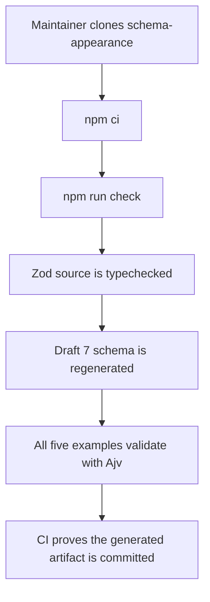
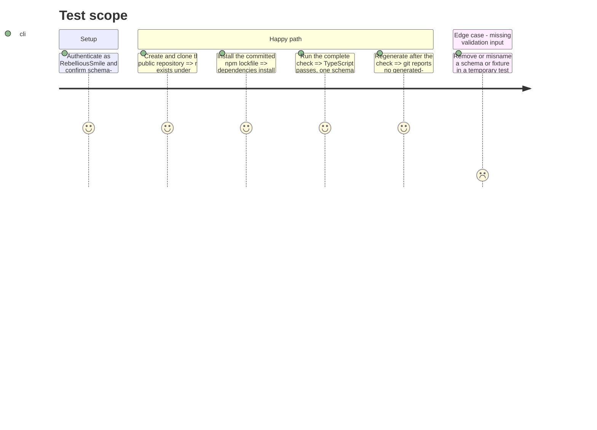

# Instruction: Publish the canonical appearance repository

## Architecture projection

> Tree of the final files. ✅ create · ✏️ modify · ❌ delete

```txt
RebelliousSmile/schema-appearance/
├── ✅ .github/workflows/ci.yml                 # run checks and reject generated drift
├── ✅ .gitignore                               # exclude dependencies and local build state
├── ✅ CHANGELOG.md                             # start the repository's own release history
├── ✅ CONTRIBUTING.md                          # document Zod-first contributions and compatibility
├── ✅ LICENSES/
│   ├── ✅ CODE-LICENSE.md                      # license code and generated schemas
│   └── ✅ DOCS-LICENSE.md                      # license documentation
├── ✅ README.md                                # define appearance scope and canonical URLs
├── ✅ package.json                             # expose typecheck, generation, validation, and check scripts
├── ✅ package-lock.json                        # provide reproducible npm installs
├── ✅ tsconfig.json                            # typecheck source and tools
├── ✅ src/zod/
│   ├── ✅ constants.ts                         # register the single appearance target
│   └── ✅ appearance/game-pack.ts              # canonical Zod source extracted from Mist
├── ✅ schemas/appearance/
│   └── ✅ game-pack.schema.json                # generated Draft 7 artifact
├── ✅ examples/appearance/game-pack/
│   ├── ✅ city-of-mist.json                    # existing representative pack fixture
│   ├── ✅ city-of-mist-shapes.json             # issue-backed polarities and shapes fixture
│   ├── ✅ legend-in-the-mist.json              # existing representative pack fixture
│   ├── ✅ otherscape.json                      # existing representative pack fixture
│   └── ✅ adrenaline.json                      # non-Son-of-Oak fixture extracted from the published pack
└── ✅ tools/
    ├── ✅ gen-schemas.ts                       # generate the registered JSON Schema
    └── ✅ validate-examples.ts                 # validate every fixture with Ajv and fail on omissions
```

## User Journey



## Test Scope



## Tasks to do

### `1)` Create the standalone repository

> Establish the public canonical home before changing the old repository.

1. Create `RebelliousSmile/schema-appearance` as a public repository with `main` as its default branch.
2. Add the npm/TypeScript project scaffold, repository metadata, contribution guidance, and code/document licenses.
3. Describe `game-pack` as cross-game presentation data and explicitly distinguish it from the mechanical `game-definition` target in `schema-pbta`.
4. Preserve the applicable Son of Oak attribution and trademark notice for the three Mist fixtures, and cite `RebelliousSmile/schema-adrenaline` as the provenance of the Adrenaline fixture.

### `2)` Reconcile and extract the canonical contract

> Resolve the two divergent implementations into one backward-compatible contract before making it canonical.

1. Compare the Zod sources and generated contracts at `9535e94` and `00669b8` field by field.
2. Preserve the current `main` document shapes while incorporating the optional `polarities` and `shapes` vocabulary from `00669b8`; relax conflicting required/defaulted structure only where needed so fixtures from both baselines remain valid.
3. Copy the three current JSON examples, retain the enriched City of Mist fixture from `00669b8` under the distinct name `city-of-mist-shapes.json`, and extract the nested `pack` object from the published Adrenaline manifest as a fifth fixture.
4. Register the reconciled Zod source as the repository's single target and generate `schemas/appearance/game-pack.schema.json` in Draft 7 mode.
5. Record both source commit SHAs in the README and changelog so the reconciliation is auditable.

### `3)` Make the validation chain complete and observable

> Reproduce the shared Zod-to-JSON-Schema-to-Ajv workflow with failures that CI can detect.

1. Add `typecheck`, `gen`, `validate`, and aggregate `check` scripts using npm.
2. Make validation fail when the registered schema is absent, the example directory is absent, or no example file is discovered.
3. Add GitHub Actions to run `npm ci`, `npm run check`, and `git diff --exit-code` on pushes to `main` and pull requests.
4. Push the initial commit only after the local check passes, then confirm the remote CI succeeds.

## Test acceptance criteria

| Task | Acceptance criteria |
| ---- | ------------------- |
| 1 | `https://github.com/RebelliousSmile/schema-appearance` is public on `main`, identifies cross-game appearance as its domain, states that `game-pack` is unrelated to PbtA `game-definition`, and documents the licenses, trademark notice, and fixture provenance. |
| 2 | The repository contains one canonical Zod target and one generated Draft 7 schema that accept the three `9535e94` fixtures, the separately named enriched `00669b8` City of Mist fixture, and the published Adrenaline `pack` object; `polarities` and `shapes` are represented and both baseline SHAs are documented. |
| 3 | A clean clone passes `npm ci` and `npm run check`, reports exactly one generated target and five successful example validations with no skip warnings, and CI reports no generated diff. |
| 3 | A controlled missing-schema and missing-fixture check each exits nonzero, proving that a green run cannot result from silently skipped inputs. |
