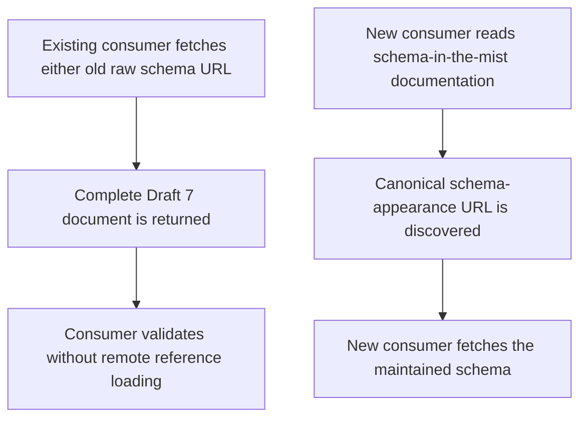
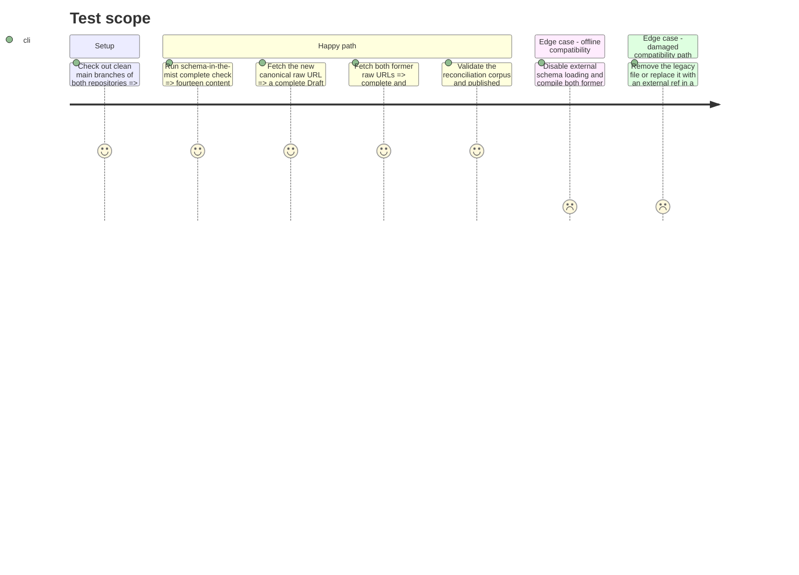

# Instruction: Migrate Mist to the compatibility path

## Architecture projection

> Tree of the final files. ✅ create · ✏️ modify · ❌ delete

```txt
schema-in-the-mist/
├── ✅ .github/workflows/ci.yml                   # protect content generation and the legacy schema on pushes and pull requests
├── ✏️ README.md                                  # point new integrations to schema-appearance and document the legacy path
├── ✏️ CHANGELOG.md                               # record extraction and compatibility policy
├── ✏️ package.json                               # include the network-free compatibility assertion in npm run check
├── ✏️ src/zod/constants.ts                       # remove the appearance import, namespace, and target
├── ❌ src/zod/appearance/game-pack.ts            # remove the no-longer-canonical Zod source
├── ✅ tools/validate-appearance-compat.ts         # assert the frozen artifact remains present, self-contained, and usable
├── appearance/
│   └── ✅ game-pack.schema.json                  # retain the issue-backed historical path as a complete frozen copy
├── schemas/appearance/
│   ├── ✏️ game-pack.schema.json                  # publish the reconciled artifact at the current main path
│   └── ✅ README.md                              # mark the artifact frozen and link its canonical successor
└── ❌ examples/appearance/game-pack/
    ├── city-of-mist.json                         # examples now validate in schema-appearance
    ├── legend-in-the-mist.json                   # examples now validate in schema-appearance
    └── otherscape.json                           # examples now validate in schema-appearance
```

## User Journey



## Test Scope



## Tasks to do

### `1)` Remove canonical ownership from Mist

> Leave only content-schema generation in `schema-in-the-mist`.

1. Remove the `GamePackSchema` import, `APPEARANCE` pseudo-game, and `game-pack` target from `src/zod/constants.ts`.
2. Delete the Zod appearance source and the three examples after their canonical copies are live.
3. Run generation and confirm it touches only the fourteen Mist content targets.
4. Keep `handbook/`, `handbook.json`, all pack manifests, and all assets unchanged.

### `2)` Preserve and document the old read path

> Keep existing consumers operational without requiring remote-reference support.

1. Copy the initial reconciled canonical artifact in full to both `appearance/game-pack.schema.json` and `schemas/appearance/game-pack.schema.json`.
2. Add `schemas/appearance/README.md` explaining that both files are identical, frozen, deprecated, and retained until a separately approved breaking release.
3. Update the root README and changelog with the canonical URL `https://raw.githubusercontent.com/RebelliousSmile/schema-appearance/main/schemas/appearance/game-pack.schema.json`, both legacy URLs, and migration guidance.
4. Add `tools/validate-appearance-compat.ts` with embedded valid and invalid probes that assert both legacy files exist, are byte-identical, have no external `$ref`, compile synchronously with Ajv, accept the valid probe, and reject the invalid probe.
5. Add the compatibility assertion to `npm run check`, and separately perform a one-time parity test of all three artifacts against the five fixtures in `schema-appearance`, every nested `pack` object, and every `variants[]` entry from the three local Handbook manifests and the published Adrenaline manifest.

### `3)` Publish and close the migration

> Complete the cross-repository handoff only after both read paths are proven.

1. Add GitHub Actions to run `npm ci`, `npm run check`, and `git diff --exit-code` on pushes to `main` and pull requests.
2. Confirm GitHub Actions is enabled on the fork, then commit and push the Mist migration after the new repository and its CI are green.
3. Verify the canonical and both legacy raw GitHub URLs return parseable schemas and the new Mist CI is green after the push.
4. Comment on tickets #4 and #5 with both commit links, all three URLs, the reconciled fields, the compatibility policy, and the validation results.
5. Close ticket #4 only after those checks succeed.

## Test acceptance criteria

| Task | Acceptance criteria |
| ---- | ------------------- |
| 1 | `npm run check` in `schema-in-the-mist` generates fourteen content schemas and validates thirty-four examples with no warnings; no appearance source, example, import, or target remains, while every `handbook/` file is unchanged. |
| 2 | Both former URLs return identical, self-contained copies of the reconciled Draft 7 artifact; the permanent offline probe passes, controlled deletion/divergence/external-`$ref` mutations fail, and the one-time cross-repository test validates all five fixtures plus every published `pack` and `variants[]` object against all three artifacts. |
| 3 | Both repositories are pushed with green CI, all three raw URLs are reachable and parseable, #5 records where its missing mainline implementation landed, and issue #4 is closed with an evidence-bearing migration comment. |
