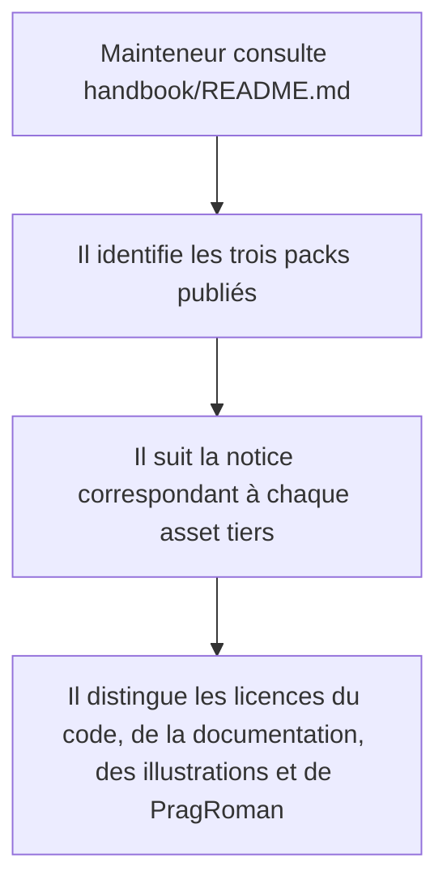
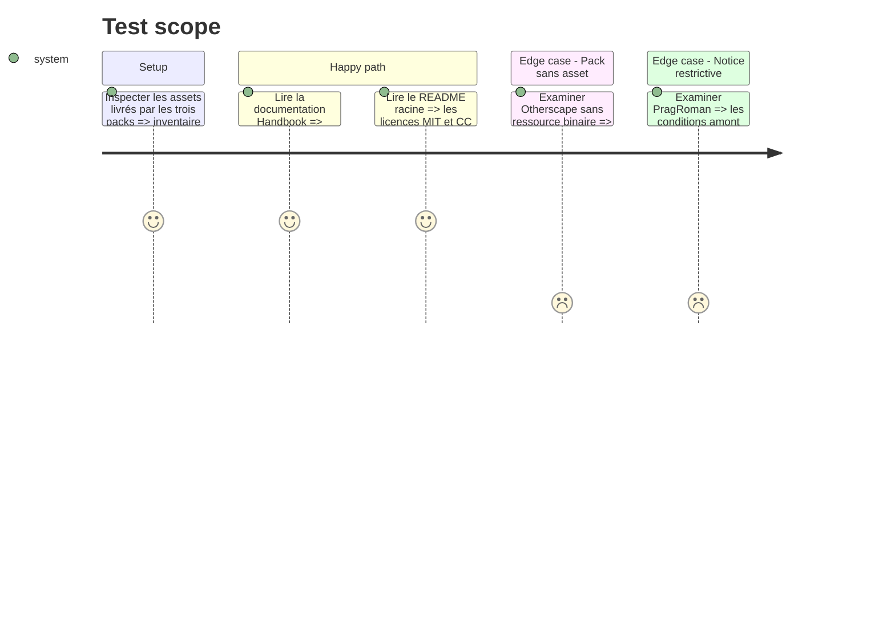

# Instruction: Publier les notices de droits des packs

## Architecture projection

> Tree of the final files. ✅ create · ✏️ modify · ❌ delete

```txt
.
├── ✏️ README.md
└── handbook/
    ├── ✅ README.md
    └── LICENSES/
        ├── ✅ PragRoman.LICENSE.txt
        └── ✅ SonOfOak.LICENSE.txt

Aucun fichier supprimé.
```

## User Journey



## Test Scope



## Tasks to do

### `1)` Consigner le statut des droits

> Ne pas confondre présence historique, absence de plainte et permission effective de republier les fichiers tiers.

1. Consigner que les assets Son of Oak proviennent du matériel communautaire Cauldron identifié, dont les conditions publiées ne suffisent pas à établir la redistribution depuis ce dépôt.
2. Consigner que PragRoman provient de l'ancien bundle Handbook/Brumes et que sa notice restrictive n'établit pas l'autorisation préalable requise pour l'inclure dans ce produit distribué.
3. Conserver les illustrations et PragRoman à leurs chemins actuels conformément à la décision explicite du mainteneur; ne pas les remplacer par une approximation typographique.
4. Présenter ces points comme un risque de droits non résolu, jamais comme une licence acquise ni comme un avis juridique.

### `2)` Publier les notices amont

> Faire accompagner les illustrations Son of Oak et la police PragRoman de leurs textes de droits existants.

1. Créer `handbook/LICENSES/`.
2. Copier à l'identique les notices `SonOfOak.LICENSE.txt` et `PragRoman.LICENSE.txt` actuellement conservées par Handbook.
3. Ne pas transformer le `FIXME` Son of Oak en autorisation acquise et ne pas reformuler les restrictions PragRoman.

### `3)` Documenter la provenance par pack

> Rendre la portée de chaque notice évidente pour un consommateur du dépôt.

1. Créer `handbook/README.md` avec le catalogue City of Mist, Legend in the Mist et :Otherscape.
2. Relier les assets City of Mist et Legend in the Mist à la notice Son of Oak.
3. Relier `handbook/legend-in-the-mist/assets/fonts/pragroman.ttf` à la notice PragRoman.
4. Indiquer que :Otherscape ne distribue actuellement aucun asset binaire.
5. Mettre à jour la section License du README racine pour séparer code/schémas, documentation et contenus tiers, puis pointer vers l'inventaire Handbook.

## Test acceptance criteria

| Task | Acceptance criteria |
| ---- | ------------------- |
| 1 | La documentation distingue explicitement la provenance connue, la présence historique et l'autorisation de redistribution, qui demeure non établie pour les illustrations Son of Oak et PragRoman. |
| 1 | Les assets existants restent inchangés conformément à la décision du mainteneur et aucune notice, absence de plainte ou ancienneté d'usage n'est présentée comme une permission. |
| 2 | Les deux notices amont sont présentes sous `handbook/LICENSES/` et leur contenu est identique aux textes actuellement distribués par Handbook. |
| 2 | La notice PragRoman accompagne explicitement le seul fichier de police livré et conserve toutes ses restrictions. |
| 3 | Un lecteur peut partir de `handbook/README.md`, choisir un pack et identifier la notice et la base d'autorisation applicables à chaque catégorie d'asset qu'il contient. |
| 3 | Le README racine ne laisse pas entendre que MIT ou CC BY 4.0 couvre les illustrations Son of Oak ou PragRoman. |
| 3 | :Otherscape est décrit sans prétendre distribuer une ressource absente. |
