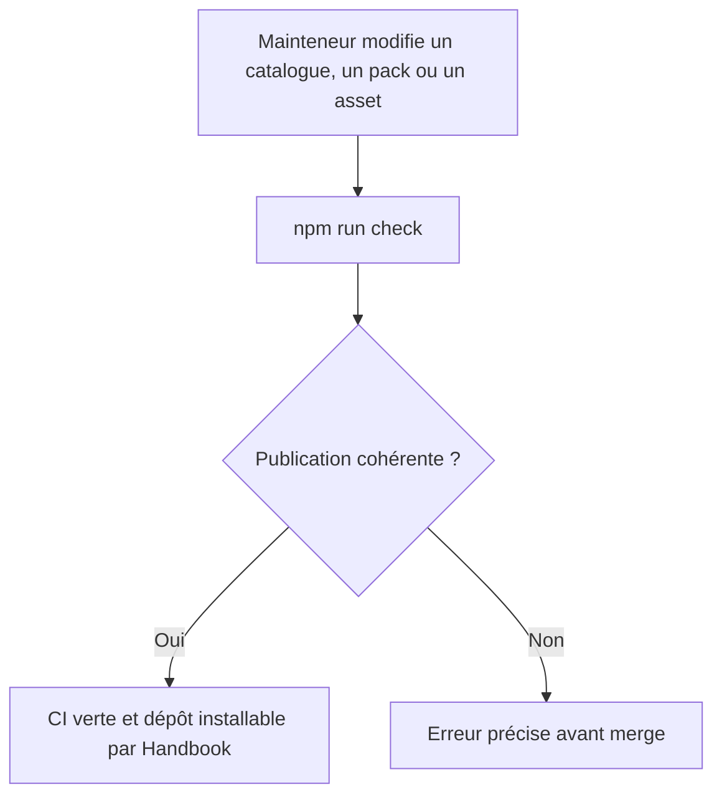
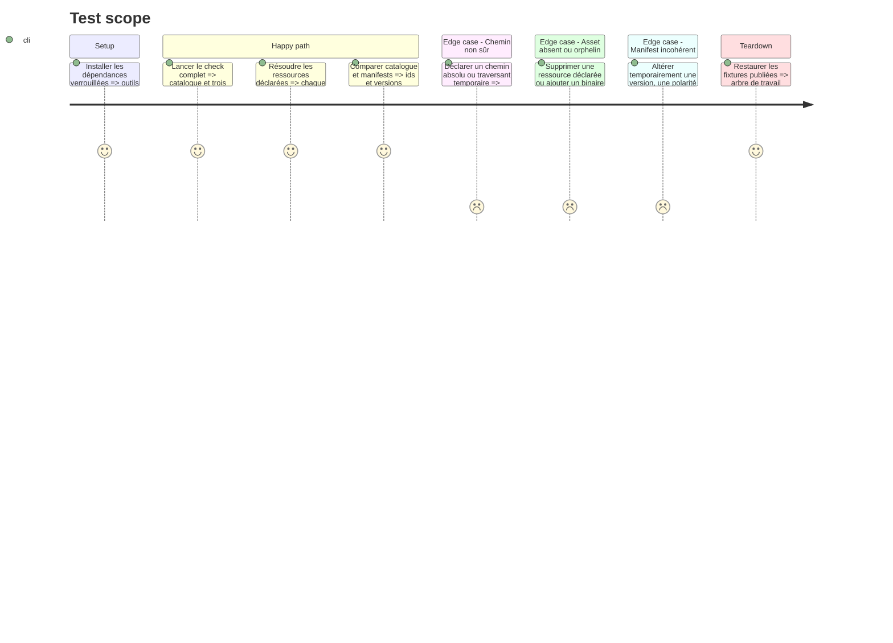

# Instruction: Verrouiller le contrat de publication

## Architecture projection

> Tree of the final files. ✅ create · ✏️ modify · ❌ delete

```txt
.
├── ✏️ package.json
└── tools/
    └── ✅ validate-handbook-packs.ts

Aucun fichier supprimé.
```

## User Journey



## Test Scope



## Tasks to do

### `1)` Valider le catalogue et les manifests Handbook

> Transformer les invariants du lecteur Handbook en contrôle local sans coupler ce dépôt à son code source.

1. Créer `tools/validate-handbook-packs.ts` sur le modèle des validateurs TypeScript existants.
2. Lire `handbook.json` et refuser une version de format inconnue, un dépôt inattendu, un catalogue vide, des ids/chemins dupliqués, un SemVer invalide ou un chemin non relatif.
3. Parcourir toutes les entrées déclarées sans figer leur nombre ni une liste d'ids dans l'outil, afin qu'un futur pack valide puisse être ajouté par son propre changement de catalogue.
4. Charger chaque manifest catalogué et vérifier la version de format, l'id, la version, `minimumHandbookVersion`, la syntaxe et l'unicité des capacités ainsi que les champs de variantes.
5. Compiler `appearance/game-pack.schema.json` avec Ajv et valider chaque objet `pack` contre cette copie de compatibilité.
6. Produire des erreurs actionnables incluant le fichier et l'invariant en faute.
7. Ne pas recopier la liste des capacités fournies par Handbook; son acceptation effective relève de la phase 3.

### `2)` Valider la fermeture des ressources publiées

> Garantir que l'installateur Handbook peut matérialiser exactement les assets annoncés.

1. Résoudre la racine d'assets de chaque pack avec `assets` comme défaut, comme le fait Handbook.
2. Refuser tout chemin absolu, segment vide, `.` ou `..` dans les images et polices.
3. Vérifier que chaque ressource déclarée existe dans le dépôt.
4. Inventorier les fichiers sous chaque racine d'assets et refuser les binaires non déclarés afin qu'un oubli de manifest ne soit pas silencieux.
5. Vérifier la présence des notices et de l'inventaire ajoutés en phase 1 sans traiter ces fichiers documentaires comme des assets installables.

### `3)` Intégrer la validation au check de livraison

> Faire échouer la CI existante dès qu'une publication Handbook devient incohérente.

1. Ajouter le script npm `validate:handbook-packs`.
2. L'insérer dans `npm run check`; conserver npm et le workflow CI existants.
3. Exécuter `npm ci`, le nouveau validateur, les scénarios négatifs temporaires et le check complet.
4. Confirmer que le check ne génère aucun diff suivi.

## Test acceptance criteria

| Task | Acceptance criteria |
| ---- | ------------------- |
| 1 | Le catalogue réel expose exactement City of Mist, Legend in the Mist et :Otherscape, et chaque entrée correspond à l'id et à la version du manifest ciblé. |
| 1 | Les trois objets `pack` satisfont le schéma d'apparence local et leurs enveloppes respectent leurs invariants structurels de version, capacités, polarités et variantes. |
| 1 | Une incohérence de catalogue ou de manifest fait échouer le validateur avec un chemin et une cause identifiables. |
| 2 | Toutes les images et polices déclarées sont résolues dans leur pack, sans sortie de répertoire, et aucun binaire livré n'est omis du manifest. |
| 2 | Les notices de phase 1 restent présentes mais ne sont pas intégrées à la liste des fichiers que Handbook installe. |
| 3 | `npm run check` exécute la validation Handbook et passe sur l'arbre publié. |
| 3 | Les scénarios temporaires chemin non sûr, asset manquant, asset orphelin et mismatch id/version échouent chacun avant restauration de la baseline. |
| 3 | Le check complet termine avec un arbre Git sans dérive générée. |
