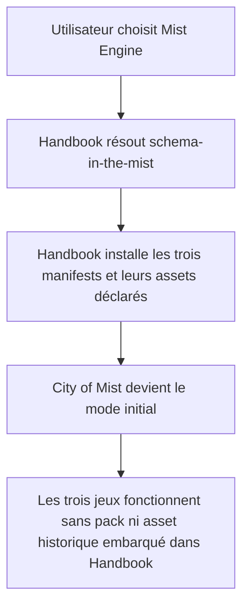
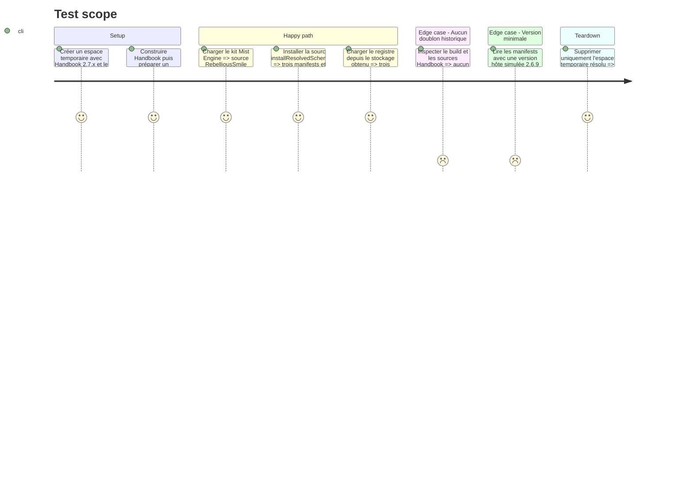

# Instruction: Prouver l'installation par le starter kit

## Architecture projection

> Tree of the final files. ✅ create · ✏️ modify · ❌ delete

```txt
.

Aucun fichier suivi créé, modifié ou supprimé; les clones, le vault et le harnais d'intégration sont temporaires.
```

## User Journey



## Test Scope



## Tasks to do

### `1)` Exécuter le consommateur réel sur la source réelle

> Prouver le critère de clôture avec le code Handbook, pas avec une seconde implémentation du contrat.

1. Créer un répertoire temporaire vérifié et y obtenir `RebelliousSmile/obsidian-handbook` à une version 2.7.x publiée.
2. Utiliser le dépôt `schema-in-the-mist` courant comme backend fichier d'un `ResolvedGithubSource`, sans modifier les sources ni contourner leurs validations.
3. Charger le catalogue livré par Handbook, sélectionner `mist-engine` et exécuter `installStarterKitSources` puis `installResolvedSchemaSource` dans un stockage de vault vide.
4. Vérifier que les trois packs catalogués, leurs versions et chaque image/police déclarée sont écrits sous le stockage de la source.
5. Charger les installations produites avec les lecteurs Handbook et vérifier les capacités, le mode initial et les variantes :Otherscape.
6. Appeler le lecteur de manifests Handbook 2.7.x avec la version hôte `2.6.9` et vérifier le refus explicite des packs, sans tenter d'exécuter une ancienne version qui ne possédait pas encore l'installateur.

### `2)` Exclure tout repli sur les anciens doublons

> Démontrer que le résultat provient seulement de `schema-in-the-mist`.

1. Confirmer dans le checkout Handbook testé l'absence des anciens manifests, packs, polices et illustrations Mist embarqués.
2. Enregistrer dans le compte rendu d'implémentation la version/commit Handbook et le commit `schema-in-the-mist` testés. Validation effectuée avec Handbook `2.7.1` (`1206f6fbd7b2419842f0f8a4b737c77da3e9d819`) et `schema-in-the-mist` (`6d993f1221d55e2d86bffe095012bfce73c3e51c`).
3. Exécuter les assertions ciblées Handbook `assert:repository-manifest`, `assert:source-installer` et `assert:starter-kits`, puis son build.
4. Supprimer le répertoire temporaire après avoir vérifié son chemin absolu et préserver les deux arbres de travail.

## Test acceptance criteria

| Task | Acceptance criteria |
| ---- | ------------------- |
| 1 | Le catalogue `mist-engine` de Handbook 2.7.x installe depuis le dépôt courant exactement City of Mist, Legend in the Mist et :Otherscape, avec les versions annoncées. |
| 1 | Chaque image et police déclarée est présente dans le stockage installé, City of Mist est le mode initial, et les variantes :Otherscape sont lisibles. |
| 1 | Le lecteur Handbook 2.7.x, exécuté avec la version hôte simulée `2.6.9`, refuse les manifests avec une erreur de version explicite. |
| 2 | Le test réussit alors que le checkout Handbook ne contient aucun ancien pack ou asset Mist pouvant masquer un défaut de la source. |
| 2 | Les trois assertions ciblées et le build Handbook passent sur le commit consommateur consigné. |
| 2 | Les preuves consignent les deux commits testés et aucun fichier suivi ne reste modifié après le teardown. |
