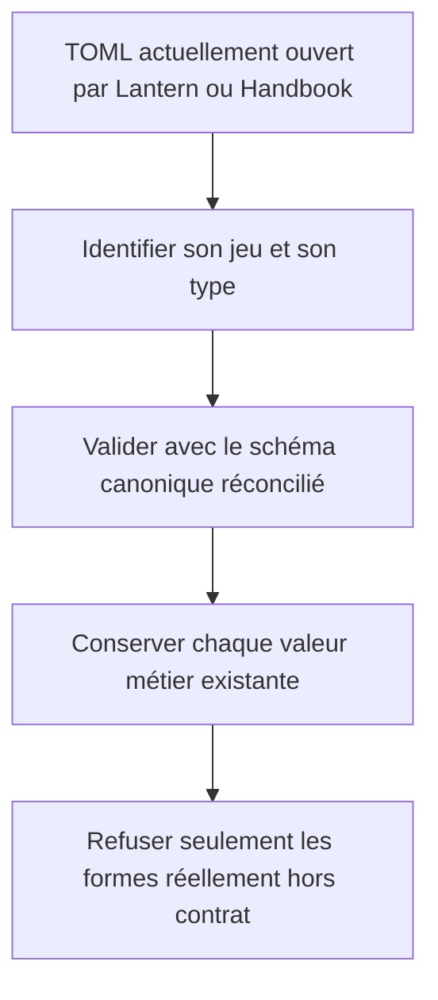
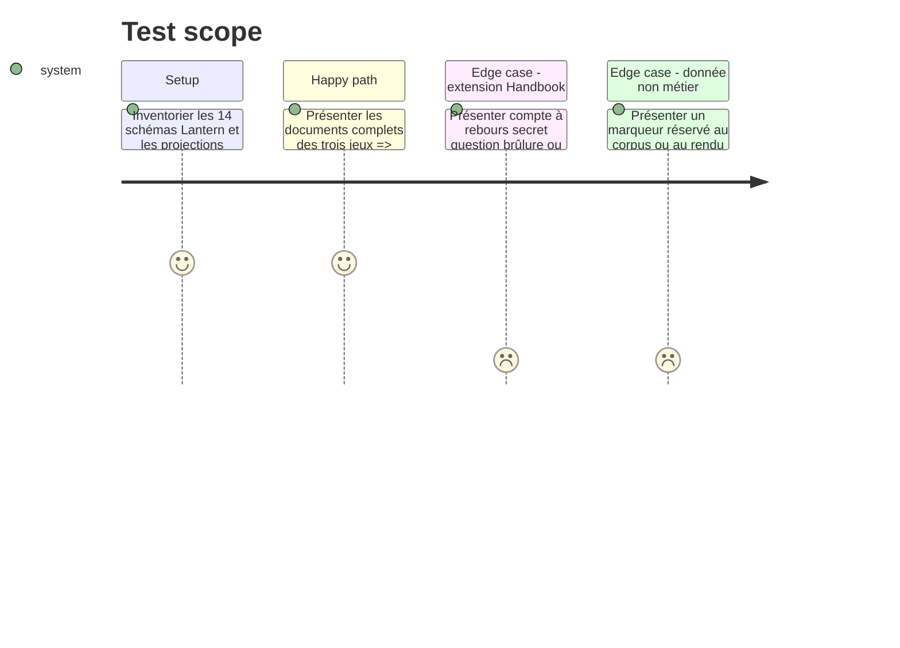

# Instruction: Réconcilier le contrat avec Lantern et Handbook

## Architecture projection

> Tree of the final files. ✅ create · ✏️ modify · ❌ delete

```txt
schema-in-the-mist/
├── ✅ docs/compatibility.md
└── ✏️ src/zod/
    ├── constants.ts
    ├── city-of-mist/{custom-move,danger,theme-card,theme-kit}.ts
    ├── legend-in-the-mist/{challenge,journey,story-theme,theme-kit}.ts
    └── otherscape/{challenge,character-trope,loadout-item,power-set,theme,theme-kit}.ts

Aucun fichier supprimé.
```

## User Journey



## Test Scope



## Tasks to do

### `1)` Établir la matrice d'autorité

> Transformer les implémentations existantes en décisions explicites avant de figer v1.

1. Recenser les 14 couples `schema.ts` et `toml.ts` de Lantern et les faire correspondre aux 14 cibles actuelles de `src/zod`, sans présumer qu'une copie est supérieure à l'autre.
2. Comparer dans les deux sens contraintes, défauts, métadonnées, symboles publics et codecs, puis comparer les interfaces, témoins et refus Mist de Handbook champ par champ.
3. Classer chaque différence comme valeur métier portable, projection tolérante, préférence de rendu ou donnée de test dans `docs/compatibility.md`.
4. N'autoriser aucune perte silencieuse : toute valeur métier existante doit être promue, migrée explicitement ou bloquer le gel de v1.

### `2)` Promouvoir les extensions portables

> Le contrat commun doit représenter ce que les outils savent déjà lire et écrire.

1. Conserver les contraintes, descriptions, exemples et symboles publics corrects déjà présents dans `schema-in-the-mist`, puis ajouter les extensions Handbook porteuses de sens, notamment `is_countdown`, `on_max`, `secrets`, `question`, `burnt` et les mouvements personnalisés sans nom lorsque leurs témoins le prouvent.
2. Aligner noms, valeurs par défaut, bornes et champs optionnels avec le comportement observé, mais remplacer les coercitions de types propres aux formulaires par une validation stricte des valeurs TOML/JSON brutes.
3. Rendre les contraintes de chaînes, notamment trim et non-vide, représentables avec la même décision d'acceptation dans le JSON Schema; documenter toute normalisation appliquée seulement par le codec TypeScript.
4. Refuser les clés inconnues au niveau du contrat afin qu'un round-trip ne puisse pas les effacer silencieusement.
5. Garder hors des schémas les états de formulaire, avertissements, préférences d'export, zones visuelles et marqueurs de fixture.

### `3)` Stabiliser le registre des cibles

> Chaque document doit posséder une identité publique non ambiguë.

1. Remplacer le tableau interne peu typé par un registre `jeu/type-document` couvrant exactement les 14 cibles.
2. Conserver les dossiers historiques `city-of-mist`, `legend-in-the-mist` et `otherscape` et les noms de documents déjà publiés.
3. Exposer les types de clé et de correspondance nécessaires aux futurs codecs sans importer de code de Lantern ou Handbook.

## Test acceptance criteria

| Task | Acceptance criteria |
| --- | --- |
| 1 | La matrice couvre les 14 cibles et explique chaque divergence entre le dépôt, Lantern et les formats Mist de Handbook. |
| 1 | Aucune divergence porteuse d'une valeur n'est laissée sans décision avant le gel du contrat. |
| 1 | Tout élément propre à `schema-in-the-mist` jugé correct reste canonique et son absence dans Lantern est couverte par Lantern #3. |
| 2 | Les témoins Mist existants conservent leurs valeurs normalisées, y compris `0`, `false`, listes vides, compte à rebours, conséquences, secrets et annotations de tags. |
| 2 | Une chaîne à la place d'un nombre, une chaîne blanche interdite ou une clé inconnue reçoit la même décision dans Zod et dans le JSON Schema généré. |
| 2 | Les données de rendu ou de test ne deviennent pas des champs du contrat. |
| 3 | Le registre contient exactement 14 clés qualifiées uniques et chacune pointe vers le schéma Zod attendu. |
