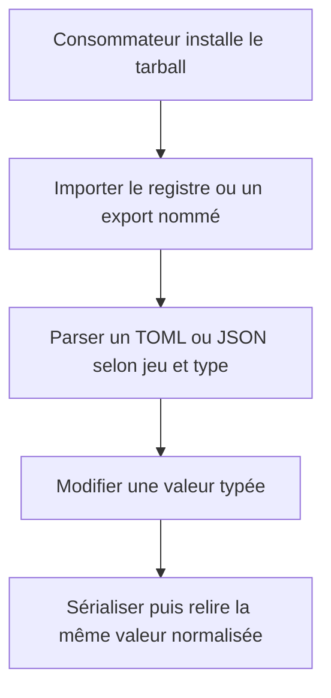
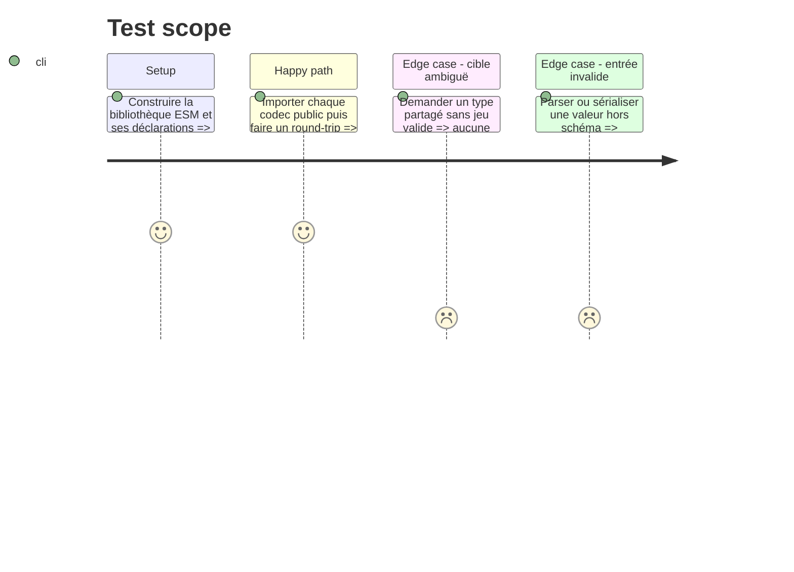

# Instruction: Publier la surface TypeScript et les codecs

## Architecture projection

> Tree of the final files. ✅ create · ✏️ modify · ❌ delete

```txt
schema-in-the-mist/
├── ✏️ package.json
├── ✏️ package-lock.json
├── ✏️ tsconfig.json
├── ✅ tsconfig.build.json
├── ✏️ tools/validate-examples.ts
└── src/
    ├── ✅ contract-version.ts
    ├── ✅ index.ts
    ├── ✅ codecs/json.ts
    ├── ✅ codecs/toml.ts
    └── ✏️ zod/**/*.ts

Aucun fichier supprimé.
```

## User Journey



## Test Scope



## Tasks to do

### `1)` Construire une bibliothèque ESM

> Le dépôt doit produire du JavaScript et des déclarations consommables, pas demander d'importer son TypeScript source.

1. Ajouter un build NodeNext depuis `src` vers `dist`, avec déclarations, sources maps et extensions `.js` dans les imports internes.
2. Déplacer `zod` et `smol-toml` dans les dépendances runtime; conserver `@iarna/toml` comme implémentation de référence de test.
3. Passer le package à `1.0.0` et corriger les métadonnées de dépôt vers `RebelliousSmile/schema-in-the-mist`.
4. Fermer le tarball avec `files` et la surface avec `exports`; ne publier comme code que l'entrée racine et inclure explicitement README et licence applicables.

### `2)` Exposer les codecs canoniques

> Une seule fonction de lecture et d'écriture doit faire autorité pour chaque document.

1. Créer un codec générique typé avec `schema`, `parseToml`, `stringifyToml`, puis un registre exhaustif indexé par la clé qualifiée.
2. Porter la sémantique éprouvée de Lantern : parsing `smol-toml`, validation Zod, projection canonique des optionnels et sérialisation des valeurs validées.
3. Exposer aussi des fonctions nommées et les types inférés des 14 documents pour les consommateurs statiques.
4. Ajouter dans `src/codecs/json.ts` un codec JSON qui parse ou sérialise du texte seulement après validation par le même schéma Zod, sans maintenir un second contrat.
5. Faire parcourir à `tools/validate-examples.ts` les 14 cibles et vérifier sur les paires existantes le round-trip de chaque codec ainsi que l'égalité des valeurs JSON/TOML normalisées.

### `3)` Déclarer la version du contrat

> Les versions du package, du schéma et de TOML doivent être lisibles par les outils.

1. Exposer la majeure de contrat `1`, le tag de schéma `v1.0.0` et la version TOML `1.0.0`.
2. Vérifier que toute version stable du package conserve la même majeure que le contrat public.
3. Documenter la politique SemVer pour ajouts compatibles, corrections et ruptures.

## Test acceptance criteria

| Task | Acceptance criteria |
| --- | --- |
| 1 | `dist` contient du JavaScript ESM exécutable et les déclarations TypeScript correspondantes sans dépendre de Vite, React ou Obsidian. |
| 1 | Le tarball n'embarque ni outils de développement, ni packs Handbook, ni sources internes non déclarées. |
| 2 | Les 14 codecs TOML, les 14 codecs JSON et les schémas sont accessibles depuis l'entrée publique et aucune cible ne possède un second chemin de validation canonique. |
| 2 | Les parseurs et sérialiseurs rejettent les valeurs invalides avec un chemin de champ exploitable. |
| 2 | Les exemples existants exercent les codecs TOML et JSON de chaque cible et conservent la même valeur normalisée. |
| 3 | La version stable, la majeure du contrat, le tag des `$id` et la version TOML sont cohérents et testables. |
