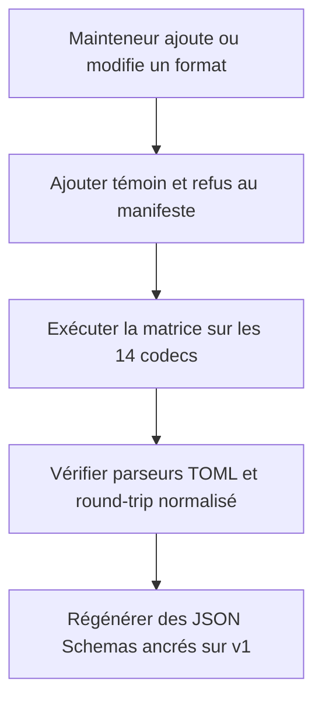
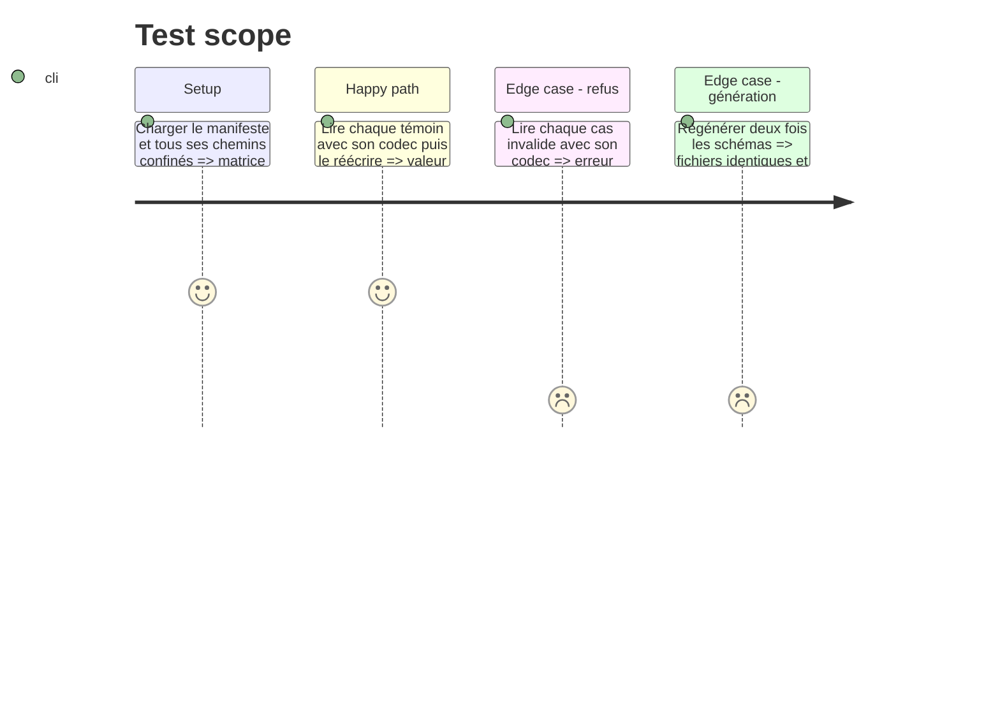

# Instruction: Installer le corpus et les schémas versionnés

## Architecture projection

> Tree of the final files. ✅ create · ✏️ modify · ❌ delete

```txt
schema-in-the-mist/
├── ✅ corpus/
│   ├── README.md
│   └── contract/
│       ├── cases.json
│       ├── valid/*.toml
│       └── invalid/*.toml
├── ✅ schemas/v1/{city-of-mist,legend-in-the-mist,otherscape}/*.schema.json
├── ✏️ schemas/{city-of-mist,legend-in-the-mist,otherscape}/*.schema.json
├── ✏️ tools/gen-schemas.ts
├── ✏️ tools/toml2json.ts
├── ✅ tools/validate-contract.ts
└── ✏️ package.json

Aucun fichier supprimé.
```

## User Journey



## Test Scope



## Tasks to do

### `1)` Centraliser le corpus Mist

> Les consommateurs doivent exécuter les mêmes fichiers, pas des copies qui se ressemblent.

1. Créer un manifeste versionné associant chaque cas à une clé qualifiée, à l'attente canonique `accept` ou `reject`, et aux attentes Lantern/Handbook `round-trip`, `reject`, `render`, `degraded` ou `null` selon le rôle réel du consommateur.
2. Importer les témoins Mist utiles de Handbook et les exemples complets de Lantern, en remplaçant seulement les marqueurs propres au test par des valeurs métier valides.
3. Compléter `city-of-mist/custom-move` et `city-of-mist/theme-kit`, absents du corpus Handbook, afin que les 14 cibles possèdent au moins un témoin et un refus.
4. Couvrir explicitement `0`, `false`, liste vide, clé citée, champ optionnel absent et chaque extension portable retenue en phase 1.
5. Publier uniquement `corpus/contract` dans le tarball et documenter la résolution des cas par les consommateurs.

### `2)` Prouver la conformité sémantique

> Un cas accepté doit survivre au codec; un refus doit réellement échouer.

1. Valider version du manifeste, vocabulaire d'attentes, chemins confinés, doublons, cibles connues et couverture accept/refus de chaque cible.
2. Pour chaque témoin, comparer la valeur normalisée avant et après `parse → stringify → parse`.
3. Comparer l'objet lu par `smol-toml` à celui lu par `@iarna/toml` afin de détecter une dépendance à un parseur permissif.
4. Compiler le JSON Schema v1 correspondant avec Ajv et vérifier qu'il accepte ou refuse chaque cas comme le codec Zod.
5. Faire utiliser le registre canonique par l'outil de conversion plutôt qu'une lecture TOML indépendante, et garder les paires d'exemples de la phase 2 dans la barrière globale.

### `3)` Versionner les JSON Schemas

> Un `$id` publié ne doit jamais désigner un contenu mutable.

1. Générer les 14 schémas sous `schemas/v1` selon la sémantique d'entrée Zod, avec un `$id` raw GitHub pointant sur le tag `v1.0.0` et le même chemin versionné.
2. Conserver les chemins non versionnés comme copies de commodité régénérées, sans les utiliser comme identifiants immuables.
3. Vérifier l'identité des générations et faire échouer la CI lorsqu'un artefact généré n'est pas commité.
4. Laisser les copies de compatibilité `appearance` et les validations des trois packs hors du registre de documents, mais toujours dans `npm run check`.

## Test acceptance criteria

| Task | Acceptance criteria |
| --- | --- |
| 1 | Le tarball contient un manifeste et les mêmes cas Mist pour les 14 cibles, chacune avec au moins un témoin, un refus et les attentes propres à Lantern et Handbook. |
| 1 | Les cas couvrent les valeurs susceptibles d'être perdues par un test de vérité ou une projection d'interface. |
| 2 | Tous les témoins conservent leur valeur normalisée et tous les refus échouent avec le codec déclaré. |
| 2 | `smol-toml` et `@iarna/toml` produisent la même valeur sur chaque témoin canonique. |
| 2 | Zod et le JSON Schema v1 donnent la même décision d'acceptation ou de refus sur chaque cas du manifeste. |
| 2 | Chaque paire d'exemples JSON/TOML décrit la même valeur normalisée à travers les codecs publics. |
| 3 | Chaque schéma v1 possède un `$id` sous le tag `v1.0.0`; deux générations consécutives ne changent aucun fichier. |
| 3 | Les validations existantes des exemples, copies d'apparence et packs City of Mist, Legend in the Mist et :Otherscape restent vertes. |
