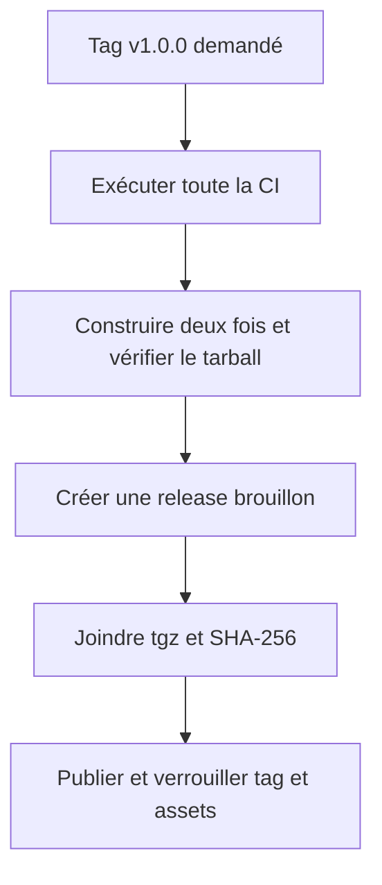
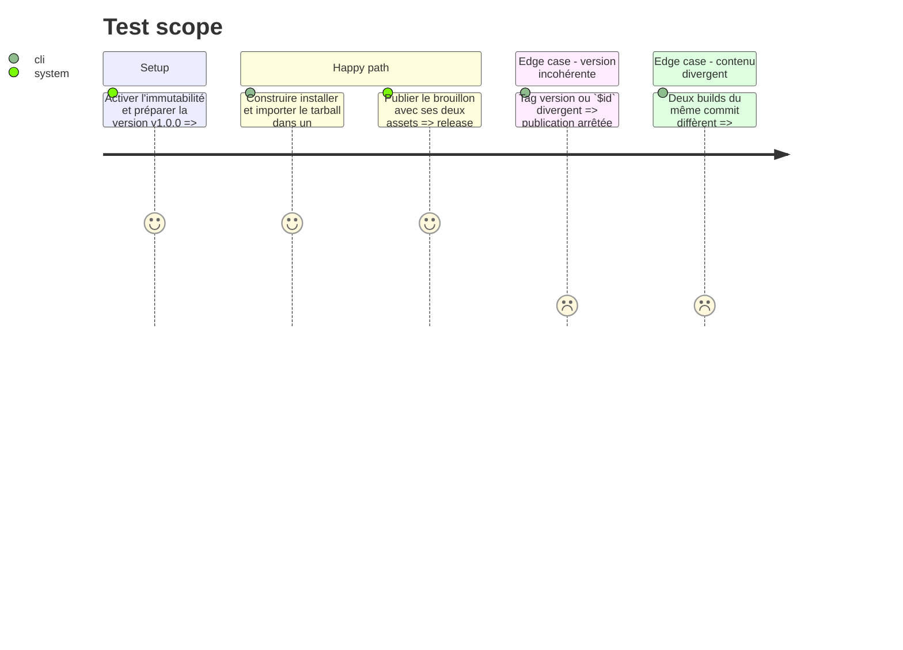

# Instruction: Verrouiller et publier la release immuable

## Architecture projection

> Tree of the final files. ✅ create · ✏️ modify · ❌ delete

```txt
schema-in-the-mist/
├── ✏️ .github/workflows/ci.yml
├── ✅ .github/workflows/release.yml
├── ✏️ CHANGELOG.md
├── ✏️ CONTRIBUTING.md
├── ✏️ README.md
├── ✅ tools/prepare-release.ts
├── ✅ tools/validate-package.ts
├── ✅ tools/validate-version-compat.ts
└── ✏️ package.json

Aucun fichier supprimé.
```

## User Journey



## Test Scope



## Tasks to do

### `1)` Tester le package comme un consommateur

> La validation du dépôt source ne suffit pas à prouver le tarball.

1. Exécuter `npm pack` dans un répertoire temporaire et installer l'archive dans un projet ESM vide avec scripts désactivés.
2. Importer versions, schémas, types exécutables, codecs et registre depuis la seule entrée publique.
3. Résoudre un JSON Schema v1 et chaque fichier du corpus via les sous-chemins exportés.
4. Vérifier qu'un import de chemin interne non exporté échoue et que ni packs ni outils ne sont présents.

### `2)` Préparer un artefact reproductible

> La release doit joindre un paquet auditable avec son digest indépendant.

1. Construire deux tarballs du même arbre et comparer leurs contenus canoniques fichier par fichier.
2. Produire `schema-in-the-mist-1.0.0.tgz` et son fichier `.sha256` seulement après `npm run check`.
3. Vérifier l'égalité entre version package, tag demandé, version du contrat et tag porté par les `$id`.

### `3)` Publier en brouillon puis rendre immuable

> Aucun asset ne doit être ajouté après que GitHub a verrouillé la release.

1. Ajouter une CI lecture seule qui exécute build, corpus, package, packs et contrôle du diff généré.
2. Ajouter un workflow de release à permission `contents: write`, déclenché pour un tag stable et bloqué si l'immutabilité du dépôt n'est pas activée.
3. Créer la release en brouillon, joindre le tarball et le SHA-256, puis publier le brouillon; ne jamais remplacer un asset existant.
4. Vérifier la release et l'asset avec GitHub CLI, puis documenter URL exacte, SHA-256 et procédure de pin.
5. Remplacer dans le README la recommandation de copier les sources Zod par les imports du package distribué.

## Test acceptance criteria

| Task | Acceptance criteria |
| --- | --- |
| 1 | Un projet ESM vierge installe le tarball et utilise tous les exports publics sans accès au dépôt source. |
| 1 | Le contenu du tarball et les sous-chemins importables correspondent exactement à la surface déclarée. |
| 2 | Deux préparations depuis le même commit ont des contenus canoniques identiques et la release fournit un SHA-256 vérifiable. |
| 3 | La release `v1.0.0` porte le `.tgz` et son checksum avant publication, puis GitHub la signale immuable. |
| 3 | La documentation donne l'URL de l'asset et ne conseille plus de copier-coller les schémas. |
