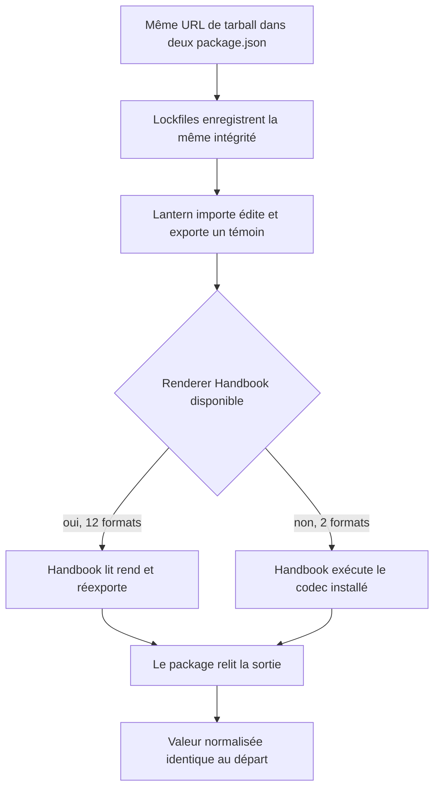
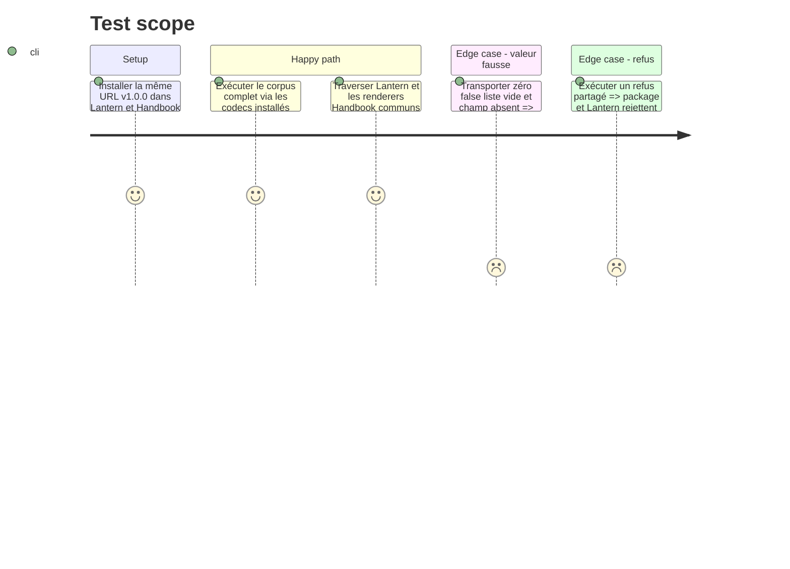

# Instruction: Épingler et éprouver le contrat dans les consommateurs

## Architecture projection

> Tree of the final files. ✅ create · ✏️ modify · ❌ delete

```txt
RebelliousSmile/lantern/
├── ✏️ package.json
├── ✏️ package-lock.json
├── ✅ src/contracts/mist-engine.ts
├── ✏️ src/templates/**/{definition,model,warnings,hooks}.ts
├── ❌ src/templates/{city-of-mist,legend-in-the-mist,otherscape}/**/schema.ts
├── ❌ src/templates/{city-of-mist,legend-in-the-mist,otherscape}/**/toml.ts
├── ✅ tools/assert-mist-contract.mjs
└── ✅ tools/assertMistContract.harness.mts

RebelliousSmile/obsidian-handbook/
├── ✏️ package.json
├── ✏️ package-lock.json
├── ✏️ src/features/{challenges,comDangers,comThemeCards,journeys,osChallenges,osCharacterCreation,osThemes,themeCards,themeKits}/schema.ts
├── ✏️ tools/assertCorpus.harness.mts
├── ❌ corpus/temoins/{com-,litm-,os-,theme-card}*.toml
└── ❌ corpus/refus/{com-,litm-,os-,theme-card}*.toml
```

## User Journey



## Test Scope



## Tasks to do

### `1)` Remplacer les copies Lantern

> Lantern garde ses écrans, mais ne possède plus les règles métier ni la sérialisation.

1. Ajouter la même URL immuable du tarball au manifeste et committer l'intégrité SRI résolue dans le lockfile.
2. Construire le registre d'adaptateurs de l'issue Lantern #2 autour des codecs qualifiés du package et des formulaires locaux, puis satisfaire la garde de préservation de Lantern #3.
3. Remplacer les imports de schémas, types et fonctions TOML dans les modèles, définitions et avertissements.
4. Faire conserver à chaque adaptateur la valeur canonique source et superposer uniquement les champs possédés par son formulaire, afin qu'un champ connu du contrat mais non édité par Lantern survive à l'export.
5. Supprimer les 14 copies `schema.ts` et `toml.ts` seulement après équivalence prouvée; conserver modèles de formulaire, projections et avertissements d'interface.
6. Exécuter directement le manifeste de corpus installé et vérifier import, édition, export et relecture canonique.

### `2)` Brancher Handbook sans perdre sa tolérance

> Handbook doit partager le contrat strict tout en continuant à dégrader les blocs fautifs.

1. Installer la même URL de release que Lantern et committer son intégrité SRI.
2. Ouvrir ou relier un suivi Handbook propre à l'intégration Mist, puisque l'issue générique #27 est déjà close, avant toute modification de ce dépôt.
3. Faire valider les sorties TOML par les codecs du package; conserver une projection d'entrée tolérante qui ignore seulement le champ fautif et n'invente aucune règle métier concurrente.
4. Adapter le harnais de corpus pour charger les 14 cibles depuis le package; appliquer aux 12 formats rendus l'attente Handbook `render`, `degraded` ou `null`, et aux deux autres uniquement la conformité du codec installé.
5. Retirer les copies Mist locales du corpus après bascule, sans toucher aux cas Adrenaline ou PbtA.
6. Garder les packs, styles, assets, renderers et capacités dans Handbook ou dans les manifests installables prévus; n'importer aucune logique depuis un pack.

### `3)` Fermer la boucle inter-dépôts

> La preuve finale doit traverser les outils réels, pas trois tests isolés.

1. Pour chaque cible, partir du témoin partagé et enregistrer la valeur normalisée du codec canonique dans les trois dépôts.
2. Faire `schema → Lantern → Handbook → schema` avec les adaptateurs et sérialiseurs réels pour les 12 formats communs, puis comparer la valeur finale à l'initiale.
3. Pour `city-of-mist/custom-move` et `city-of-mist/theme-kit`, faire `schema → Lantern → schema` et vérifier séparément que le codec installé dans Handbook accepte le même témoin.
4. Vérifier séparément les valeurs `0`, `false`, listes vides, clés citées et optionnels absents.
5. Exécuter les builds complets et suites existantes des trois dépôts avant de fermer schema-in-the-mist #10, Lantern #2 et Lantern #3.

## Test acceptance criteria

| Task | Acceptance criteria |
| --- | --- |
| 1 | Lantern ne contient plus de copie équivalente des 14 schémas ou codecs et ses formulaires utilisent le registre du package. |
| 1 | Tous les témoins du tarball sont importables, éditables et exportables par Lantern sans perte normalisée. |
| 1 | Un champ canonique non possédé par un formulaire Lantern ressort inchangé après l'édition d'un autre champ. |
| 2 | Handbook exécute les mêmes fichiers de corpus depuis le package, rejette au niveau canonique et dégrade au niveau rendu conformément à sa règle existante. |
| 2 | Les trois packs Mist restent installables et leurs validations, assets, styles et capacités restent inchangés. |
| 3 | Les deux lockfiles nomment exactement la même URL `v1.0.0` et conservent chacun l'intégrité SRI calculée par npm. |
| 3 | Le parcours `schema → Lantern → Handbook → schema` conserve la valeur normalisée des 12 formats communs; les deux autres passent par Lantern et par le codec installé dans Handbook, et les trois suites de dépôt sont vertes. |
