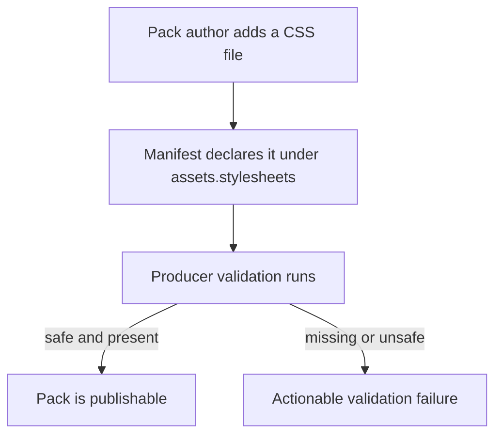
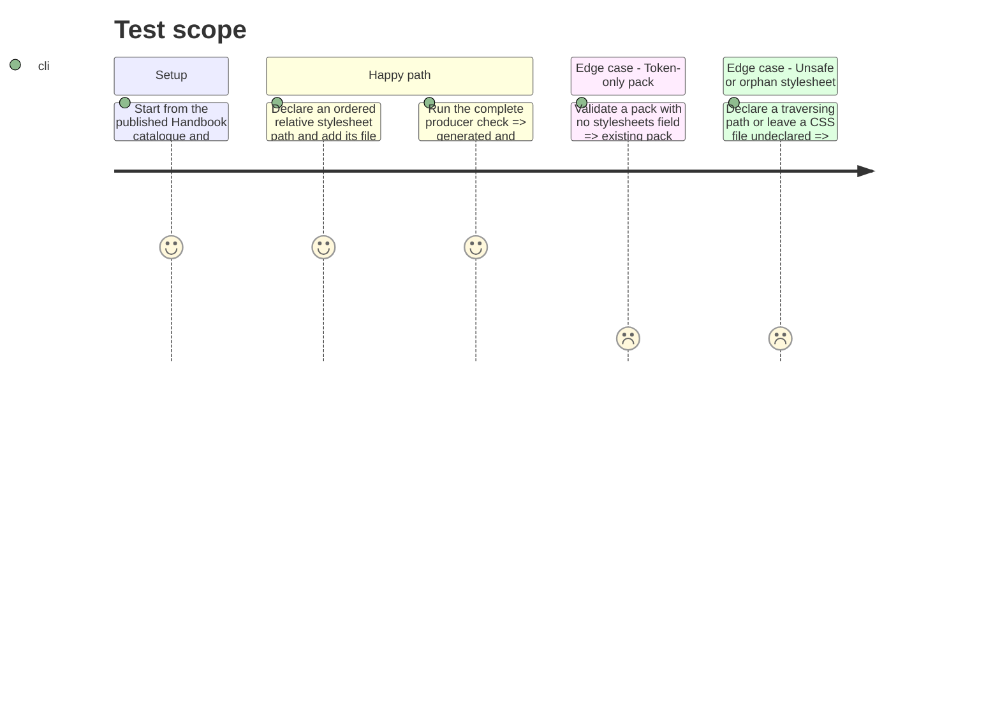

# Instruction: Declare and publish stylesheet resources

## Architecture projection

> Tree of the final files. ✅ create · ✏️ modify · ❌ delete

```txt
schema-in-the-mist/
├── ✏️ appearance/game-pack.schema.json            synchronized frozen compatibility copy
├── ✏️ schemas/appearance/game-pack.schema.json    synchronized frozen compatibility copy
├── ✏️ tools/validate-handbook-packs.ts             validates declared CSS paths and closure
└── ✏️ tools/validate-appearance-compat.ts          proves the copies accept a stylesheet declaration

Aucun fichier supprimé.
```

## User Journey



## Test Scope



## Tasks to do

### `1)` Verify the published canonical pack contract

> Make a stylesheet an explicit optional pack resource, rather than an untyped manifest extension.

1. Verify canonical commit `22367691ef8fb5890bf08cc8fcdc0f422eee66d3` remains the source of truth for `assets.stylesheets`: an ordered array of normalized forward-slash, non-empty relative paths.
2. Verify its contract preserves existing optional images and font forms, and accepts a manifest without stylesheets.

### `2)` Synchronize and validate the distributed Mist packs

> Keep the two explicitly frozen compatibility paths usable offline while making published resources closed and safe.

1. Keep both compatibility schemas content-identical to canonical commit `22367691ef8fb5890bf08cc8fcdc0f422eee66d3`; ignore only CRLF-versus-LF conversion performed by the local Git worktree.
2. Extend `tools/validate-appearance-compat.ts` with a valid stylesheet probe and an invalid unknown-field/path probe while retaining its self-contained and equality checks.
3. Extend `tools/validate-handbook-packs.ts` so stylesheets use the existing normalized safe-relative-path rules, must exist below `pack.assets.root`, count as declared assets, and participate in the no-orphan inventory.
4. Keep all published packs token-only in this phase; phase 3 introduces City of Mist's first non-empty declared resource after the consumer can load it.
5. Update Handbook-pack documentation to identify stylesheets as installable pack resources and their ownership boundary.

## Test acceptance criteria

| Task | Acceptance criteria |
| --- | --- |
| 1 | The published canonical schema accepts ordered normalized stylesheet paths and still accepts every existing token-only pack. |
| 1 | Empty, duplicate, malformed, or unsafe stylesheet declarations are rejected by the canonical contract or producer validation with a precise cause. |
| 2 | Both legacy schema copies have canonical-equivalent content after newline normalization, are self-contained, and accept the new declaration without external resolution. |
| 2 | `npm run check` accepts every published pack and fails if a declared stylesheet is missing, escapes the asset root, or is an undeclared delivered file. |
| 2 | All currently published packs remain valid without a `stylesheets` field; the validator is ready to reject missing, escaping, or orphan stylesheet resources when a pack begins declaring them. |
