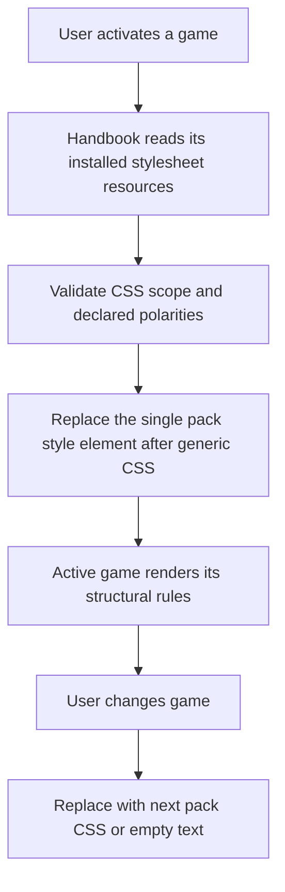
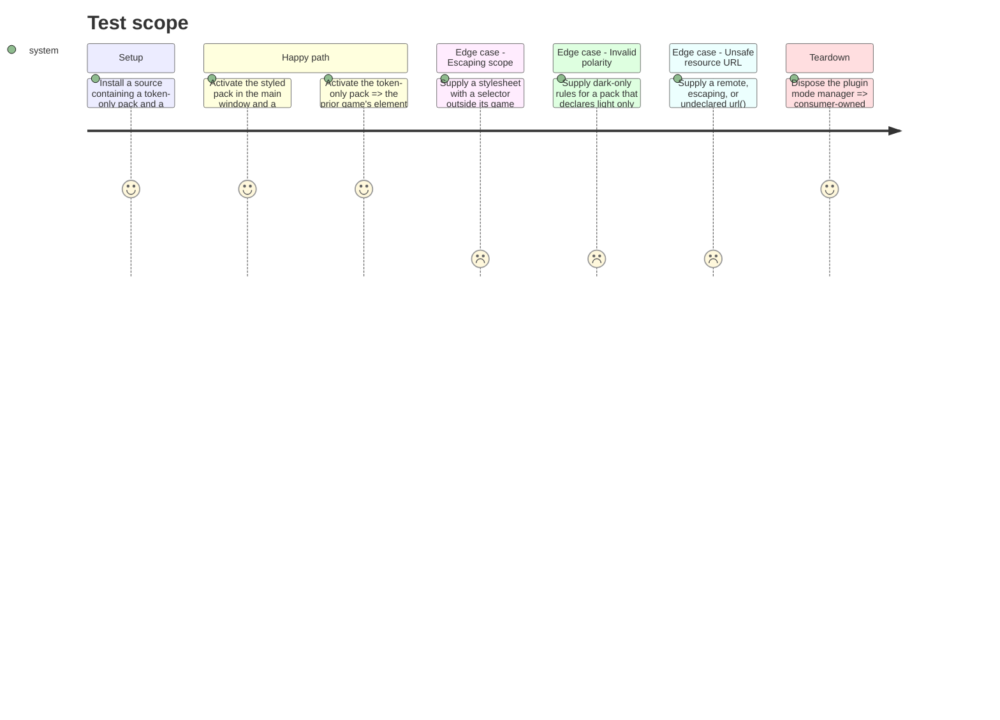

# Instruction: Install and activate the active pack stylesheet

> Prerequisite: execute this phase in a writable `obsidian-handbook` worktree. Use fixtures conforming to canonical commit `22367691ef8fb5890bf08cc8fcdc0f422eee66d3` and the `schema-in-the-mist` integration branch; a new schema-in-the-mist release is an output of this issue, never a prerequisite for this phase.

## Architecture projection

> Tree of the final files. ✅ create · ✏️ modify · ❌ delete

```txt
obsidian-handbook/
├── ✏️ package.json / package-lock.json       add the pinned CSS and selector parsers used for validation
├── ✏️ src/games/types.ts                    represent declared stylesheet resources
├── ✏️ src/games/fromSchema.ts               read stylesheet declarations tolerantly
├── ✏️ src/games/sourceInstaller.ts           stage declared CSS with the same safe limits as assets
├── ✏️ src/features/modes/styleElement.ts     validate, compose, and write pack CSS to every tracked document
├── ✏️ src/features/modes/*                   pass the active pack layer through game, variant, source, and shutdown lifecycle
├── ✏️ tools/assert-style-scope.mjs           cover pack resource and selector/polarity failures
└── ✏️ README.md                              document pack CSS scope and token use

Aucun fichier supprimé.
```

## User Journey



## Test Scope



## Tasks to do

### `1)` Carry stylesheet files through the installed-source boundary

> A manifest declaration must become a locally staged, bounded resource before any CSS is interpreted.

1. Record the Handbook revision and the canonical schema commit used for integration, then add `stylesheets` to its pack asset type and `fromSchema` projection, preserving empty defaults for absent fields.
2. Extend `sourceInstaller.ts` to resolve each stylesheet from the manifest directory plus asset root, apply existing safe-relative-path checks, resource-count constraints, and cumulative byte limits, then write it only beneath the installed pack root.
3. Validate MIME-independent text decoding, reject unreadable or oversized CSS, and make installation fail before promotion rather than leave a partly replaced source.
4. Add installer assertions covering ordered multiple resources, missing files, traversal attempts, and legacy manifests with only images/fonts.

### `2)` Enforce scope and manage the runtime layer

> CSS remains authored by the pack but executable authority stays with the consumer that owns the DOM.

1. Extend `GameStyleWriter`, rather than introduce a disconnected writer, with a distinct pack-CSS element that follows the compiled plugin stylesheet and its generated token element in every tracked main or detached document.
2. Add pinned `postcss` and `postcss-selector-parser` dependencies, then introduce a parser-backed stylesheet validator that recursively checks selectors in ordinary rules and grouping at-rules (`@media`, `@supports`, and equivalent): each must be rooted in the declaring `body.brumes--<game-id>` or documented local block scope. Reject global selectors and at-rules that create unscoped global side effects, including unnamespaced keyframes and imports. Never use regex as the CSS grammar.
3. Parse every `url(...)` reference. Reject data, protocol, protocol-relative, absolute, escaping, and undeclared paths; resolve a permitted relative path from the stylesheet directory under the pack asset root, require a matching declared image or font asset, and rewrite it through Obsidian's vault resource-path API before injecting the CSS.
4. Derive the pack's allowed light/dark compound selector forms from its declared polarities and reject a stylesheet that claims an unavailable polarity; do not restrict references to already-written pack custom properties such as `var(--color-accent)`.
5. Compose validated and URL-rewritten files in manifest order into the named pack-CSS element. Rebuild it when source installation, active game, or active variant changes; replace its text with the next pack's content or remove the element when absent so no previous rules survive.
6. Reuse `GameStyleWriter` document registration and teardown to update detached windows and remove both generated elements on plugin shutdown; surface a concise pack-and-file error instead of activating an invalid partial layer.

### `3)` Prove lifecycle, order, scope, and compatibility

> Lock the contract to observable browser/runtime behavior rather than a string convention.

1. Extend the existing style-scope harness to assert element order, ordered concatenation, recursive selector/at-rule scope, declared-polarity handling, main-and-detached-window synchronization, game switching cleanup, source reload, and disposal.
2. Test a token-only legacy pack through the same activation path and assert it writes no pack CSS while retaining its token layer.
3. Test invalid CSS, an out-of-scope selector, a bare/undeclared theme selector, and each unsafe `url(...)` form independently; each must leave the previous valid active layer untouched. Assert that an allowed declared asset becomes the expected vault resource URL in injected CSS.
4. Build, lint, and run the focused Handbook assertions plus the existing style reload/scope checks.

## Test acceptance criteria

| Task | Acceptance criteria |
| --- | --- |
| 1 | Every declared stylesheet is staged only from a safe installed source path, in declaration order, and a source with no stylesheets installs as it did before. |
| 1 | A missing, escaping, unreadable, or over-limit stylesheet aborts installation before source promotion. |
| 2 | Active pack CSS is inserted after generic CSS and generated tokens in every tracked document, may use the pack's existing custom-property tokens, and is restricted to the declaring game class. |
| 2 | Rules targeting a polarity absent from the declaring pack, a bare global theme selector, another game's class, a global import, or unnamespaced keyframes never become active. |
| 2 | Malformed CSS and selector syntax are rejected by the pinned parser before any style element changes. |
| 2 | A stylesheet can reference only a declared image or font under its pack root; permitted URLs are rewritten for the vault and no network, data, absolute, escaping, or undeclared URL is injected. |
| 2 | Changing game, variant, source, detached window, or shutdown removes all prior pack stylesheet rules deterministically. |
| 3 | Automated assertions demonstrate ordering, scope, lifecycle cleanup, negative validation paths, and unchanged token-only behavior. |
