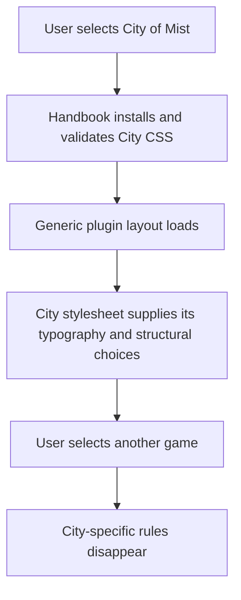
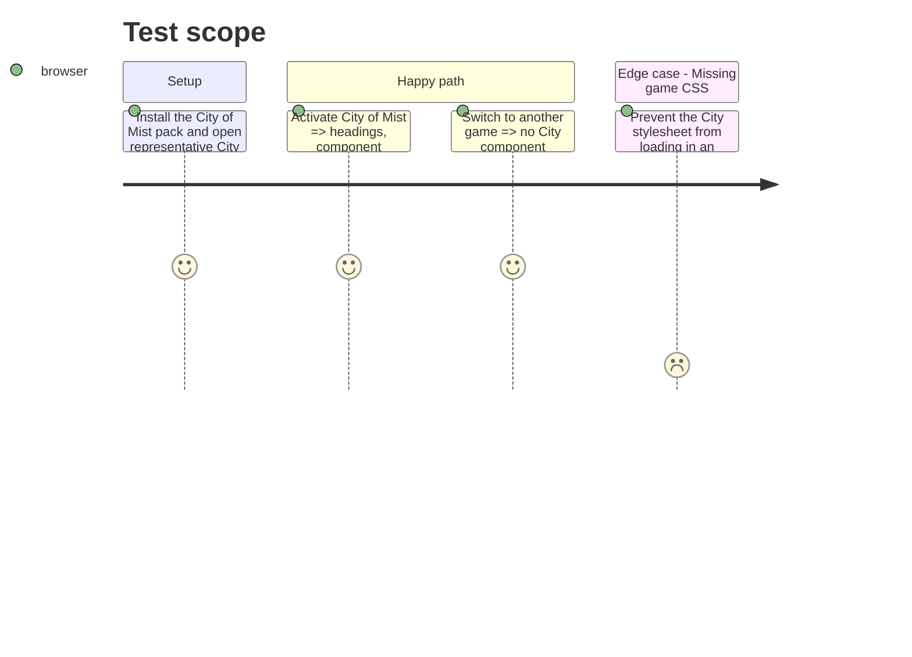

# Instruction: Move City of Mist structural typography into its pack

> Completed against the phase-2 Handbook implementation. This phase publishes the City resource as `schema-in-the-mist@v1.2.0`; it did not wait for a City release to exist.

## Architecture projection

> Tree of the final files. ✅ create · ✏️ modify · ❌ delete

```txt
schema-in-the-mist/
├── ✏️ handbook/city-of-mist/pack.json                        declares the first shipped game stylesheet
└── ✅ handbook/city-of-mist/assets/styles/city-of-mist.css  owns City-specific structural and typography rules

obsidian-handbook/
└── ✏️ src/styles/city-of-mist/*                             retains only shared geometry and consumer safety rules

Aucun fichier supprimé.
```

## User Journey



## Test Scope



## Tasks to do

### `1)` Classify and extract City-owned rules

> Move only authored game presentation; preserve host-wide layout, accessibility, and failure-safe rules in Handbook.

1. Inventory `src/styles/city-of-mist/` by selector and classify each rule as City-specific typography/structure, generic layout, accessibility/safety, or shared component geometry.
2. Create and declare `handbook/city-of-mist/assets/styles/city-of-mist.css` after the consumer contract is available, then move City-specific component typography and structural choices into it, scoped to `body.brumes--city-of-mist` and using pack tokens where values already exist.
3. Keep generic selectors, resets, fallback rendering, editor compatibility, and reusable geometry in Handbook; do not make the CSS resource a second block-layout engine.
4. Remove only the migrated duplicate rules from consumer SCSS and retain an explicit comment or test boundary for rules intentionally owned by the consumer.

### `2)` Verify visual and cross-game isolation

> The move changes ownership, not City of Mist's established presentation.

1. Capture focused before/after browser fixtures for City headings and each migrated component in each declared polarity.
2. Compare the City rendering after the external layer activates to the pre-migration baseline, allowing only documented intentional corrections.
3. Switch City → each other installed game and assert that no City selector or font metric persists; then switch back and assert deterministic restoration.
4. Run the repository producer check and Handbook's focused style/install/browser assertions, recording the exact consumer and pack revisions used for the integration proof.

## Test acceptance criteria

| Task | Acceptance criteria |
| --- | --- |
| 1 | City-specific typography and structural rules live in the declared City stylesheet, while generic layout, safety, and reusable geometry remain consumer-owned. |
| 1 | Every moved selector is rooted in `.brumes--city-of-mist` and uses declared light/dark token behavior where applicable. |
| 2 | Representative City blocks preserve their approved rendering after installation of the pack stylesheet. |
| 2 | Switching away from City removes its visual rules completely, and unavailable/invalid City CSS fails safely without breaking generic layout. |
| 2 | Producer and consumer validation suites pass against the recorded compatible revisions. |
