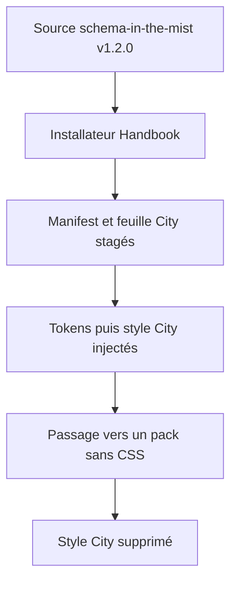
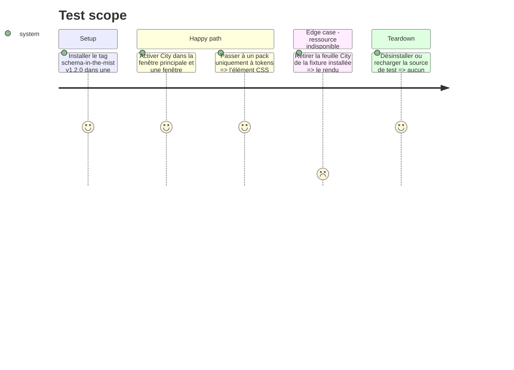

# Instruction: Verrouiller la preuve de la release City

## Architecture projection

> Tree of the final files. ✅ create · ✏️ modify · ❌ delete

```txt
obsidian-handbook/
├── ✏️ tools/sourceInstaller.harness.mts       vérifie le staging de la feuille City déclarée
├── ✏️ tools/assertStyleScope.harness.mts      prouve l’ordre du style de pack et son nettoyage
├── ✏️ tools/e2e/request-url-journey.sh        ajoute le tag v1.2.0 et sa ressource CSS aux contrôles v1.0.0 existants
└── ✏️ tools/e2e/README.md                     documente la révision et les preuves attendues
```

## User Journey



## Test Scope



## Tasks to do

### `1)` Faire couvrir la première feuille réellement expédiée

> La fixture doit devenir une preuve du produit livré, non une approximation du format.

1. Étendre le harnais d’installateur avec le manifest City v1.2.0 et vérifier que `styles/city-of-mist.css` est promu uniquement sous le pack installé.
2. Étendre le harnais de styles pour vérifier l’ordre après l’élément de tokens, la synchronisation des documents et la suppression lors d’un pack sans `stylesheets`.
3. Étendre, sans remplacer le contrôle v1.0.0 existant, le parcours requestUrl avec l’installation du tag v1.2.0, la ressource City déclarée et son absence contrôlée.
4. Mettre à jour la documentation E2E avec la révision, les fichiers attendus et les commandes de preuve.

## Test acceptance criteria

| Task | Acceptance criteria |
| --- | --- |
| 1 | Le tag v1.2.0 installe la feuille City déclarée à l’emplacement de pack attendu et aucune autre ressource n’est obtenue hors déclaration. |
| 1 | Dans chaque document suivi, le style City suit les tokens ; passer à un pack sans CSS le retire complètement. |
| 1 | Une feuille absente ou invalide ne laisse jamais de règle City partielle et le rendu générique reste lisible. |
