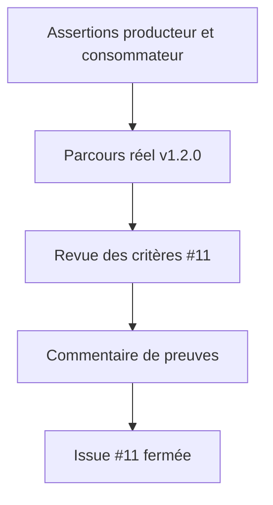

# Instruction: Vérifier les livrables et clôturer l’issue

## Architecture projection

> Tree of the final files. ✅ create · ✏️ modify · ❌ delete

```txt
schema-in-the-mist/
└── ✏️ aidd_docs/tasks/2026_09/2026_09_15_issue_11_release_closeout/*  enregistre les révisions et preuves finales
```

## User Journey



## Test Scope

```mermaid
---
title: Test scope
---
journey
  section Setup
    Installer les dépendances verrouillées dans les deux worktrees => validateurs producteur et consommateur exécutables: 5: cli
  section Happy path
    Exécuter les assertions de pack, d’installation, d’isolation et le parcours v1.2.0 => tous les critères #11 sont démontrés: 5: cli
    Vérifier City clair et sombre puis City vers un pack sans feuille => aucune règle City ne persiste hors de son pack: 5: browser
  section Edge case - preuve incomplète
    Une assertion ou un parcours échoue => l’issue reste ouverte avec le résultat reproductible: 1: cli
```

## Tasks to do

### `1)` Établir le dossier de preuve final

> Une issue terminée est vérifiée depuis les artefacts publiés, pas déduite de son historique Git.

1. Restaurer les dépendances verrouillées du producteur avec `npm ci` si `tsx` n’est pas disponible, sans modifier les lockfiles.
2. Exécuter les validateurs de packs et compatibilité dans schema-in-the-mist, puis les harnais Handbook de staging, portée, City et le parcours requestUrl mis à jour.
3. Réaliser la vérification browser des deux polarités City et de la transition vers un pack sans feuille ; enregistrer les révisions Handbook et v1.2.0 utilisées.
4. Comparer chaque critère de #11 à une preuve nommée ; publier ce résumé dans l’issue puis la fermer seulement si aucun écart ne subsiste.

## Test acceptance criteria

| Task | Acceptance criteria |
| --- | --- |
| 1 | Les validations producteur et consommateur s’exécutent avec leurs dépendances verrouillées, sans modifier les artefacts versionnés. |
| 1 | Chaque critère de #11 possède une preuve exécutable ou observée contre v1.2.0 et Handbook. |
| 1 | L’issue est fermée seulement après publication du résumé de preuves ; un échec conserve l’issue ouverte et documente sa reproduction. |
