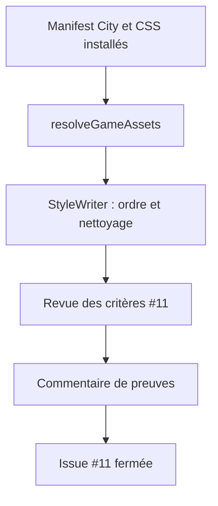
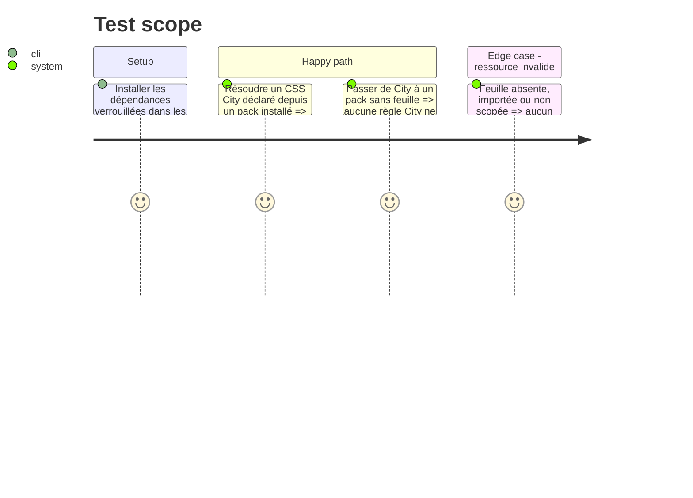

# Instruction: Prouver le runtime portable et clôturer l’issue

## Architecture projection

> Tree of the final files. ✅ create · ✏️ modify · ❌ delete

```txt
schema-in-the-mist/
└── ✏️ aidd_docs/tasks/2026_09/2026_09_15_issue_11_release_closeout/*  enregistre les révisions et preuves finales

obsidian-handbook/
└── ✏️ tools/customPacks.harness.mts  résout une feuille City installée, refuse une feuille hors portée et conserve le rendu générique
```

## User Journey



## Test Scope



## Tasks to do

### `1)` Compléter la chaîne runtime sans dépendance à un navigateur Linux

> Les critères de l’issue portent sur les ressources, leur résolution et leur cycle de vie ; le navigateur AppImage reste une sonde complémentaire, pas un prérequis de livraison.

1. Étendre `tools/customPacks.harness.mts` avec un pack City versionné dont `assets.stylesheets` référence le CSS déjà installé ; vérifier que `resolveGameAssets` lit ce fichier, renvoie exactement son CSS et conserve les autres ressources déclarées.
2. Couvrir les échecs atomiques : feuille manquante, `@import` et sélecteur non préfixé doivent produire un `packCss` vide, sans règle partielle hors du pack.
3. Exécuter les validateurs producteur et les harnais Handbook de staging, résolution, portée, thème City et build avec leurs dépendances verrouillées ; conserver `e2e:request-url` comme contrôle opt-in documenté, non bloquant.
4. Comparer chaque critère de #11 à une preuve nommée ; publier ce résumé dans l’issue puis la fermer seulement si aucun écart ne subsiste.

## Test acceptance criteria

| Task | Acceptance criteria |
| --- | --- |
| 1 | Un pack City installé résout sa feuille déclarée à travers `resolveGameAssets`; les feuilles absentes, importées ou non scopées échouent atomiquement. |
| 1 | Les validations producteur et consommateur s’exécutent avec leurs dépendances verrouillées, sans modifier les artefacts versionnés ni exiger un AppImage ou un vault Linux. |
| 1 | Chaque critère de #11 possède une preuve exécutable contre v1.2.0 et Handbook. |
| 1 | L’issue est fermée seulement après publication du résumé de preuves ; un échec conserve l’issue ouverte et documente sa reproduction. |
