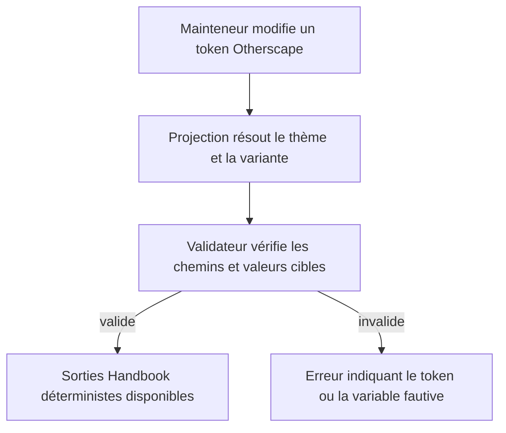
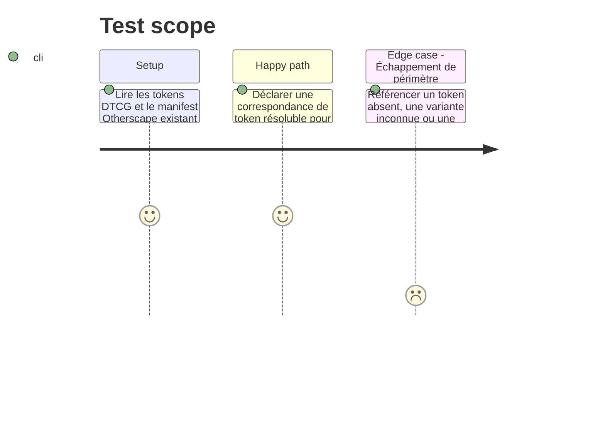

# Instruction: Stabiliser la source et le contrat de projection Otherscape

## Architecture projection

> Tree of the final files. ✅ create · ✏️ modify · ❌ delete

```txt
schema-in-the-mist/
├── ✏️ schemas/otherscape/design/tokens.json              source DTCG Otherscape revue et prête à être projetée
├── ✏️ schemas/otherscape/design/design-system.md         provenance, choix de variantes et limites de la projection Handbook
├── ✅ schemas/otherscape/design/components.json           manifeste de composants produit au figeage du design
├── ✅ schemas/otherscape/design/policies.json             politiques et sortie de génération déclarées au figeage
├── ✅ schemas/otherscape/design/release.json              version et contrôles de contraste du contrat figé
├── ✅ schemas/otherscape/design/handbook-projection.json correspondance versionnée tokens DTCG → variables/variantes Handbook
├── ✅ tools/build-otherscape-handbook-design.ts           résout aliases/thèmes et construit les sorties attendues en mémoire ou sur demande
└── ✅ tools/validate-otherscape-design.ts                 valide le schéma de projection, les aliases et les invariants de périmètre
```

## User Journey



## Test Scope



## Tasks to do

### `1)` Réconcilier le brouillon avec le pack déjà publié

> Éliminer les contradictions avant de faire du brouillon une source de rendu.

1. Établir une matrice d’évidence : `page.jpg`, `chapter-title.jpg`, `light-chapo.jpg` et `description.jpg` pour `metro/light` ; `dark.jpg` et `dark-chapo.jpg` pour `metro/dark`. Relever séparément fonds, surfaces, texte, titres, cartouches, filets, textures et hiérarchie.
2. Comparer ces deux jeux de valeurs, les familles et la géométrie de `schemas/otherscape/design/tokens.json` avec la seule variante `metro` de `handbook/otherscape/pack.json`.
3. Documenter `metro` comme l’unique cible de la migration ; conserver `cairo` et `tokyo` structurellement inchangées et hors de la table de projection. Ne pas dériver le sombre par inversion du clair.
4. Appliquer les corrections validées au brouillon et consigner ce qui reste délibérément distinct entre `metro/light` et `metro/dark` (tokens éditoriaux sans équivalent Handbook, textures et effets réservés à une feuille CSS).
5. Traiter les recommandations bloquantes de `schemas/otherscape/design/critique/2026_09_15-design-system.md` : cartographie des appariements, grille de lecture et stratégie des éléments décoratifs par mode.
6. Une fois ces choix clos, invoquer `design:adjust` sur `schemas/otherscape/design/` afin de promouvoir le brouillon en contrat versionné avant que la projection ne puisse devenir une sortie distribuée. Si le figeage révèle un écart, revenir aux étapes 1 à 5 ; ne jamais contourner ses gates.

### `2)` Définir une projection versionnée, limitée au pack

> Rendre explicite la traduction entre le vocabulaire DTCG et les variables que Handbook connaît déjà.

1. Créer `handbook-projection.json` avec une version, les variantes/polarités supportées et des chemins de token comme seules sources de couleur, typo et géométrie.
2. Mapper exclusivement vers les variables déjà acceptées par `appearance/game-pack.schema.json` (zones `note` et `workspace`) ou vers des propriétés CSS explicitement consommées par la future feuille Otherscape ; interdire toute clé de pack étrangère.
3. Définir les règles de priorité `base → metro/light|metro/dark`, avec deux branches explicites issues de leurs maquettes, et la représentation des valeurs qui n’ont pas d’équivalent direct (grille, texture, séparateur). Interdire une branche sombre vide, un fallback implicite vers le clair et toute inversion calculée de couleurs.
4. Préserver l’autonomie : aucun chemin de projection ne peut pointer vers City of Mist, Legend in the Mist, `schemas/appearance/` ou les copies `schemas/v1/`.

### `3)` Fournir le résolveur et son validateur de source

> Garantir qu’une évolution de tokens ne produit pas silencieusement un pack incohérent.

1. Ajouter un outil TypeScript sans dépendance runtime supplémentaire pour lire le DTCG, résoudre les aliases et overlays de thème, charger la table et produire une représentation stable des seules branches `metro.style.light` / `metro.style.dark` et des variables CSS de feuille.
2. Ajouter un validateur dédié qui vérifie JSON, version de projection, chemins DTCG, aliases cycliques, thèmes, variantes, noms de variables CSS et absence de sortie hors Otherscape.
3. Prévoir une interface `--check` et une interface d’émission distinctes : la première n’écrit rien et compare structurellement les deux branches Metro et la feuille ; la seconde sera utilisée par la phase 2 pour actualiser ces seules sorties publiées sans reformater ni modifier les branches hors scope.

## Test acceptance criteria

| Task | Acceptance criteria |
| --- | --- |
| 1 | Les preuves clair/sombre sont nommées par fichier, et `metro` est l’unique variante reliée au nouveau design ; `cairo` et `tokyo` restent explicitement hors migration. |
| 1 | Les décisions de palette, police, décor et contraste clair/sombre ne contredisent plus silencieusement la source DTCG et le manifest existant ; le design est promu par `design:adjust`, non plus laissé au statut brouillon. |
| 2 | Toute valeur projetée vient d’un chemin DTCG résoluble et cible exclusivement `metro/light` ou `metro/dark`, avec un jeu explicite de fonds et d’avant-plans par mode. |
| 2 | Aucun fichier, token ou mapping de City of Mist ou Legend in the Mist n’est lu ni modifié. |
| 3 | Le validateur rejette un alias cassé, un cycle, une variable CSS invalide, un thème ou une variante inconnus, avec une erreur localisable. |
