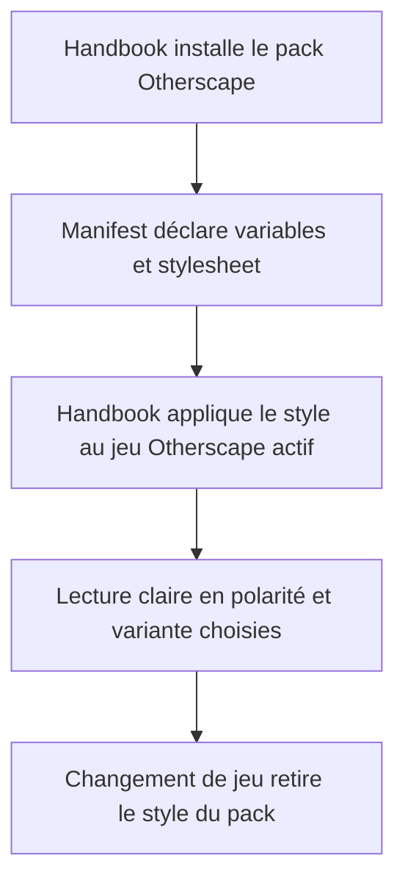
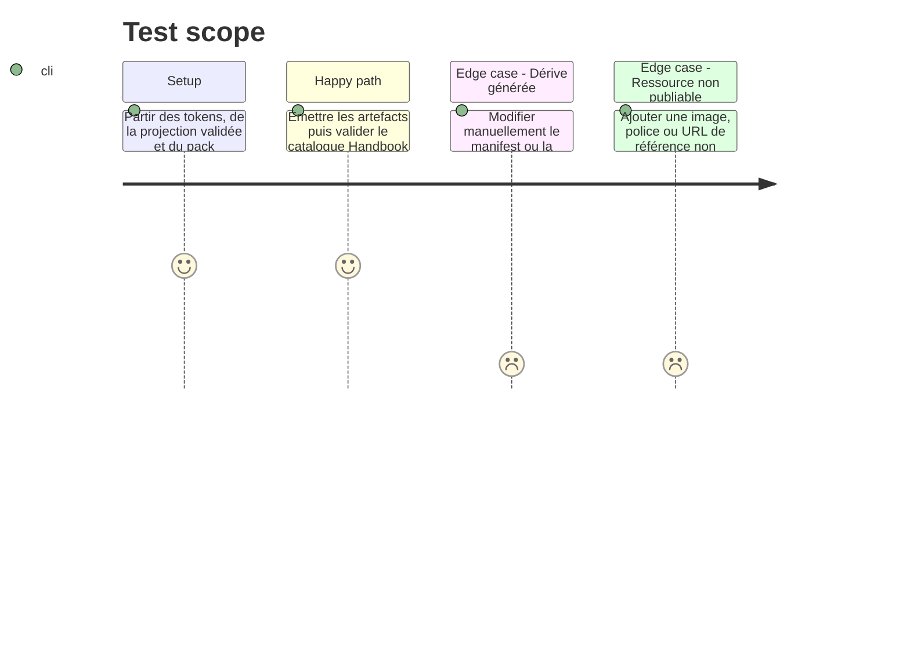

# Instruction: Émettre le style Handbook et raccorder le pack

## Architecture projection

> Tree of the final files. ✅ create · ✏️ modify · ❌ delete

```txt
schema-in-the-mist/
├── ✏️ handbook.json                                      catalogue : version du pack Otherscape synchronisée
├── ✏️ handbook/README.md                                 inventaire et statut de la feuille Otherscape
├── ✏️ handbook/otherscape/pack.json                      variables générées et déclaration explicite de stylesheet
└── ✅ handbook/otherscape/assets/styles/otherscape.css   feuille de structure Otherscape générée, scoped au jeu
```

## User Journey



## Test Scope



## Tasks to do

### `1)` Générer les sorties propres à Handbook

> Traduire une source isolée en données que le consommateur sait déjà installer.

1. Faire émettre les overrides `metro.style.light` et `metro.style.dark` à partir de la projection, avec deux jeux complets de surfaces, textes, titres, cartouches et décorations ; effectuer une fusion limitée à ces branches et vérifier structurellement que `cairo`, `tokyo` et les variables hors scope conservent la même valeur.
2. Générer `assets/styles/otherscape.css` avec les seuls sélecteurs autorisés par le lifecycle Handbook, une structure éditoriale de lecture et deux couches de polarité explicites pour `metro`. La couche claire reprend le papier et les repères froids observés ; la couche sombre reprend le fond nocturne, la grille et les contrastes observés, avec un fallback lisible sans texture ni animation.
3. Réserver les effets de grille, scan et glitch à des pseudo-éléments décoratifs ; protéger `prefers-reduced-motion`, ne pas placer de texte essentiel dans un effet et ne pas faire dépendre l’interaction de la couleur.
4. Ne copier aucune image, illustration, logo ou police depuis les captures de référence ; déclarer seulement les fichiers réellement distribués et dont la provenance est acceptée.

### `2)` Mettre à jour le manifest et le catalogue sans casser les packs voisins

> Publier la feuille comme une ressource de pack, pas comme une feuille globale.

1. Ajouter la feuille générée à `pack.assets.stylesheets`, dans l’ordre où Handbook doit l’appliquer après ses styles communs et tokens.
2. Bumper de façon cohérente `handbook/otherscape/pack.json` et son entrée `handbook.json` pour refléter le changement additif de présentation ; conserver les identifiants, capacités et chemins existants.
3. Ajuster `minimumHandbookVersion` seulement si la version effectivement ciblée ne sait pas consommer les stylesheets déjà supportées par le contrat publié ; ne pas déduire une exigence sans preuve.
4. Mettre à jour l’inventaire `handbook/README.md` avec le stylesheet, ses droits et la distinction entre CSS distribué et références non redistribuées.

### `3)` Vérifier le rendu publiable au périmètre producteur

> Prouver que les données et ressources distribuées sont fermées et cohérentes.

1. Exécuter l’émission puis les validateurs de projection et de pack ; vérifier qu’un second passage ne change aucun fichier.
2. Étendre les assertions producteur si nécessaire afin qu’une feuille Otherscape déclarée soit présente, ne s’échappe pas de la racine d’assets et qu’aucun asset orphelin n’existe.
3. Réserver une vérification d’intégration dans un worktree Handbook réel pour le scope extérieur : activation Otherscape uniquement, ordre de cascade, nettoyage lors du changement de jeu et rendu des variants. Ne pas réimplémenter Handbook dans ce dépôt.

## Test acceptance criteria

| Task | Acceptance criteria |
| --- | --- |
| 1 | Les valeurs visuelles `metro/light` et `metro/dark` sont résolues à partir de la table de projection, ont chacune fonds, surfaces, avant-plans et accents explicites, et restent lisibles quand les décorations et animations sont désactivées. |
| 1 | Le pack ne contient aucune capture de référence ni ressource tierce non accompagnée d’une décision explicite de redistribution. |
| 2 | Le catalogue et le manifest déclarent la même version Otherscape, le stylesheet existe sous la racine d’assets, `cairo` et `tokyo` restent structurellement inchangées, et City of Mist/Legend in the Mist restent inchangés. |
| 3 | Une génération suivie d’un contrôle ne produit aucun diff ; une modification manuelle de sortie est détectée. |
| 3 | `validate:handbook-packs` accepte le pack complet et rejette une stylesheet manquante, échappante ou orpheline. |
