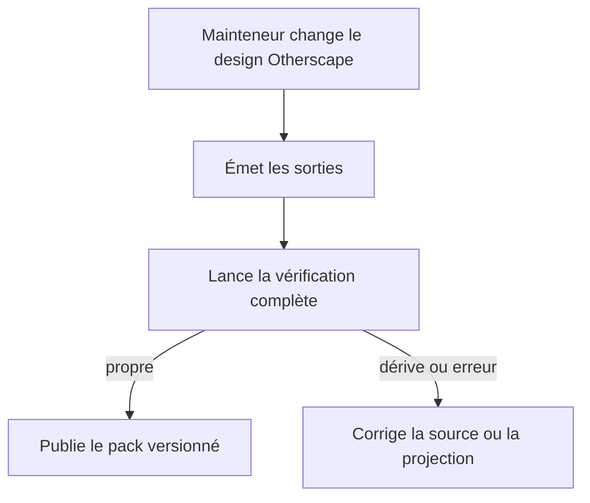
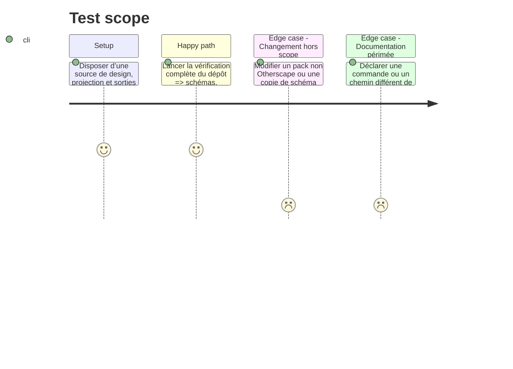

# Instruction: Verrouiller la dérive et documenter la distribution

## Architecture projection

> Tree of the final files. ✅ create · ✏️ modify · ❌ delete

```txt
schema-in-the-mist/
├── ✏️ package.json                              scripts d’émission et de contrôle intégrés à la vérification complète
├── ✏️ tools/validate-handbook-packs.ts          réutilise la preuve de projection sans doubler le contrat de pack
├── ✏️ README.md                                 séparation : schémas de contenu, contrat d’apparence externe et design source Otherscape
├── ✏️ CHANGELOG.md                              publication du changement de pack et de son design source
└── ✅ docs/otherscape-handbook-design.md        guide mainteneur : modifier, générer, valider et distinguer source/rendu/références
```

## User Journey



## Test Scope



## Tasks to do

### `1)` Brancher la reproductibilité dans les commandes du dépôt

> Faire de la synchronisation une propriété vérifiée, pas une discipline manuelle.

1. Ajouter des scripts npm dédiés à l’émission et au contrôle Otherscape, puis raccorder le contrôle sans écriture à `npm run check` dans un ordre où les artefacts Metro existent avant leur validation.
2. Réutiliser `tools/validate-handbook-packs.ts` pour la fermeture des ressources et conserver la validation de projection séparée : les responsabilités restent source/résolveur/manifest distinctes.
3. S’assurer que la commande habituelle Windows documentée reste `npm`/`npm.cmd`, sans introduire `pnpm-lock.yaml` ni dépendance non nécessaire.

### `2)` Documenter les limites du contrat et la procédure de changement

> Éviter qu’un mainteneur confonde source de design, contrat d’apparence et données de jeu.

1. Ajouter un guide expliquant les trois couches : contrat DTCG Otherscape figé par `design:adjust`, projection spécifique vers Handbook, et `game-pack` externe/copies de compatibilité.
2. Décrire le workflow : associer toute modification aux maquettes `metro/light` ou `metro/dark` concernées, modifier la source, traiter la critique et les contrastes pour chaque polarité, exécuter l’émission, vérifier le diff, lancer les validateurs puis tester dans Handbook réel.
3. Documenter la règle de provenance : références visuelles comme preuve de direction, CSS propre publiable, assets externes soumis à une autorisation et à une déclaration de manifest.
4. Mettre à jour README et changelog avec des liens précis vers le pack et sa source de design sans présenter ce sous-système comme un schéma de contenu réutilisable par les autres jeux.

### `3)` Préparer la publication et la preuve consommateur

> Distinguer ce que le producteur peut garantir de ce que seul Handbook peut prouver.

1. Déterminer si le changement de manifest et de stylesheet requiert une release de pack/documentation ou une release de package selon la politique de version effective ; ne pas modifier les IDs immuables `schemas/v1/**` si les schémas de contenu ne changent pas.
2. Exécuter le contrôle complet, les vérifications de version qui s’appliquent réellement et l’outil de préparation de release seulement si une release de package est décidée.
3. Dans le worktree Handbook autorisé, effectuer le test d’intégration ciblé : installer la source publiée, sélectionner Otherscape, basculer light/dark et variantes, puis vérifier suppression du CSS au changement de jeu.

## Test acceptance criteria

| Task | Acceptance criteria |
| --- | --- |
| 1 | `npm run check` détecte un token/projection/manifest/stylesheet Otherscape désynchronisé sans modifier le worktree. |
| 1 | Les validateurs existants des packs continuent de valider les trois jeux sans dépendance à un design partagé. |
| 2 | Un mainteneur peut identifier la source canonique, les sorties générées, les commandes exactes et les limites de redistribution sans consulter les captures externes. |
| 3 | Le changement de version est justifié par la surface publiée ; aucun schéma de contenu ou ID versionné n’est modifié sans nécessité. |
| 3 | Le consommateur Handbook réel confirme l’activation et le nettoyage du style Otherscape, ainsi que les rendus `metro/light` et `metro/dark` distincts, ce que le validateur producteur ne prétend pas prouver. |
