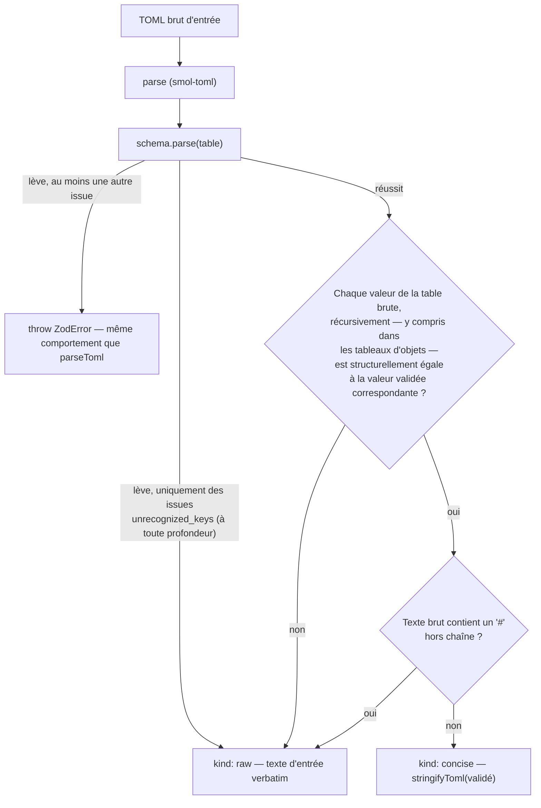

<!-- Fill or omit these sections; never add, rename, or reorder one. -->

# Instruction: Codec de conversion concise/brut

## Architecture projection

> Tree of the final files. ✅ create · ✏️ modify · ❌ delete

```txt
.
├── src/
│   ├── codecs/
│   │   ├── json.ts
│   │   ├── toml.ts
│   │   └── source.ts                 ✅ create — type MistSourceConversion + createSourceConversionCodec
│   ├── index.ts                      ✏️ modify — construit et exporte les 6 codecs de conversion + MIST_SOURCE_CONVERSION_CODECS
│   └── zod/
│       └── constants.ts              ✏️ modify — registre explicite des 6 cibles (MIST_SOURCE_CONVERSION_TARGETS)
```

## User Journey



## Tasks to do

### `1)` Type et algorithme de conversion

> Prouver la perte plutôt que la supposer, dans un module générique sur le schéma.

1. Dans `src/codecs/source.ts`, définir `export type MistSourceConversion = { readonly kind: "concise"; readonly source: string } | { readonly kind: "raw"; readonly source: string }`.
2. Écrire un comparateur structurel unidirectionnel `isLosslessSubset(raw: unknown, validated: unknown): boolean`, **récursif à chaque niveau d'imbrication**, dont le rôle est de détecter une divergence de **valeur** introduite par une transformation du schéma (`.trim()`, coercion) une fois `schema.parse()` réussi — la perte par clé inconnue est traitée en amont (voir point 4), pas ici. Pour un objet/table, chaque clé de `raw` doit exister dans `validated`, et sa valeur être elle-même `isLosslessSubset`-vraie contre la valeur correspondante côté `validated` (une clé supplémentaire côté `validated`, issue d'un `.default()`, n'est pas un échec) ; pour un tableau, même longueur puis même appel récursif élément par élément — **cette récursion doit s'appliquer aussi aux éléments-objets d'un tableau** (ex. un `.trim()` appliqué au `description` d'un élément de `threats[]` ou `vignettes[]` doit être détecté exactement comme à la racine) ; pour une primitive, égalité stricte. Aucune des six cibles ne porte de champ date/datetime (vérifié : aucune occurrence de `TomlDate`/`z.date()` dans `src/zod`) — pas de cas particulier à prévoir pour `TomlDate`.
3. Écrire un scanner `containsComment(source: string): boolean` : parcourir le texte caractère par caractère en suivant l'état chaîne TOML (aucune, basic `"..."`, literal `'...'`, basic multiligne `"""…"""`, literal multiligne `'''…'''`), avec gestion de l'échappement `\"` à l'intérieur des chaînes basic et basic multiligne (une guillemet échappée ne referme pas la chaîne — les chaînes literal n'ont pas d'échappement) ; un `#` rencontré hors chaîne est un commentaire. Se référer à la grammaire des commentaires et des chaînes TOML 1.0.0 (voir Resources du plan).
4. Écrire `createSourceConversionCodec<Schema extends z.ZodType>(schema: Schema)` retournant `{ readonly schema: Schema; convertToSource(rawToml: string): MistSourceConversion }`. `convertToSource` : parse le texte avec `parse` de `smol-toml`, appelle `schema.parse(table)` dans un `try/catch`. Si l'appel lève une `ZodError` dont **toutes** les issues portent `code: "unrecognized_keys"` (à n'importe quelle profondeur — vérifié via `error.issues.every(...)`), renvoyer `kind: "raw"` avec le texte d'entrée verbatim, sans relancer. Si l'appel lève pour toute autre raison (au moins une issue d'un autre type), relancer l'erreur telle quelle (même comportement que `parseToml` sur un document réellement invalide). Si le parse réussit, renvoyer `kind: "raw"` si `containsComment(rawToml)` ou si `!isLosslessSubset(table, JSON.parse(JSON.stringify(validated)))`, sinon `kind: "concise"` avec `stringifyToml(validated)`.

### `2)` Registre des six cibles et exports publics

> Rendre le périmètre explicite, pas une activation silencieuse des 14 cibles existantes.

1. Dans `src/zod/constants.ts`, ajouter une constante exportée `MIST_SOURCE_CONVERSION_TARGETS` listant exactement les six clés de l'issue (`legend-in-the-mist/story-theme`, `legend-in-the-mist/challenge`, `legend-in-the-mist/journey`, `legend-in-the-mist/theme-kit`, `city-of-mist/theme-card`, `city-of-mist/danger`), typée comme sous-ensemble de `MistEngineDocumentTarget`.
2. Dans `src/index.ts`, importer `createSourceConversionCodec`, construire une instance par cible du registre en réutilisant les schémas déjà importés (mêmes imports que pour `MIST_ENGINE_CODECS`), exporter chaque instance nommée et un objet `MIST_SOURCE_CONVERSION_CODECS` clé/valeur (même forme que `MIST_ENGINE_CODECS`), ainsi que le type `MistSourceConversion` et `createSourceConversionCodec`.

### `3)` Build

1. `npm run build` passe sans erreur TypeScript.

## Test acceptance criteria

<!-- Each criterion is an observable behavior, not a command. -->

| Task | Acceptance criteria |
| ---- | -------------------- |
| 1... | Pour une des six cibles, `convertToSource` sur un TOML valide sans clé inconnue ni commentaire renvoie `{ kind: "concise" }` dont `source`, re-parsé par `schema.parse(parse(source))`, est structurellement égal à la valeur validée d'origine. |
| 1... | Le même document avec une clé inconnue en plus, ou avec un `#` de commentaire ajouté sur une ligne (hors chaîne), renvoie `{ kind: "raw" }` avec `source` strictement identique (`===`) au texte d'entrée — y compris quand la clé inconnue fait lever `schema.parse()` en interne (`ZodError` à issues uniquement `unrecognized_keys`), interceptée et convertie en `raw` plutôt que propagée. |
| 1... | Une clé inconnue ajoutée dans un élément d'un tableau imbriqué (ex. un élément de `threats[]` ou `vignettes[]`, selon la cible) — pas seulement à la racine ou dans `meta` — déclenche elle aussi `{ kind: "raw" }`, via la même interception `unrecognized_keys` (le chemin de l'issue Zod pointe dans le tableau, ex. `["threats", 0]`). |
| 1... | Un document dont `schema.parse()` échoue pour une raison **autre** qu'une clé inconnue (champ requis manquant, type erroné) fait lever `convertToSource` avec la même `ZodError`, sans branche `kind` alternative. Un document combinant une clé inconnue **et** une autre erreur de validation lève aussi (le filtre `every(issue => code === "unrecognized_keys")` échoue). |
| 2... | `MIST_SOURCE_CONVERSION_CODECS` expose exactement les six clés de l'issue, ni plus ni moins ; une cible hors périmètre (ex. `otherscape/theme`) n'y est pas indexable sans erreur de type. |
| 3... | `npm run build` termine avec un code de sortie 0. |
