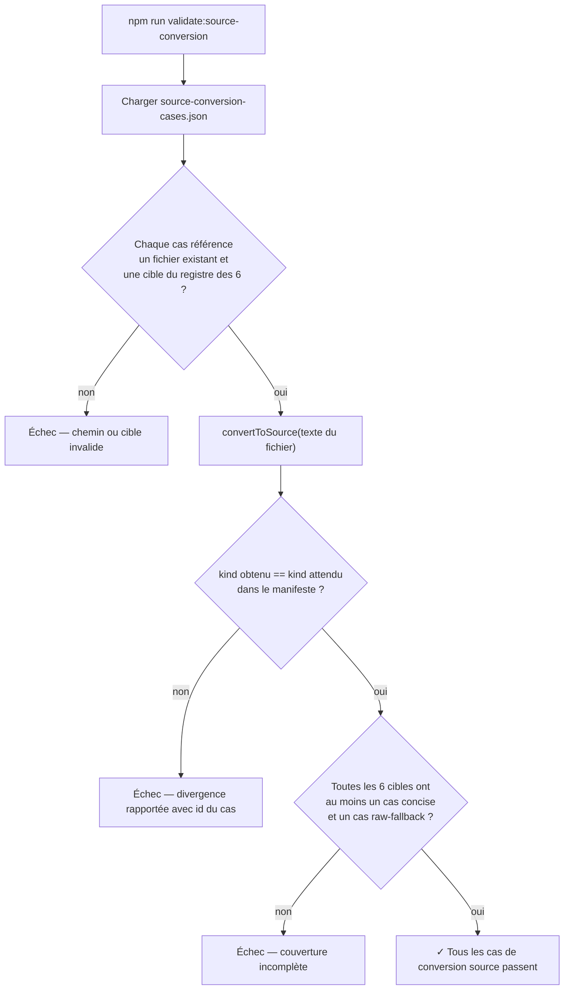

<!-- Fill or omit these sections; never add, rename, or reorder one. -->

# Instruction: Corpus de preuve de non-perte

## Architecture projection

> Tree of the final files. ✅ create · ✏️ modify · ❌ delete

```txt
.
├── corpus/
│   └── contract/
│       ├── cases.json
│       ├── source-conversion-cases.json          ✅ create — manifeste concis/brut, 6 cibles
│       └── source-conversion/                     ✅ create
│           ├── concise/                            ✅ create — 1 .toml par cible, sans clé inconnue ni commentaire
│           │   ├── legend-in-the-mist--story-theme.toml
│           │   ├── legend-in-the-mist--challenge.toml
│           │   ├── legend-in-the-mist--journey.toml
│           │   ├── legend-in-the-mist--theme-kit.toml
│           │   ├── city-of-mist--theme-card.toml
│           │   └── city-of-mist--danger.toml
│           └── raw-fallback/                       ✅ create — au moins clé inconnue racine + meta + tableau imbriqué + commentaire, réparti sur les 6 cibles
│               ├── legend-in-the-mist--story-theme--unknown-field.toml
│               ├── legend-in-the-mist--challenge--nested-unknown.toml       (clé inconnue dans un élément de threats[])
│               ├── legend-in-the-mist--journey--meta-unknown.toml
│               ├── legend-in-the-mist--theme-kit--comment.toml
│               ├── city-of-mist--theme-card--unknown-field.toml
│               └── city-of-mist--danger--comment.toml
├── tools/
│   ├── validate-contract.ts
│   └── validate-source-conversion.ts               ✅ create — mirrors validate-contract.ts's structure
└── package.json                                     ✏️ modify — script validate:source-conversion, wired into check
```

## User Journey



## Tasks to do

### `1)` Manifeste et fixtures

> Un cas par combinaison (cible × résultat attendu), matérialisé en fichier plutôt qu'inventé inline.

1. Créer `corpus/contract/source-conversion-cases.json` : tableau d'objets `{ id, target, file, expectedKind: "concise" | "raw" }`, un id unique par cas, `target` une des six clés du registre de la phase 1.
2. Créer les six fixtures `concise/*.toml`, chacune un document valide pour sa cible, sans clé hors schéma et sans caractère `#` hors chaîne.
3. Créer les six fixtures `raw-fallback/*.toml`, chacune un document par ailleurs valide mais déclenchant explicitement le repli : au moins une avec une clé inconnue à la racine, au moins une avec une clé inconnue dans `meta`, au moins une avec une clé inconnue **nichée dans un élément d'un tableau imbriqué** (ex. `threats[]` sur `legend-in-the-mist/challenge`, cf. note projet sur l'ordre des tables TOML), au moins une avec un commentaire `#` en fin de ligne d'une valeur scalaire — réparties sur les six cibles pour que chacune ait au moins un cas `raw`. Les schémas cibles étant tous `.strictObject()` à toute profondeur, une clé inconnue fait lever `schema.parse()` (`ZodError` à issues `unrecognized_keys`) : c'est cette levée, interceptée dans `convertToSource`, qui produit `kind: "raw"` pour ces fixtures — pas `isLosslessSubset`. Le cas nié dans un tableau imbriqué reste le plus à risque : c'est lui qui prouve que l'interception fonctionne à n'importe quelle profondeur, pas seulement à la racine.

### `2)` Script de validation

> Mirrors `tools/validate-contract.ts`'s structure: manifest loading, safe-path checks, per-target coverage assertion.

1. Créer `tools/validate-source-conversion.ts` : charge le manifeste, résout chaque `file` sous `corpus/contract/source-conversion/` avec un contrôle de chemin sûr (pas de traversée hors du dossier), résout `target` vers l'instance codec correspondante dans `MIST_SOURCE_CONVERSION_CODECS` exportée par `src/index.ts`.
2. Pour chaque cas : lit le fichier, appelle `convertToSource`, compare `kind` obtenu à `expectedKind` ; rapporte l'id du cas en échec, `process.exitCode = 1` si un cas diverge.
3. Assertion de couverture : chacune des six cibles a au moins un cas `expectedKind: "concise"` et un cas `expectedKind: "raw"` dans le manifeste ; échoue explicitement sinon (même famille de piège que la note projet sur `validate-examples.ts` qui peut sortir vert sans avoir rien couvert).

### `3)` Câblage

1. Ajouter le script `validate:source-conversion` dans `package.json`, l'insérer dans la chaîne `check` (après `validate:contract`).

## Test acceptance criteria

<!-- Each criterion is an observable behavior, not a command. -->

| Task | Acceptance criteria |
| ---- | -------------------- |
| 1... | `source-conversion-cases.json` contient au moins 12 cas (6 cibles × 2 résultats), et chaque `file` référencé existe sous `corpus/contract/source-conversion/`. |
| 1... | Chacune des six fixtures `raw-fallback/*` échouerait le test `kind: concise` si on retirait manuellement l'élément déclencheur (clé inconnue ou commentaire) — preuve que le cas teste bien ce qu'il prétend, pas un rejet Zod. |
| 1... | La fixture à clé inconnue nichée dans un tableau imbriqué fait lever `schema.parse()` une `ZodError` dont toutes les issues portent `code: "unrecognized_keys"` (vérifié directement, pas seulement via `convertToSource`) — la levée est attendue et interceptée par le codec, pas un signe de fixture invalide — et son cas de manifeste attend bien `expectedKind: "raw"`. |
| 2... | Modifier un `expectedKind` du manifeste pour qu'il ne corresponde plus au résultat réel fait échouer `npm run validate:source-conversion` avec un message citant l'id du cas. |
| 2... | Retirer temporairement tous les cas `raw` d'une cible du manifeste fait échouer l'assertion de couverture, pas seulement passer silencieusement. |
| 3... | `npm run check` exécute `validate:source-conversion` et échoue globalement si ce script échoue seul. |
