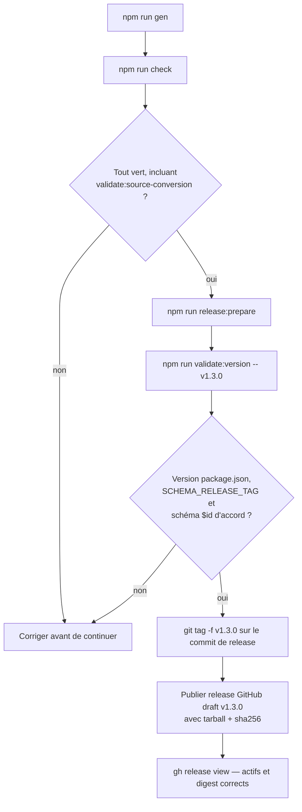

<!-- Fill or omit these sections; never add, rename, or reorder one. -->

# Instruction: Documentation, réconciliation de version et release v1.3.0

## Architecture projection

> Tree of the final files. ✅ create · ✏️ modify · ❌ delete

```txt
.
├── package.json                        ✏️ modify — version 1.2.0 → 1.3.0
├── src/
│   └── contract-version.ts             ✏️ modify — SCHEMA_RELEASE_TAG "v1.2.0" → "v1.3.0"
├── schemas/v1/                         ✏️ modify — régénéré par npm run gen sur les $id v1.3.0
├── CHANGELOG.md                        ✏️ modify — fusionner l'entrée v1.3.0 existante avec la nouvelle fonctionnalité
├── README.md                           ✏️ modify — documenter l'API concise/brut, URL du tarball épinglée en v1.3.0
├── tools/
│   └── validate-package.ts             ✏️ modify — étendre le smoke test au nouvel export
└── (release GitHub)                    ✏️ modify — repositionner le tag local v1.3.0, publier schema-in-the-mist-1.3.0.tgz + .sha256
```

## User Journey



## Tasks to do

### `1)` Réconciliation de version

> `package.json`, `contract-version.ts` et le tag git doivent tous les trois pointer sur la même release réelle, pas sur une tentative interrompue.

1. Dans `package.json`, faire passer `"version"` de `"1.2.0"` à `"1.3.0"`.
2. Dans `src/contract-version.ts`, faire passer `SCHEMA_RELEASE_TAG` de `"v1.2.0"` à `"v1.3.0"`.
3. `npm run gen` pour régénérer `schemas/v1/**` avec les `$id` pointant sur le tag v1.3.0.

### `2)` CHANGELOG

1. Fusionner l'entrée `## [v1.3.0] - 2026-09-15` déjà présente (le bullet Otherscape/Metro) avec un nouveau bullet décrivant la conversion concise/brut à six cibles, sous la même section `## [v1.3.0]`, datée du jour réel de publication.

### `3)` README et smoke test

1. Documenter dans `README.md` l'API `MIST_SOURCE_CONVERSION_CODECS` / `convertToSource` : les six cibles couvertes, le contrat concis-ou-brut, et un exemple minimal.
2. Mettre à jour l'URL du tarball épinglée dans `README.md` pour pointer sur `v1.3.0`.
3. Étendre `tools/validate-package.ts` pour vérifier, sur le paquet empaqueté, que `MIST_SOURCE_CONVERSION_CODECS` est exporté avec exactement les six clés attendues (même style que l'assertion existante sur `MIST_ENGINE_CODECS`).

### `4)` Release immuable

> Même procédure que v1.0.0/v1.1.0/v1.2.0, en tenant compte du tag local déjà posé sur le mauvais commit.

1. `npm run check` intégralement vert (build, gen, validate, validate:contract, validate:source-conversion, validate:version, validate:appearance-compat, validate:otherscape-design, validate:handbook-packs).
2. `npm run release:prepare` pour produire `schema-in-the-mist-1.3.0.tgz` et son `.sha256` reproductibles.
3. `npm run validate:version -- v1.3.0` passe.
4. Repositionner le tag annoté local `v1.3.0` (actuellement sur `6c2392d`, deux commits derrière `HEAD`) sur le commit de release réel avec `git tag -f`, après confirmation explicite puisque c'est une réécriture de tag.
5. Publier une release GitHub draft-first immuable `v1.3.0` avec le tarball et le sidecar SHA-256 en actifs.

## Test acceptance criteria

<!-- Each criterion is an observable behavior, not a command. -->

| Task | Acceptance criteria |
| ---- | -------------------- |
| 1... | `package.json.version`, `SCHEMA_RELEASE_TAG` et le tag git final s'accordent tous sur `1.3.0` / `v1.3.0`. |
| 1... | `schemas/v1/**` régénéré contient des `$id` référençant `v1.3.0`, pas `v1.2.0`. |
| 2... | `CHANGELOG.md` a une seule section `## [v1.3.0]`, listant à la fois le bullet Otherscape/Metro existant et le nouveau bullet de conversion source. |
| 3... | Un exemple du README, copié tel quel, s'exécute et produit un `MistSourceConversion` valide pour une des six cibles. |
| 3... | `npm run validate:package` échoue si `MIST_SOURCE_CONVERSION_CODECS` est retiré de `src/index.ts` (vérifié en le commentant temporairement). |
| 4... | `npm run check` termine avec un code de sortie 0. |
| 4... | `gh release view v1.3.0 --repo RebelliousSmile/schema-in-the-mist` montre le tarball et le `.sha256` comme actifs, et le digest du tarball téléchargé correspond au sidecar. |
