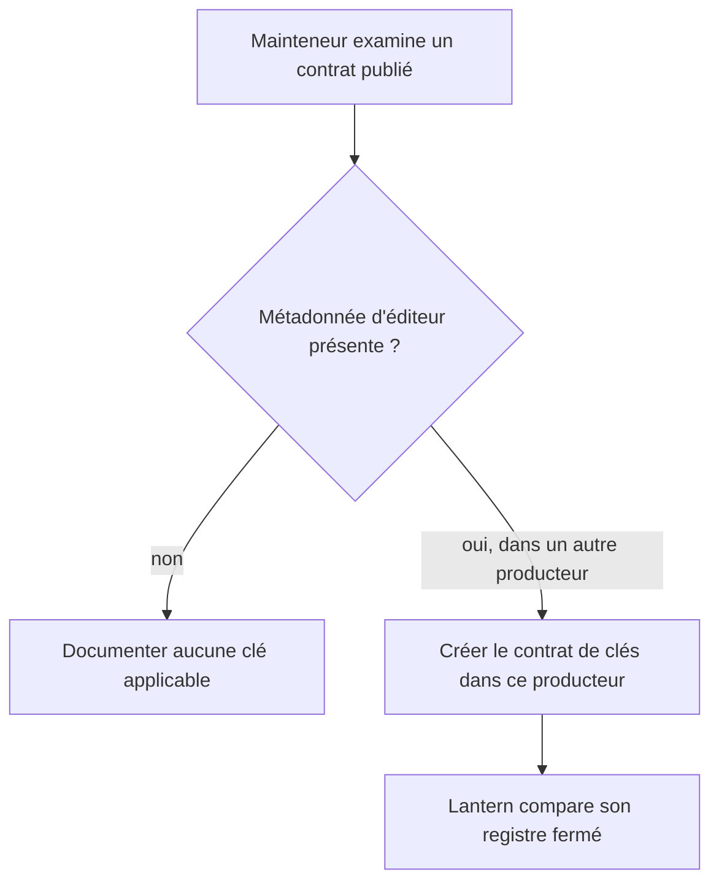
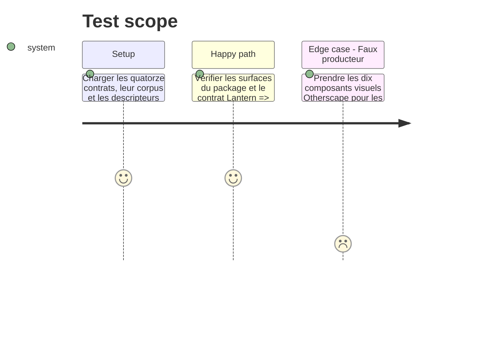

# Instruction: Constater la frontière et orienter le raccordement

## Architecture projection

> Tree of the final files. ✅ create · ✏️ modify · ❌ delete

```txt
schema-in-the-mist/
├── ✏️ docs/compatibility.md                            constat que les 14 contrats et leurs corpus ne publient aucune métadonnée d'adaptateur
└── ✏️ README.md                                        frontière entre contrats TOML, descripteurs visuels non emballés et runtime consommateur
```

## User Journey



## Test Scope



## Tasks to do

### `1)` Établir le périmètre réellement publié

> Distinguer les contrats de ce package du futur contrat de clés qui doit appartenir à son véritable producteur.

1. Comparer les exports npm, les quatorze schémas Zod, les quatorze JSON Schema et le corpus pour établir qu'aucun ne définit de descripteur d'éditeur ou de clé d'adaptateur.
2. Contrôler séparément `schemas/otherscape/design/components.json` : ses dix entrées sont des descripteurs de classes visuelles, ne font pas partie des fichiers npm et ne sont pas les 80 descripteurs d'édition annoncés.
3. Identifier dans la documentation le producteur des 80 descripteurs et y rattacher le futur contrat de clés ; ne pas introduire de champ dans les objets TOML, `meta`, le corpus Mist ou l'artefact Otherscape sur cette seule base.

### `2)` Documenter la décision #13 et le prochain contrat inter-dépôts

> Rendre le non-périmètre présent explicite et définir la condition de reprise sans simuler une release.

1. Ajouter à la matrice de compatibilité la décision : schema-in-the-mist ne publie actuellement aucune métadonnée de présentation destinée à un éditeur et aucune clé d'adaptateur ne s'applique encore.
2. Expliquer dans le README que les adaptateurs React, chemins, composants et logique d'inférence restent consommateurs ; le futur producteur publiera seulement des clés finies et stables.
3. Consigner le critère de réouverture : lorsqu'un producteur publie les 80 descripteurs avec leur vocabulaire, Lantern doit vérifier l'égalité bidirectionnelle avec son registre fermé et échouer pour toute clé manquante ou orpheline avant sa release.

## Test acceptance criteria

| Task | Acceptance criteria |
| --- | --- |
| 1 | Les exports de schema-in-the-mist, ses schémas et son corpus prouvent qu'aucune clé d'adaptateur n'est actuellement publiée. |
| 1 | Les dix entrées de `components.json` sont explicitement exclues des 80 descripteurs : elles restent un contrat de styles Otherscape non emballé. |
| 2 | La compatibilité et le README indiquent sans ambiguïté que l'alternative « aucune métadonnée applicable » clôt #13 pour ce package. |
| 2 | Le critère de reprise désigne le vrai producteur et exige de Lantern un registre fermé exhaustif, sans repli inféré ni transfert de React dans un schema package. |
