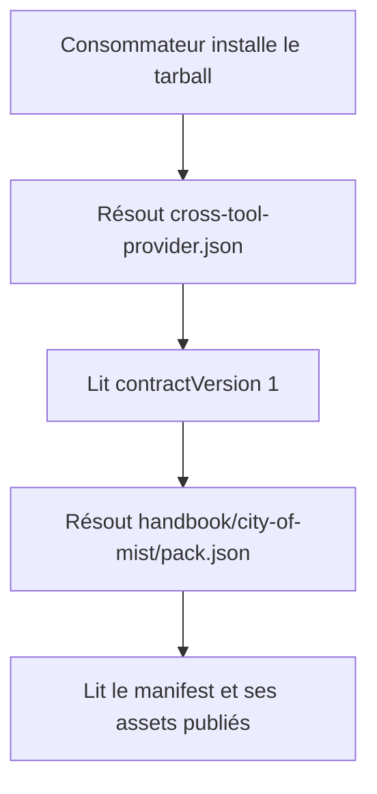
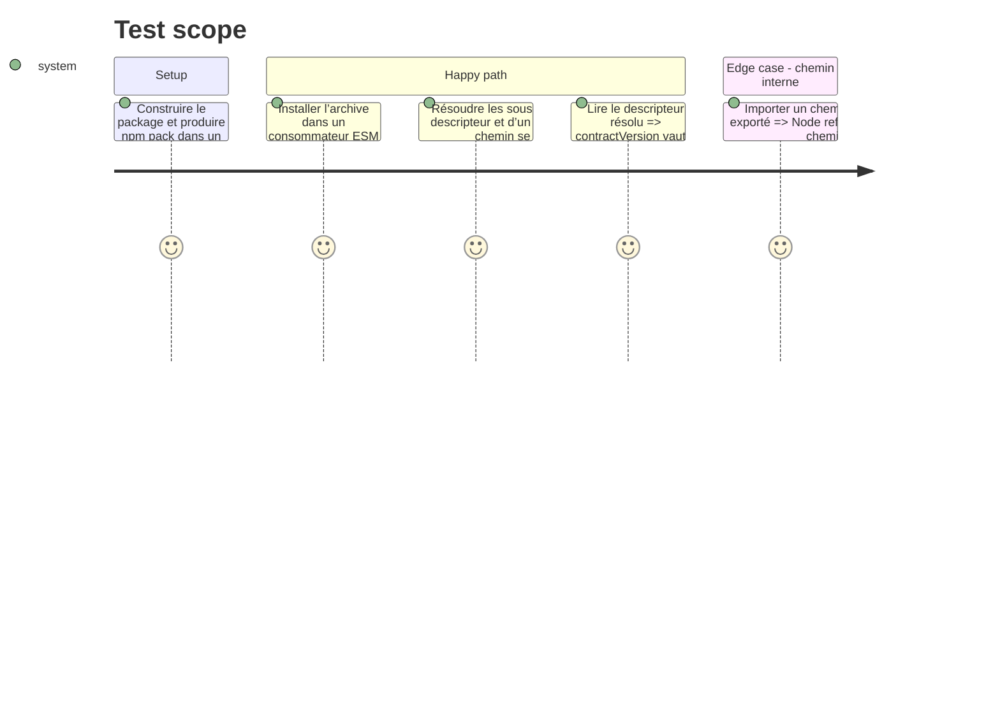

# Instruction: Publier et prouver la surface déclarée

## Architecture projection

> Tree of the final files. ✅ create · ✏️ modify · ❌ delete

```txt
schema-in-the-mist/
├── ✏️ cross-tool-provider.json       ajoute la version explicite du contrat du provider
├── ✏️ package.json                   emballe, exporte et exécute les validations de la surface déclarée
├── ✏️ tools/validate-packs.ts        refuse un descripteur dont la version ou les manifests divergent
└── ✏️ tools/validate-package.ts      prouve le contenu du tarball et les résolutions depuis un consommateur isolé
```

## User Journey



## Test Scope



## Tasks to do

### `1)` Aligner le descripteur avec le contrat publié

> Le descripteur doit suffire à un consommateur pour identifier la version de contrat qu’il vient d’installer.

1. Ajouter `"contractVersion": 1` à `cross-tool-provider.json`, en conservant les valeurs, capacités et chemins existants.
2. Étendre `tools/validate-packs.ts` pour vérifier que `contractVersion` est l’entier majeur attendu et que les manifests déclarés restent présents.
3. Ne déplacer aucune sémantique de jeu, aucun adapter runtime ni donnée utilisateur : le package reste propriétaire du contrat et de ses métadonnées de présentation publiées.

### `2)` Rendre les chemins annoncés réellement installables et résolubles

> Le tarball et la table d’exports doivent couvrir ensemble toutes les surfaces décrites par le provider.

1. Étendre `files` avec `cross-tool-provider.json` et `handbook/`, ajouter les exports publics exacts du descripteur et des sous-chemins `handbook/*`, puis intégrer `validate:packs` à `npm run check`.
2. Étendre `tools/validate-package.ts` pour vérifier, dans la liste de `npm pack`, le descripteur, chaque manifest et les assets Handbook nécessaires, tout en continuant à exclure les outils de développement.
3. Dans le consommateur ESM temporaire du validateur, résoudre et lire le descripteur et un manifest via les nouveaux sous-chemins, comparer `contractVersion` avec `CONTRACT_VERSION`, puis préserver l’assertion de refus d’un chemin interne.
4. Exécuter `npm run validate:packs`, `npm run validate:package` et `npm run check`; le premier garde le descripteur source cohérent, le deuxième prouve la surface distribuée et le dernier empêche leur régression avant toute adoption par un consommateur.

## Test acceptance criteria

| Task | Acceptance criteria |
| --- | --- |
| 1 | `cross-tool-provider.json` déclare `contractVersion: 1`, égal à la constante publique; `validate:packs` refuse une version ou un manifest qui diverge, sans modifier capacités ou chemins de packs. |
| 2 | Un tarball neuf contient le descripteur, les trois packs et leurs assets Handbook; un consommateur installé résout leurs sous-chemins publics sans exposer les modules internes. |
| 2 | Les validateurs de packs, de package et de contrat passent depuis un arbre propre, avant qu’un autre dépôt ne référence la release. |
