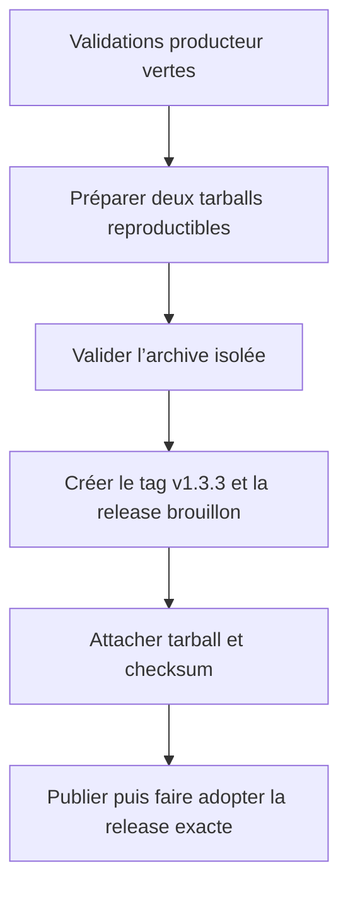
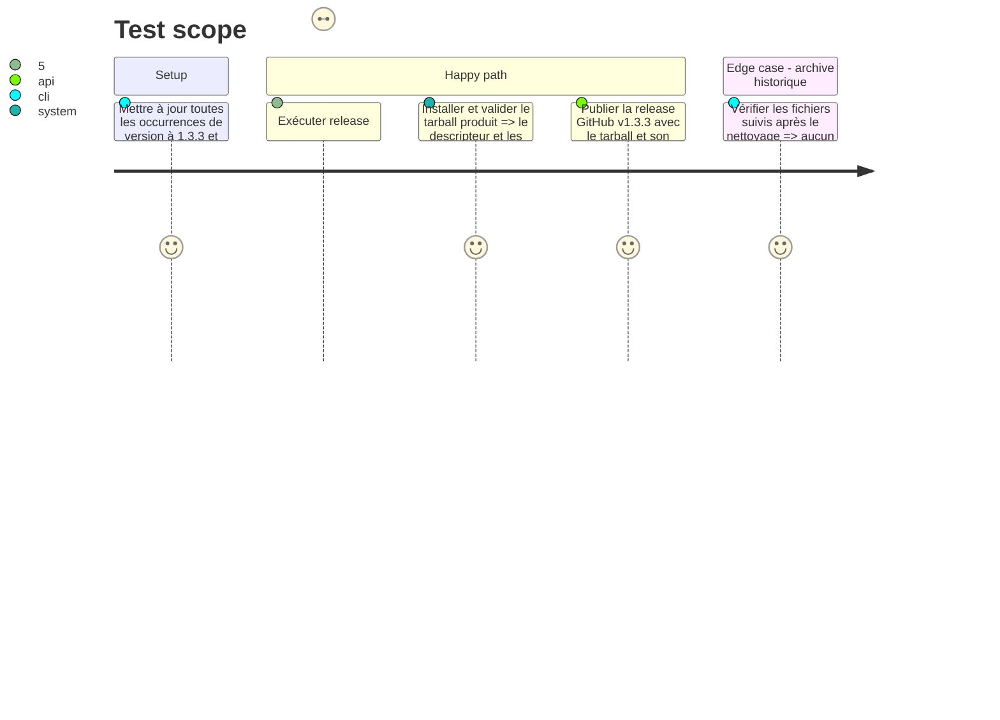

# Instruction: Livrer le correctif et nettoyer les artefacts Git

## Architecture projection

> Tree of the final files. ✅ create · ✏️ modify · ❌ delete

```txt
schema-in-the-mist/
├── ✏️ package.json                              version corrective 1.3.3
├── ✏️ package-lock.json                         version racine synchronisée
├── ✏️ src/contract-version.ts                   tag de release aligné sur v1.3.3, contrat conservé à 1
├── ✏️ CHANGELOG.md                              note de correction de surface distribuée
├── ❌ schema-in-the-mist-1.1.0.tgz              ancien artefact suivi
├── ❌ schema-in-the-mist-1.1.0.tgz.sha256       checksum de l’ancien artefact suivi
├── ❌ schema-in-the-mist-1.2.0.tgz              ancien artefact suivi
└── ❌ schema-in-the-mist-1.2.0.tgz.sha256       checksum de l’ancien artefact suivi
```

## User Journey



## Test Scope



## Tasks to do

### `1)` Versionner le correctif de distribution

> La release doit identifier exactement les octets qui portent les nouveaux chemins publics.

1. Bumper `package.json`, `package-lock.json` et `SCHEMA_RELEASE_TAG` à `1.3.3` / `v1.3.3`, sans changer `CONTRACT_VERSION`.
2. Ajouter l’entrée `v1.3.3` au changelog : le descripteur expose sa version de contrat et le paquet publie/résout le descripteur et les packs Handbook.
3. Exécuter la validation complète, la validation de compatibilité de version et la préparation reproductible; conserver les archives générées comme fichiers ignorés destinés aux assets de release.

### `2)` Retirer les archives suivies et publier la release complète

> Git garde le source et le tag ; GitHub Release porte les binaires et leurs checksums.

1. Supprimer les deux archives historiques effectivement suivies (`1.1.0`, `1.2.0`) et leurs sidecars SHA-256; ne toucher à aucun autre contenu ignoré ou non suivi.
2. Vérifier que `.gitignore` continue d’exclure `*.tgz` et `*.tgz.sha256`, puis confirmer par `git ls-files` qu’aucun artefact de ce type ne reste suivi.
3. Depuis `main`, créer le tag `v1.3.3`, joindre le tarball reproductible et son checksum à une GitHub Release brouillon, vérifier leur téléchargement et leur digest, puis publier la release immuable.
4. Seulement après cette release du producteur, mettre à disposition des consommateurs le pin exact `v1.3.3`; aucun fallback local de descriptor ou de manifest n’est permis.

## Test acceptance criteria

| Task | Acceptance criteria |
| --- | --- |
| 1 | Tous les artefacts porteurs de version désignent `v1.3.3`, tandis que le descripteur et la constante publique conservent le contrat majeur 1. |
| 1 | Deux préparations depuis le même commit produisent le même tarball et le même checksum, et l’installation isolée valide les nouvelles surfaces publiques. |
| 2 | Aucun `.tgz` ni `.tgz.sha256` n’est suivi par Git; la release GitHub v1.3.3 attache à la place exactement une archive et son checksum vérifié. |
| 2 | Les consommateurs ne sont mis à jour qu’après la publication de la release du package de schémas. |
