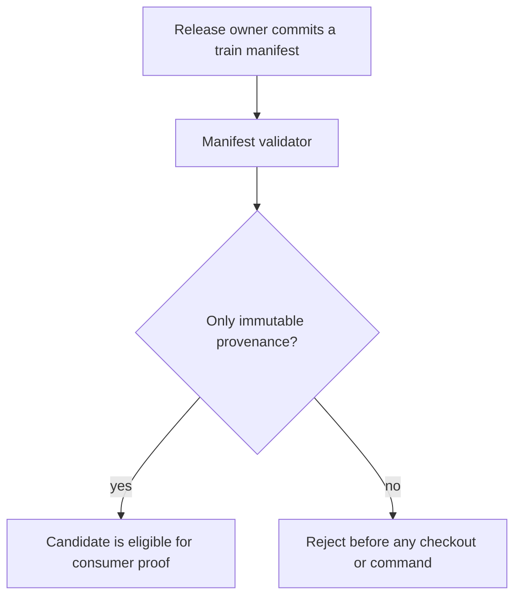
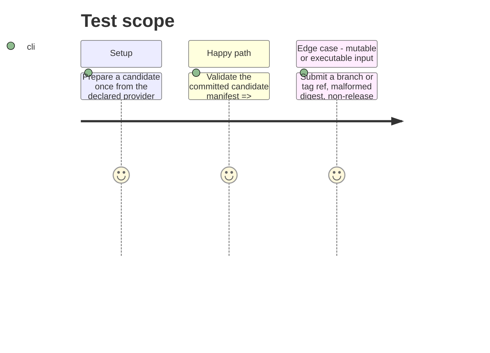

# Instruction: Define and validate the immutable train contract

## Architecture projection

> Tree of the final files. ✅ create · ✏️ modify · ❌ delete

```txt
schema-in-the-mist/
├── ✅ release-trains/README.md                    documents the committed candidate-manifest lifecycle
├── ✅ release-trains/<final-tag>.json             records one real candidate’s immutable provenance
├── ✅ tools/release-train-stage.ts                 prepares and stages one candidate archive from its provider commit
├── ✅ tools/release-train-manifest.ts              parses and validates the closed manifest grammar
├── ✅ tools/validate-release-train.ts              exercises valid and hostile manifest fixtures
├── ✅ test/fixtures/release-trains/*.json          supplies valid, mutable-ref, command, and digest failures
└── ✏️ package.json                                 exposes validation and later train commands
```

## User Journey



## Test Scope



## Tasks to do

### `1)` Specify the closed release-train manifest

> One committed file must name the exact bytes and identities involved in a promotion.

1. Document a versioned JSON shape under `release-trains/` containing the schema-in-the-mist candidate archive URL, SHA-256, SHA-512 SRI, provider commit, final tag/version, and immutable Lantern and Handbook repository commits.
2. Define only fixed consumer proof identifiers in code; do not allow a manifest to name a binary, script, working directory, environment expression, or arbitrary command.
3. Require HTTPS GitHub Release asset URLs for this repository, a lowercase 64-hex digest, full 40-hex commits, a canonical final `vX.Y.Z` tag, and consistency between the tag, archive filename, and package version expected by the train.

### `2)` Stage the candidate exactly once

> The bytes referenced by the manifest must exist before consumers can adopt them.

1. Add a controlled staging command that checks out the declared provider commit, verifies its package version and generated schema IDs against the intended final tag, runs the existing reproducible `release:prepare` once, and records the resulting SHA-256 and SHA-512 SRI.
2. Upload that archive and its checksum to a dedicated candidate GitHub Release whose tag is derived from the final version and full provider commit; record its GitHub Release asset URL for the subsequent committed manifest.
3. On a rerun, adopt the candidate release only when its tag points to the same provider commit and its archive/checksum hashes match; otherwise fail rather than replace candidate bytes.

### `3)` Make unsafe provenance unrepresentable at the CLI boundary

> Validation must reject unsafe input before the orchestrator can resolve a ref or launch a process.

1. Implement the typed parser/validator and focused fixture runner, including duplicate/missing-field, mutable-ref, noncanonical URL, checksum, and unexpected-property cases.
2. Add `release-train:validate` and reserve `release-train:assert -- <manifest>` for the fixed orchestration entry point; integrate manifest validation into the normal producer checks where it can validate committed manifests without contacting consumers.
3. Add the first real train manifest only after staging has supplied the final version, immutable provider commit, candidate asset URL/digest, and both consumer commits; keep it committed as the promotion record.

## Test acceptance criteria

| Task | Acceptance criteria |
| --- | --- |
| 1 | A committed train manifest identifies exactly one final archive, checksum, provider commit/tag, and Lantern/Handbook commits; it contains no executable consumer configuration. |
| 2 | Candidate staging produces one reproducible final-version archive from the declared provider commit, records its SHA-256 and asset URL, and rejects any rerun whose existing candidate bytes or tag target differ. |
| 3 | Valid provenance is accepted, while mutable refs, arbitrary commands, untrusted or non-final archive URLs, inconsistent tags, and malformed digests fail deterministically before subprocess execution. |
