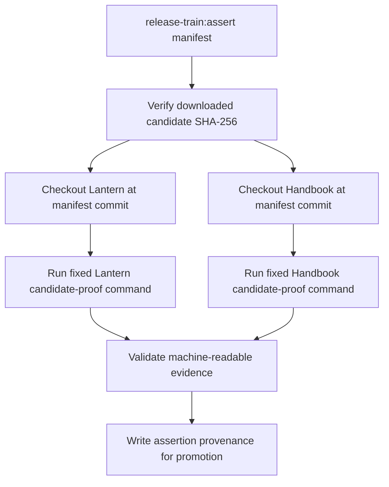
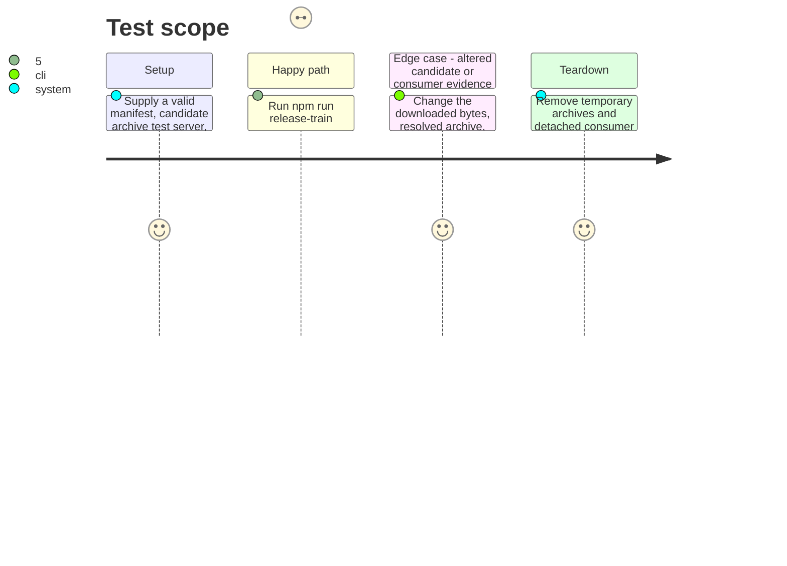

# Instruction: Orchestrate pinned consumer evidence

## Architecture projection

> Tree of the final files. ✅ create · ✏️ modify · ❌ delete

```txt
schema-in-the-mist/
├── ✅ tools/release-train-assert.ts               downloads, verifies, and coordinates the candidate proof
├── ✅ tools/release-train-consumers.ts            materializes exact consumer commits and parses their evidence
├── ✅ test/fixtures/release-train-evidence/*.json tests accepted and rejected consumer result records
├── ✏️ package.json                                binds the single public assertion command
├── ✏️ README.md                                   distinguishes daily baseline checks from release-train operation
└── ✏️ CONTRIBUTING.md                              directs maintainers to consumer-owned proof and release order
```

## User Journey



## Test Scope



## Tasks to do

### `1)` Assert the candidate bytes before consumer use

> Both consumers must prove the exact archive declared by the manifest, not a similarly named package.

1. Download the manifest archive into an isolated temporary directory, calculate SHA-256 locally, and validate the package with the existing packed-public-API validator before any consumer proof.
2. Materialize each external repository as a detached checkout at its manifest’s full commit, confirm `HEAD` equals that commit, and prohibit fallback to the daily cross-tool configuration or an existing workspace checkout.
3. Copy the already validated manifest into each detached checkout and invoke consumers solely through the fixed `npm run release-train:assert -- <manifest>` protocol, forwarding the verified candidate identity through the protocol's controlled manifest file, never a manifest command.

### `2)` Verify consumer-owned results and preserve provenance

> The provider coordinates evidence but does not duplicate Lantern’s build or Handbook’s renderer.

1. Require each consumer’s machine-readable result to echo its repository, resolved commit, candidate URL, SHA-256, resolved package version, and lockfile integrity, and reject extra/mismatched identities.
2. Require the Lantern result to attest its production build/install path and the Handbook result to attest its package-pin/source-install and install/render path; retain their detailed assertions in their repositories.
3. Emit one normalized local assertion record that binds the verified archive, manifest digest, provider commit/tag, consumer commits, and validated result digests for the promotion workflow.
4. Document the command, expected ownership boundaries, and release sequence without moving consumer adapters, renderer semantics, or user data into this package.

## Test acceptance criteria

| Task | Acceptance criteria |
| --- | --- |
| 1 | `npm run release-train:assert -- <manifest>` only uses the declared archive after local SHA verification and only materializes consumer commits equal to the full hashes in that manifest. |
| 2 | A train passes only when both consumer-owned proofs return structurally valid, identity-matching evidence; changed bytes, commits, archive URLs, lock metadata, or missing build/render proof block promotion. |
