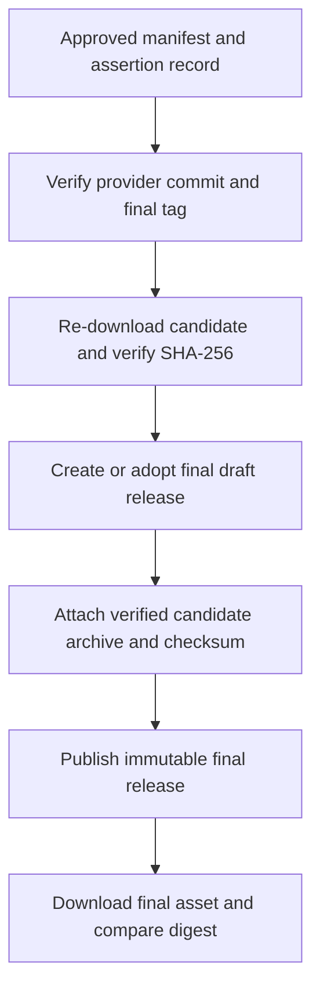
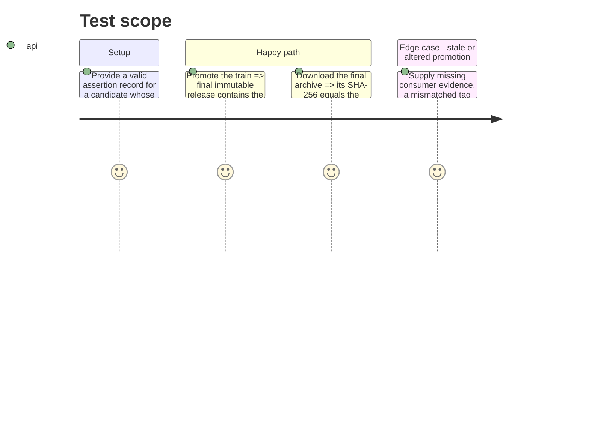

# Instruction: Gate byte-identical final promotion

## Architecture projection

> Tree of the final files. ✅ create · ✏️ modify · ❌ delete

```txt
schema-in-the-mist/
├── ✅ tools/release-train-promote.ts              verifies evidence and attaches the already-proven bytes
├── ✅ .github/workflows/release-train.yml         runs candidate assertion and controlled promotion
├── ❌ .github/workflows/release.yml               removes the rebuild-on-tag publication path
├── ✏️ package.json                                exposes local promotion verification only
├── ✏️ README.md                                   documents final immutable-download verification
└── ✏️ .codex/rules/04-tooling/4-release-completeness.md preserves the completed-release rule for the train flow
```

## User Journey



## Test Scope



## Tasks to do

### `1)` Replace rebuild-on-tag with evidence-gated promotion

> A final release must be a promotion of the candidate consumers actually adopted.

1. Add a manually controlled release-train workflow that accepts only a committed manifest path, validates it, runs the single assertion command, and passes its signed/recorded provenance to promotion.
2. Retire the tag-triggered rebuild workflow. The train workflow alone creates or verifies the final tag at the manifest’s provider commit, so no tag can independently publish an unproven archive.
3. Verify the final tag resolves to the manifest’s provider commit and package/tag version before draft creation; preserve idempotent draft adoption while refusing an already-published release whose assets or digests differ.

### `2)` Attach and re-verify the candidate bytes

> Promotion transports verified bytes; it never regenerates them.

1. Have promotion download the candidate archive and checksum from the staged URL, independently verify SHA-256 against the manifest and assertion record, and attach those exact files to the final draft release.
2. Publish only after both consumer statuses and all provenance identities match; then fetch the final release asset and compare its digest with the candidate before reporting success or closing the tracking issue.
3. Update release guidance and CI-facing rules to require the candidate manifest, consumer evidence, final digest check, and preserved separation from the daily provider baseline.

## Test acceptance criteria

| Task | Acceptance criteria |
| --- | --- |
| 1 | No final tag release can bypass a successful manifest-led Lantern and Handbook proof, and a tag/provider-commit or pre-existing-asset mismatch stops the workflow before publication. |
| 2 | The final immutable release asset hashes exactly to the staged candidate SHA-256 and is attached without a second `npm pack` or `release:prepare` invocation. |
