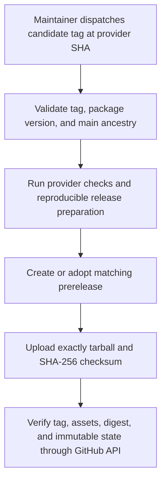
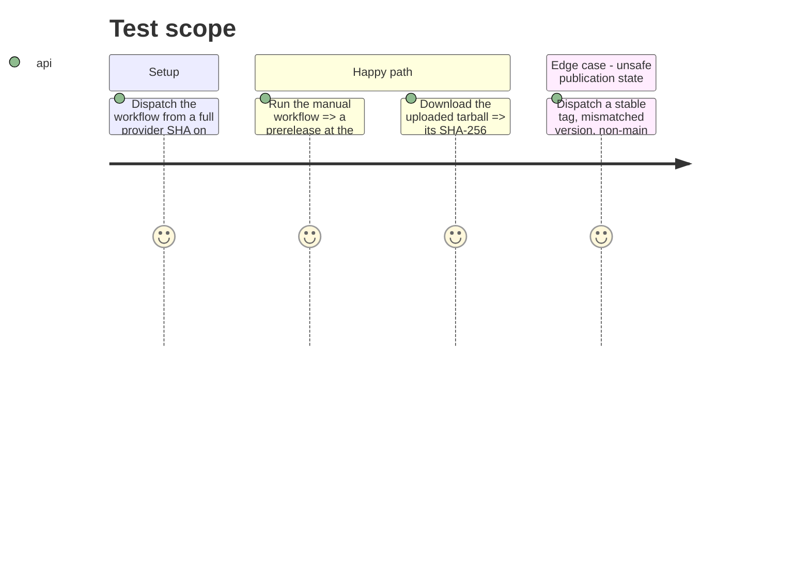

# Instruction: Publish and verify guarded candidate bytes

## Architecture projection

> Tree of the final files. ✅ create · ✏️ modify · ❌ delete

```txt
schema-in-the-mist/
└── ✅ .github/workflows/release-candidate.yml  manually prepares, uploads, and API-verifies one immutable prerelease archive
```

## User Journey



## Test Scope



## Tasks to do

### `1)` Define the manual candidate-only workflow boundary

> Only an explicit dispatch with a valid candidate tag at an eligible provider commit may proceed.

1. Create `.github/workflows/release-candidate.yml` with `workflow_dispatch` as its only trigger, a required candidate-tag input, `contents: write`, and an Ubuntu runner using Node 20.
2. Check out full history and fail unless the input exactly matches `vX.Y.Z-rc.N`, its base version equals `package.json`, the dispatched `GITHUB_SHA` is an ancestor of `main`, and any existing candidate tag resolves to that same SHA.
3. Explicitly reject stable tags and ensure no job creates, edits, uploads to, or publishes a stable release tag.

### `2)` Prepare reproducible candidate assets

> Candidate assets are generated under the same Linux/Node 20 conditions that stable promotion must reproduce.

1. Install locked dependencies, run the provider verification suite, and invoke the existing `npm run release:prepare -- <base-version-tag>` path to obtain the tarball and its SHA-256 checksum.
2. Assert the produced filenames use the package version, the checksum names and hashes the tarball, and repeated preparation preserves the repository's reproducibility guarantee.
3. Keep generated archive files scoped to the workflow workspace so a failure cannot make them available as a release artifact.

### `3)` Create or safely adopt one immutable prerelease

> A rerun can prove the same candidate but cannot overwrite a release or substitute bytes.

1. Query GitHub for the candidate release and create it only when absent, with the candidate tag targeted at the dispatched SHA and prerelease state enabled.
2. For a newly created release only, upload the tarball and checksum once without overwrite semantics, publish the prerelease, then query GitHub API until it reports immutability and verify the exact two asset names, tarball SHA-256 digest, checksum content, candidate tag target, and prerelease status.
3. When the release already exists, perform no release or asset mutation: require prerelease state, immutable state, the exact dispatched target SHA, exactly the two expected assets, and matching tarball/checksum digests; reject an existing stable, partial, mutable, asset-conflicting, or differently pointed candidate release.

## Test acceptance criteria

| Task | Acceptance criteria |
| --- | --- |
| 1 | The release workflow cannot run from push or tag events, and invalid candidate syntax, version, ancestry, tag target, or stable tag fails before release mutation. |
| 2 | A valid dispatch on Ubuntu/Node 20 runs provider checks and produces a tarball plus SHA-256 checksum whose names and digest agree. |
| 3 | A newly created GitHub prerelease is tied to the dispatched SHA, immutable, and exposes exactly those two verified assets; reruns only verify that complete state, while all conflicting existing release states fail closed. |
