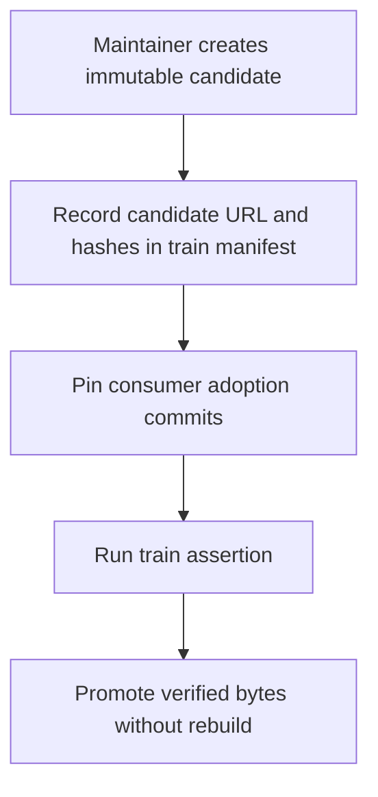
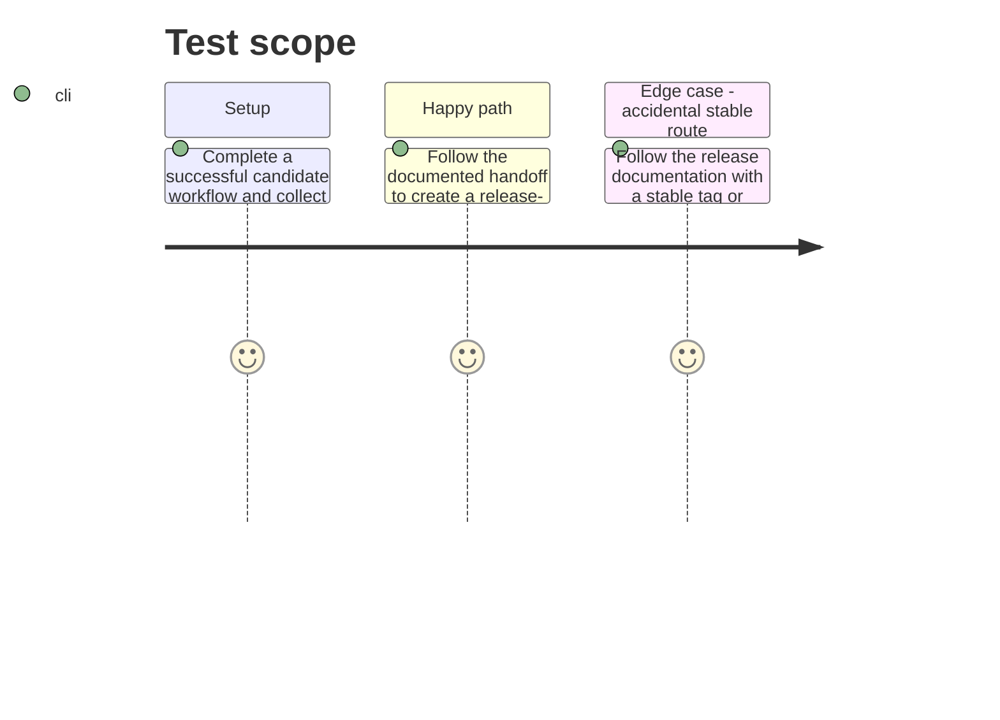

# Instruction: Document candidate-to-train handoff

## Architecture projection

> Tree of the final files. ✅ create · ✏️ modify · ❌ delete

```txt
schema-in-the-mist/
├── ✏️ README.md                 explains creation, verification, and consumption of a candidate archive
├── ✏️ CONTRIBUTING.md           directs release operators to the candidate workflow and train boundary
└── ✏️ release-trains/README.md  records the candidate prerelease as the mandatory input to train assertion and promotion
```

## User Journey



## Test Scope



## Tasks to do

### `1)` Explain candidate creation and verification

> Operators need an unambiguous manual procedure that cannot be mistaken for stable publication.

1. Update the root README with the dispatch input format, eligibility conditions, generated filenames, and GitHub API-backed verification results for a candidate prerelease.
2. State that the candidate is immutable but not stable, is tied to a specific provider SHA, is the only archive that the later release train can consume, and can only be re-run as verification once complete.
3. Update CONTRIBUTING's release guidance to distinguish candidate publication from train assertion and stable promotion, with no tag-push release path.

### `2)` Connect the candidate to the existing release-train contract

> The existing train manifest must record the immutable bytes just created rather than a rebuilt approximation.

1. Amend `release-trains/README.md` so its operator flow begins with candidate workflow dispatch and identifies the required candidate URL, SHA-256, SHA-512 SRI, tag, and provider commit to record.
2. Preserve the existing ownership boundary: this repository publishes schema bytes and coordinates its manifest; Lantern and Handbook retain their pinned adoption and consumer-specific proof.
3. Describe stable promotion solely as the existing evidence-gated, no-rebuild train operation and require its final asset digest to equal the candidate digest.

## Test acceptance criteria

| Task | Acceptance criteria |
| --- | --- |
| 1 | README and contributor guidance explain how to create and verify only a candidate prerelease, and do not offer a stable release command or tag-triggered path. |
| 2 | The train documentation makes a verified candidate's URL, digests, tag, and provider SHA the required handoff and preserves byte-identical, consumer-owned stable promotion. |
