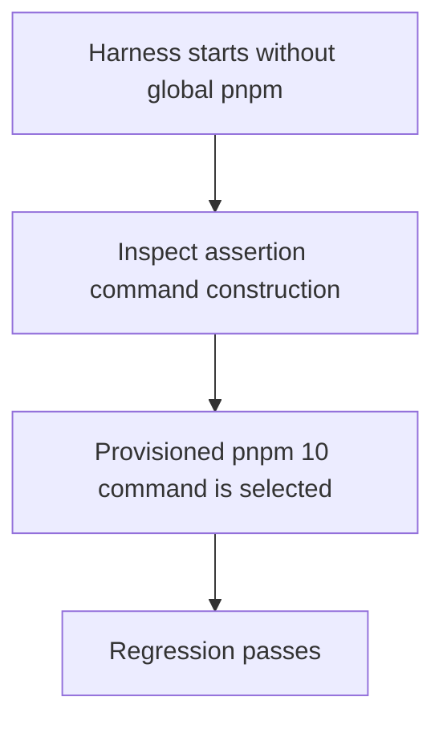
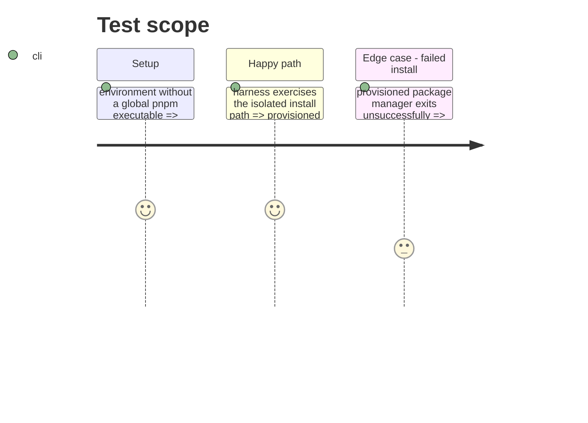

# Instruction: Global-pnpm regression proof

## Architecture projection

> Tree of the final files. ✅ create · ✏️ modify · ❌ delete

```txt
tools/
├── release-train-assert.mjs ✏️ export the frozen-install command helper for test coverage
└── release-train-protocol.harness.mjs ✏️ assert deterministic command construction without invoking pnpm
```

## User Journey



## Test Scope



## Tasks to do

### `1)` Cover package-manager provisioning

> Make the regression fail if a future change returns to a bare `pnpm` command.

1. Import the exported command helper into the existing Node-only protocol harness.
2. Assert the selected executable and arguments include `npx --yes pnpm@10` plus the existing frozen-install protections.
3. Assert a supplied temporary-store path is passed through unchanged.
4. Retain the protocol parser and evidence assertions already covered by the harness.

## Test acceptance criteria

| Task | Acceptance criteria |
| --- | --- |
| 1 | The harness fails if the assertion depends on a global `pnpm` executable. |
| 1 | The regression confirms `--frozen-lockfile`, `--ignore-scripts`, and the isolated store remain in the command. |
| 1 | The regression runs as Node-only unit coverage and does not download a candidate archive. |
