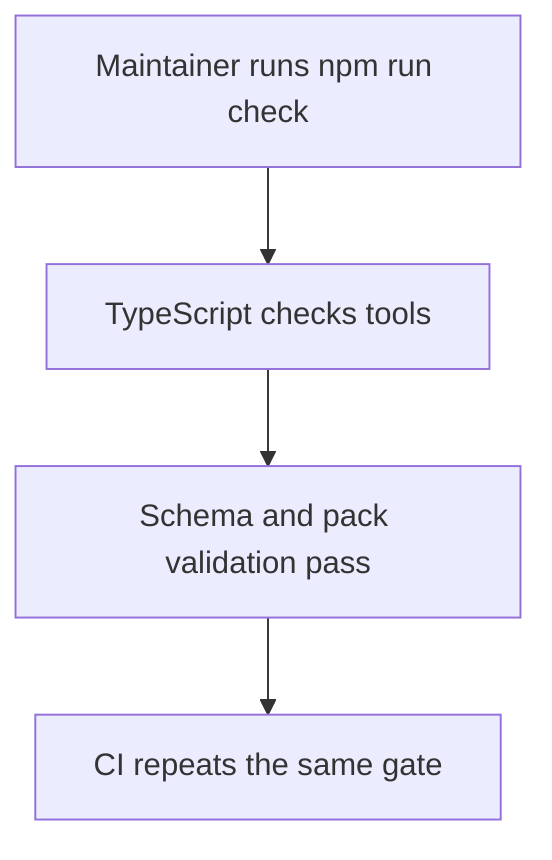
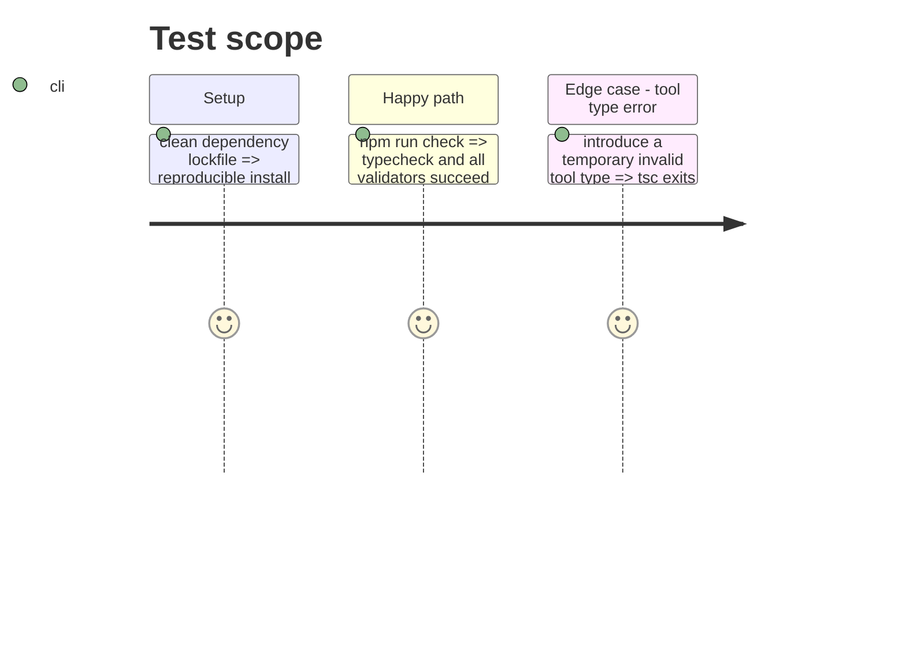

# Instruction: Establish local quality, dependency, and publication baselines

## Architecture projection

> Tree of the final files. ✅ create · ✏️ modify · ❌ delete

```txt
.
├── package.json ✏️ add typecheck, update dependencies and package licence/files
├── package-lock.json ✏️ lock advisory-free dependency graph
├── .github/workflows/ci.yml ✏️ run the complete quality gate
└── tools/validate-package.ts ✏️ assert the final packed licence and media surface
```

## User Journey



## Test Scope



## Tasks to do

### `1)` Upgrade and lock development dependencies

> Close the audited `fast-uri` and `esbuild` advisory paths without adding a direct esbuild dependency.

1. Update the declared `tsx` version and regenerate the lockfile.
2. Audit the resulting production and development dependency graph.
3. Verify the locked graph has no advisories.

### `2)` Add the tools typecheck gate

> Typecheck every TypeScript source covered by the existing configuration before generation and validation.

1. Add a no-emit typecheck script.
2. Make `check` invoke it and make CI run the complete check command.
3. Confirm a temporary invalid tools type is rejected, then restore it.

### `3)` Make package validation match the final publication contract

> Assert the complete licences and only the intended media formats in a packed tarball.

1. Update the tarball expectations after the asset and licence work in phase 2.
2. Verify the dry-run pack list and packed-consumer test.

## Test acceptance criteria

| Task | Acceptance criteria |
| ---- | -------------------------------- |
| 1 | The lockfile contains no reported dependency advisories. |
| 2 | A type error in `tools/` makes `npm run typecheck` fail, while the clean tree passes. |
| 3 | The packed tarball carries both root licence texts and no prohibited legacy media. |
