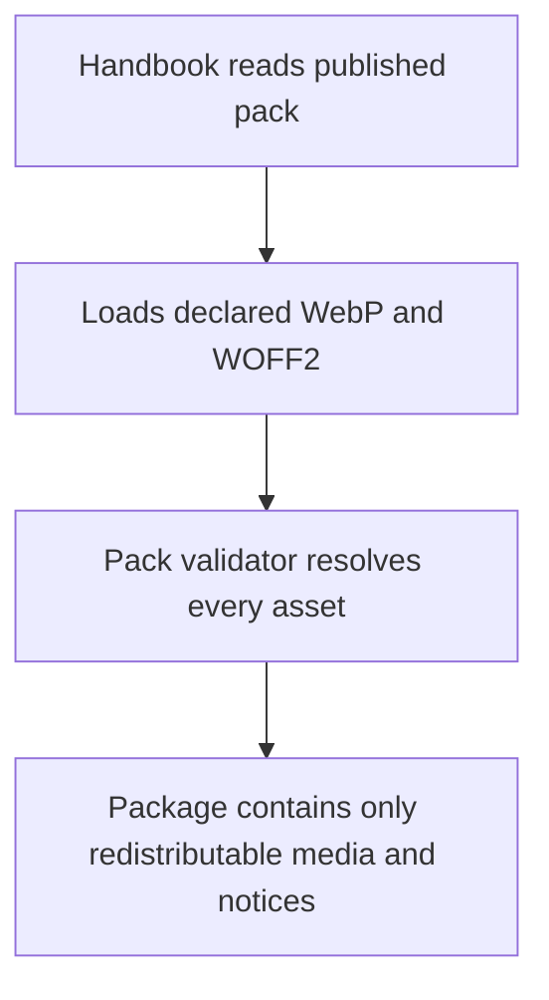
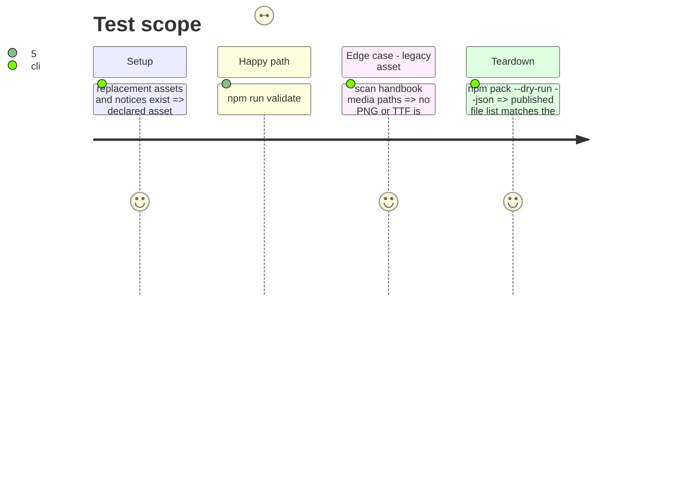

# Instruction: Replace publishable Handbook media and state its license boundary

## Architecture projection

> Tree of the final files. ✅ create · ✏️ modify · ❌ delete

```txt
.
├── handbook/legend-in-the-mist/assets/images/*.webp ✅ replace legacy cards
├── handbook/legend-in-the-mist/assets/fonts/*.woff2 ✅ replace legacy typeface
├── handbook/legend-in-the-mist/pack.json ✏️ declare replacement media
├── handbook/README.md ✏️ record the substitution and redistribution decision
├── package.json ✏️ publish a composite SPDX licence and full LICENSES folder
├── LICENSES/THIRD-PARTY-NOTICES.md ✅ attribute replacement media
├── handbook/legend-in-the-mist/assets/images/*.png ❌ remove disputed raster cards
└── handbook/legend-in-the-mist/assets/fonts/pragroman.ttf ❌ remove disputed font
```

## User Journey



## Test Scope



## Tasks to do

### `1)` Replace the disputed media

> Use freely licensed replacement cards and font assets in the published Handbook contract.

1. Produce four WebP card images with equivalent roles and an OFL-compatible WOFF2 typeface.
2. Point the pack manifest and CSS at their new paths.
3. Remove every legacy PNG and TTF beneath `handbook/`.

### `2)` Publish an accurate licensing statement

> Make package metadata, notices, and handbook documentation agree on what is redistributed.

1. Change the root SPDX expression to cover code and documentation separately.
2. Publish all root licence texts and an explicit third-party notice.
3. Explain that disputed historical assets are substituted and no longer published.

## Test acceptance criteria

| Task | Acceptance criteria |
| ---- | -------------------------------- |
| 1 | Every declared card and font resolves and uses WebP or WOFF2 only. |
| 2 | The package metadata and tarball are consistent with the documented licence decision. |
