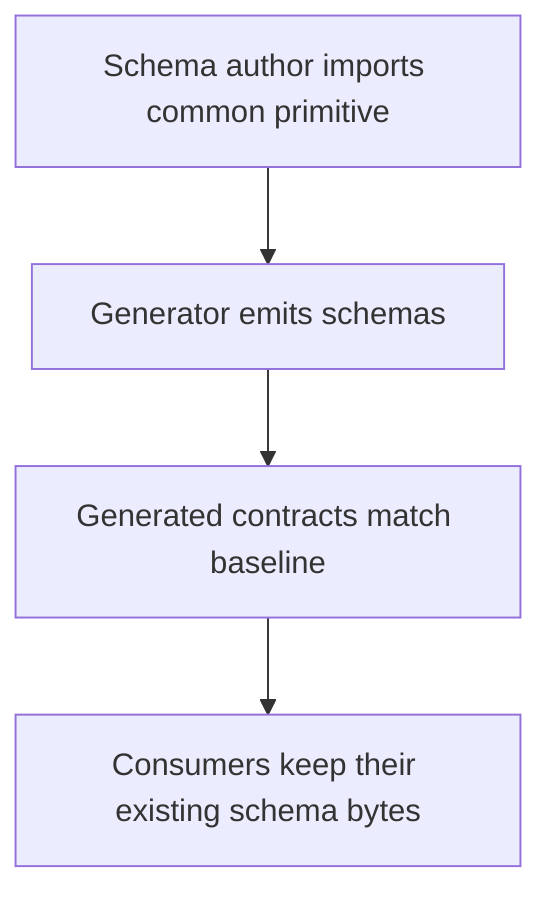
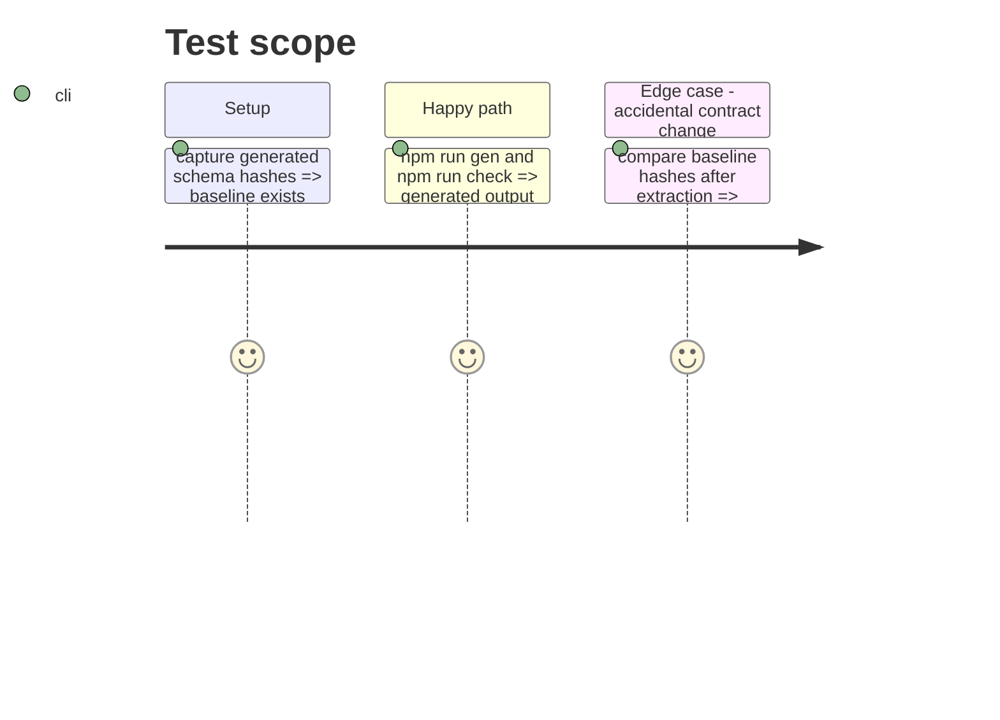

# Instruction: Extract shared schemas without changing generated contracts

## Architecture projection

> Tree of the final files. ✅ create · ✏️ modify · ❌ delete

```txt
.
├── src/zod/common/publication.ts ✅ central shared Zod metadata primitives
├── src/zod/{city-of-mist,legend-in-the-mist,otherscape}/*.ts ✏️ import shared primitives
├── src/zod/city-of-mist/danger.ts ✏️ correct the residual Challenge description
├── schemas/v1/**/*.json ✏️ regenerate and byte-compare expected output
└── CLAUDE.md ✏️ replace the superseded per-target duplication convention
```

## User Journey



## Test Scope



## Tasks to do

### `1)` Centralize the shared Zod values

> Define `PublicationTypeEnum` and `MetaSchema` once without changing the public schema shape.

1. Identify the byte-equivalent shared declarations and their exported types.
2. Introduce the common module and replace only exact duplicate local declarations.
3. Fix the Danger-origin description while updating its import.

### `2)` Prove output preservation

> Demonstrate that the source refactor did not alter generated schema bytes except for the intentional text correction.

1. Generate a before/after manifest of schemas and hashes.
2. Review each changed file and document the sole intentional difference.
3. Update the project convention that deferred shared primitive extraction.

## Test acceptance criteria

| Task | Acceptance criteria |
| ---- | -------------------------------- |
| 1 | There is one exported source definition for each shared primitive and Danger no longer says Challenge. |
| 2 | The hash comparison identifies no unreviewed generated-contract changes. |
