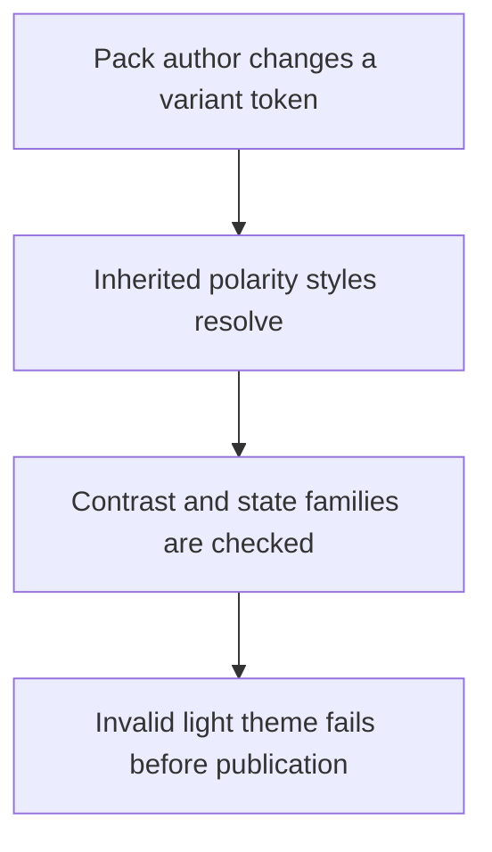
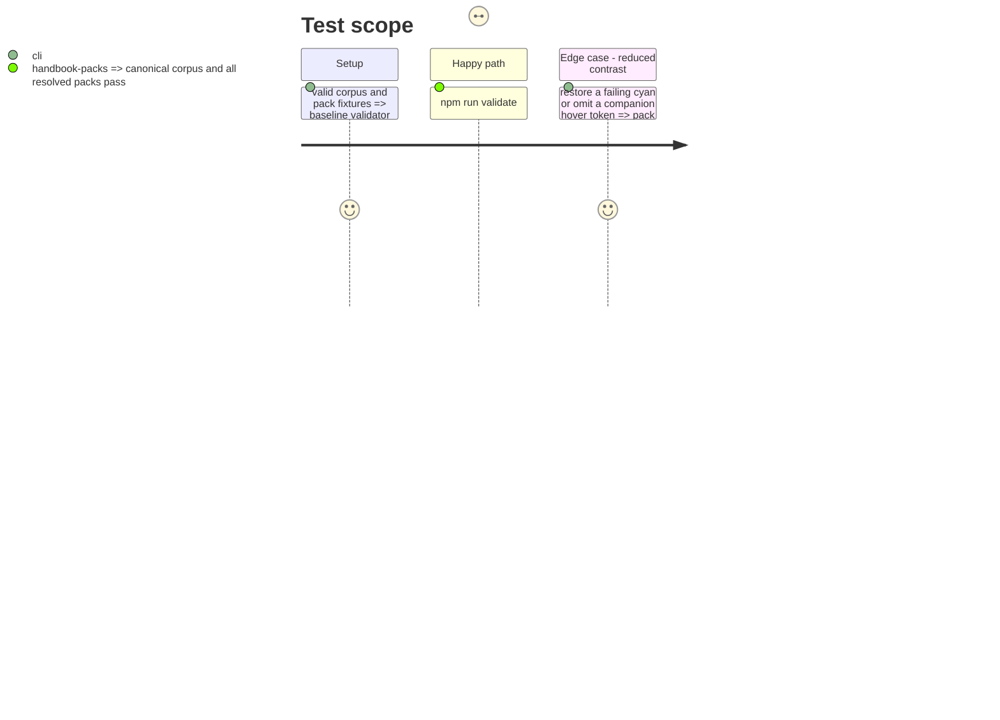

# Instruction: Make corpus responsibilities and Handbook contrast executable

## Architecture projection

> Tree of the final files. ✅ create · ✏️ modify · ❌ delete

```txt
.
├── corpus/README.md ✏️ document consumer-owned declarative outcomes
├── corpus/contract/cases.json ✏️ remove the redundant Lantern axis
├── tools/validate-contract.ts ✏️ validate canonical contract only and reject obsolete axes
├── tools/validate-handbook-packs.ts ✏️ resolve inherited styles and enforce contrast/state families
├── tools/require-contrast.ts ✅ shared luminance, contrast, and token-family rules
├── handbook/otherscape/pack.json ✏️ complete variants and correct light-polarity token values
└── test/fixtures/handbook-contrast/* ✅ red fixtures for contrast and incomplete overrides
```

## User Journey



## Test Scope



## Tasks to do

### `1)` Clarify consumer responsibility in the corpus

> Stop publishing redundant or unverified consumer behavior as provider assertions.

1. Remove `lantern` outcomes from each case and its validator type.
2. Describe `handbook` outcomes as declarative consumer-owned expectation metadata.
3. Keep canonical Zod/Ajv agreement as the provider’s executable assertion.

### `2)` Add inherited contrast and state-family validation

> Measure every resolved text and link declaration for every polarity and variant.

1. Port relative-luminance and contrast helpers into `tools/`.
2. Resolve base and variant token layers before validation.
3. Require 4.5:1 text/link contrast, hover no weaker than rest, and complete override state families.
4. Add failing fixtures so each policy is regression-tested.

### `3)` Repair :Otherscape light tokens

> Correct the light-polarity cyan family and complete every affected variant override.

1. Apply accessible hue-preserving light token values.
2. Add rest, hover, and active partners to affected variants.
3. Run the generator/pack validation to retain the published design projection.

## Test acceptance criteria

| Task | Acceptance criteria |
| ---- | -------------------------------- |
| 1 | The provider verifies canonical behavior and labels remaining consumer outcomes declarative. |
| 2 | A bad inherited contrast or incomplete state family fails validation. |
| 3 | Every resolved text/link token meets 4.5:1, and hover contrast is never lower than rest. |
