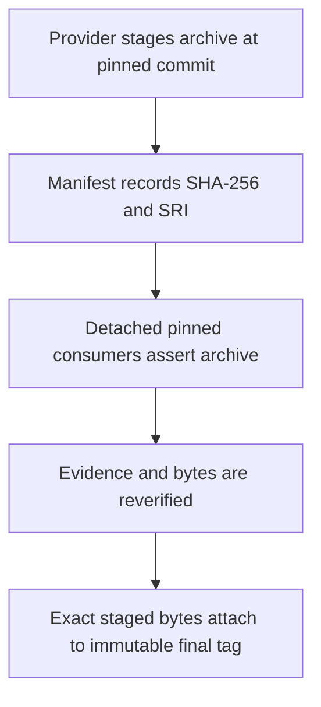
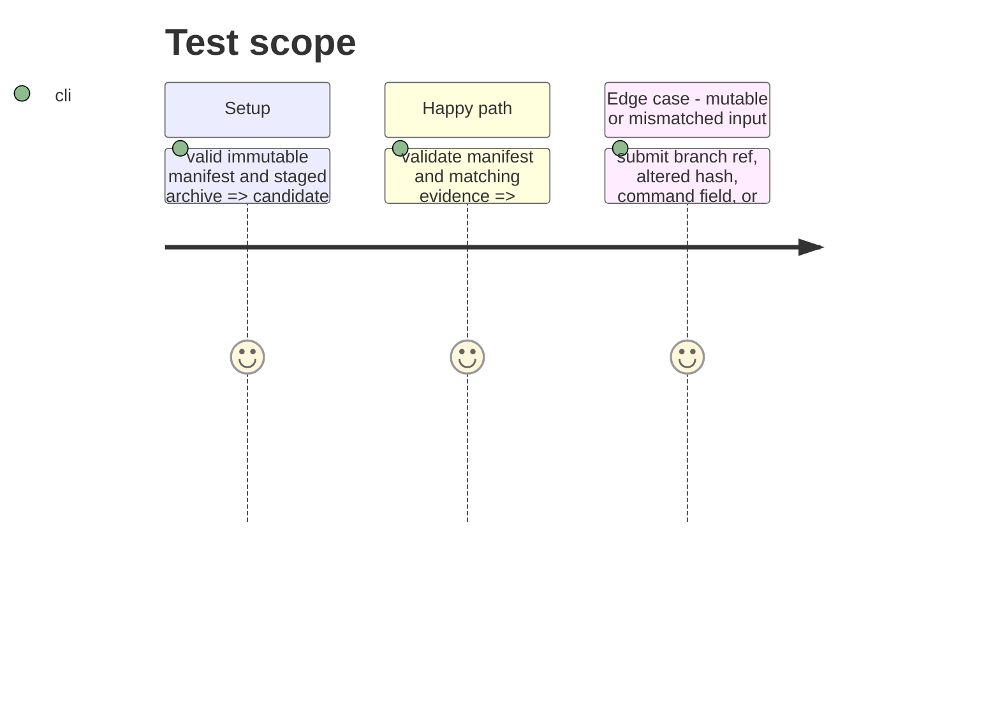

# Instruction: Complete and prove the immutable provider release train

## Architecture projection

> Tree of the final files. ✅ create · ✏️ modify · ❌ delete

```txt
.
├── release-trains/*.json ✏️ committed candidate provenance manifest
├── tools/release-train-manifest.ts ✏️ reject mutable data and validate evidence shape
├── tools/release-train-stage.ts ✏️ stage and hash candidate bytes once
├── tools/release-train-promote.ts ✅ verify evidence and attach staged bytes without rebuilding
├── tools/validate-release-train.ts ✏️ validate manifests and evidence
├── tools/test-release-train-manifest.ts ✏️ cover hostile and valid fixtures
├── test/fixtures/release-trains/* ✏️ cover immutable manifest and evidence cases
├── .github/workflows/release.yml ✏️ separate candidate proof from immutable promotion
└── release-trains/README.md ✏️ document provider/consumer ownership and operator flow
```

## User Journey



## Test Scope



## Tasks to do

### `1)` Finish provider-owned release-train machinery

> Enforce the v1 manifest and promotion invariants without consumer-local adaptation code.

1. Complete manifest validation and fixtures for exact commits, archive URL, SHA-256, and SRI.
2. Stage candidate bytes once and record their immutable provenance.
3. Implement promotion that re-downloads/re-hashes and uploads those exact bytes without invoking a build.

### `2)` Integrate canonical consumer evidence

> Require only the documented `npm run release-train:assert -- <manifest>` interface in disposable pinned consumer checkouts.

1. Verify Lantern’s structured bundle evidence and Handbook’s structured install/render evidence against the manifest.
2. Preserve their adoption commits and lockfiles as consumer-owned external prerequisites.
3. Keep the daily cross-tool provider contract workflow independent from promotion.

## Test acceptance criteria

| Task | Acceptance criteria |
| ---- | -------------------------------- |
| 1 | Mutable refs, executable manifest fields, altered bytes, and invalid evidence are rejected. |
| 2 | Promotion is accepted only after both pinned consumer proofs and uploads the staged candidate without rebuilding. |
