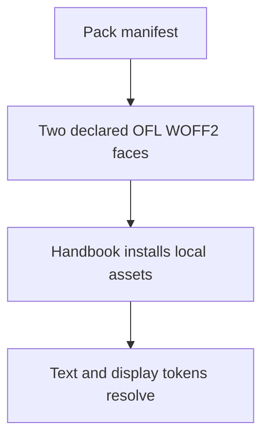
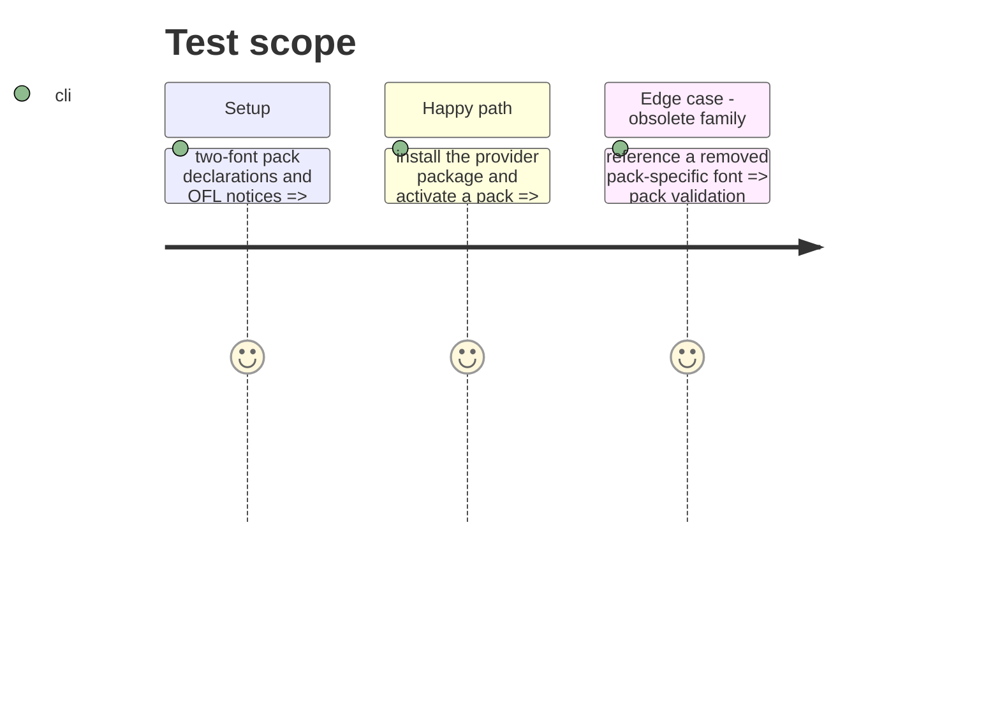

# Instruction: Consolidate pack typography on the Monsterhearts font pair

## Architecture projection

> Tree of the final files. ✅ create · ✏️ modify · ❌ delete

```txt
.
├── handbook/{city-of-mist,legend-in-the-mist,otherscape}/assets/styles/fonts.css ✏️ declare the two shared OFL faces only
├── handbook/{city-of-mist,legend-in-the-mist,otherscape}/assets/styles/fonts/*.woff2 ✏️ retain only IM Fell English and Averia Serif Libre
├── handbook/*/pack.json ✏️ map all text/display token families to the two-font contract
├── handbook/LICENSES/IMFellEnglish.LICENSE.txt ✅ ship the OFL notice
├── handbook/LICENSES/Averia.LICENSE.txt ✅ retain the OFL notice
└── handbook/README.md ✏️ record the consolidated redistributable typography decision
```

## User Journey



## Test Scope



## Tasks to do

### `1)` Replace the per-pack font families

> Preserve local asset delivery with the proven two-font Monsterhearts contract.

1. Copy IM Fell English Roman and Averia Serif Libre Bold WOFF2 plus their OFL notices from `schema-pbta`.
2. Map each pack’s text and display tokens to those two faces, preserving intended weight semantics.
3. Delete now-unreferenced families and make each manifest’s resource list exact.

## Test acceptance criteria

| Task | Acceptance criteria |
| ---- | -------------------------------- |
| 1 | Every pack renders with declared local WOFF2 files, and no undeclared legacy font survives. |
