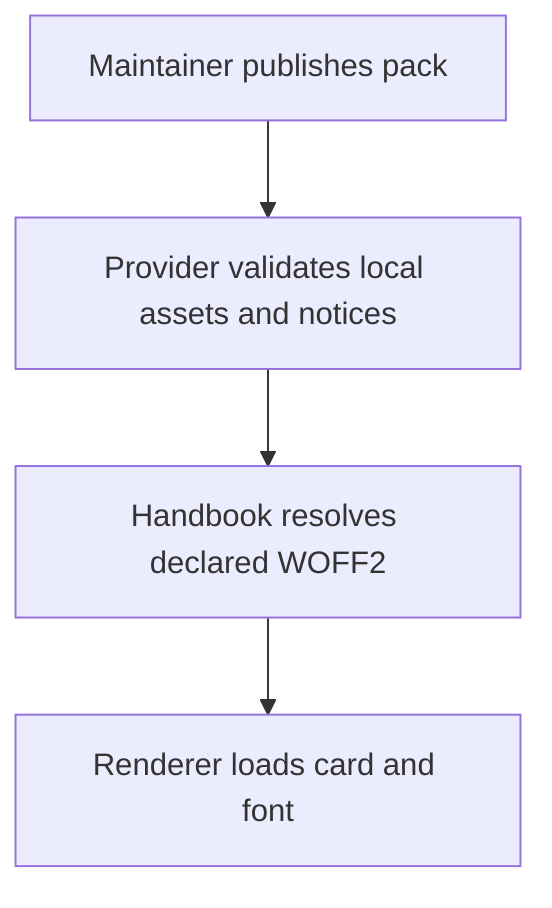
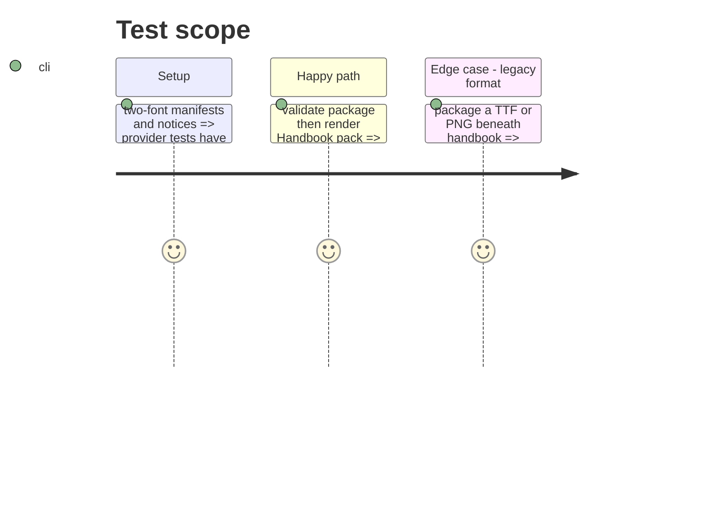

# Instruction: Publish the two-font asset and licence contract

## Architecture projection

> Tree of the final files. ✅ create · ✏️ modify · ❌ delete

```txt
.
├── handbook/*/pack.json ✏️ declare exact two-font local resources
├── handbook/LICENSES/*.LICENSE.txt ✏️ carry both OFL notices
├── handbook/README.md ✏️ publish the final provenance statement
└── tools/validate-package.ts ✏️ enforce no TTF/PNG or obsolete font family is packed
```

## User Journey



## Test Scope



## Tasks to do

### `1)` Enforce the published asset boundary

> Keep assets, style tokens, provenance, and validation in this provider.

1. Update manifests, CSS, licence notices, and package checks for the two-font inventory.
2. Reject missing notices, undeclared font paths, and legacy image/font formats.

## Test acceptance criteria

| Task | Acceptance criteria |
| ---- | -------------------------------- |
| 1 | Provider metadata and the tarball contain only the two declared OFL font families and valid WebP assets. |
