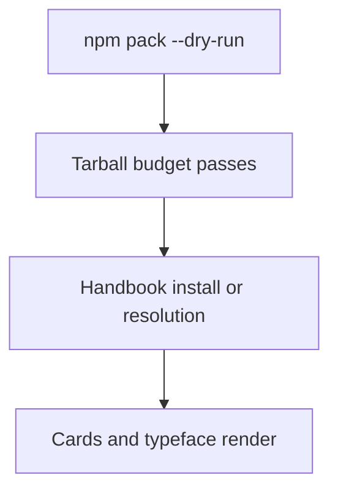
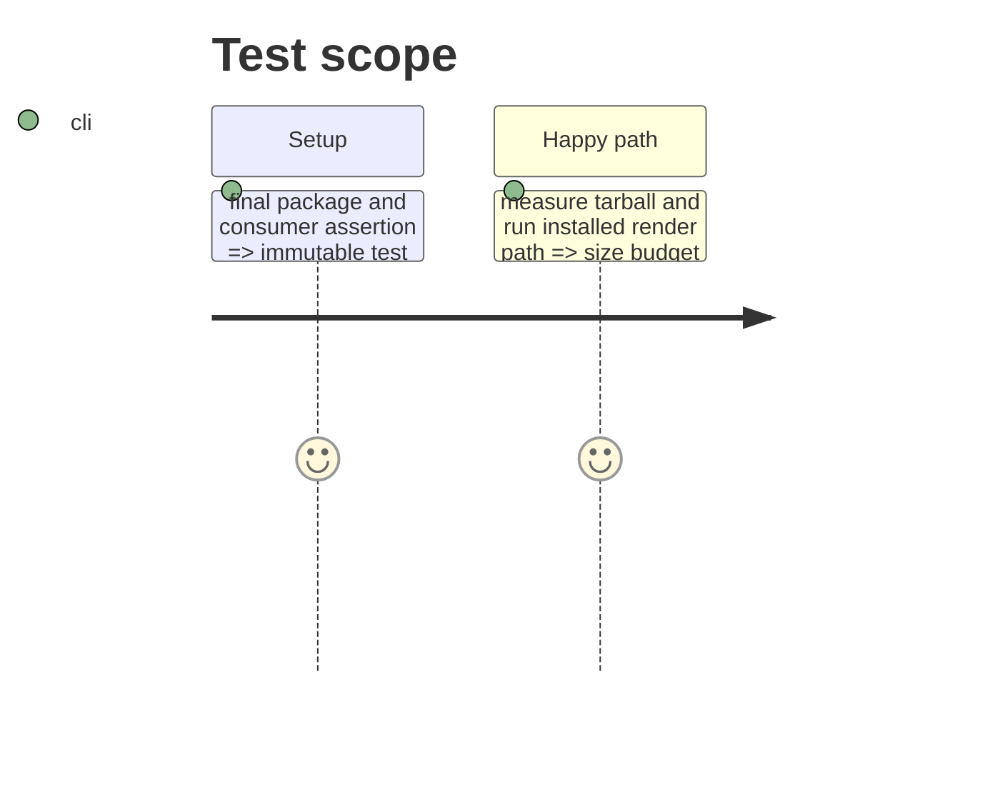

# Instruction: Measure the complete published and installed result

## Architecture projection

> Tree of the final files. ✅ create · ✏️ modify · ❌ delete

```txt
.
├── tools/validate-package.ts ✏️ assert tarball contents and size budget
├── handbook/README.md ✏️ publish measured package and delivery evidence
└── aidd_docs/tasks/2026_09/2026_09_23_package_asset_delivery_replan/phase-3.md ✏️ record completed evidence
```

## User Journey



## Test Scope



## Tasks to do

### `1)` Enforce the chosen budget

> Prove the package and end-user installation meet the selected acceptance criteria.

1. Run the package dry-run and record compressed and unpacked sizes.
2. Run Handbook’s real asset/render assertion at its pinned consumer commit.
3. Make the package validator fail when the selected budget or delivery proof regresses.

## Test acceptance criteria

| Task | Acceptance criteria |
| ---- | -------------------------------- |
| 1 | The tarball meets the agreed budget and the consumer renders every declared asset through the selected path. |
