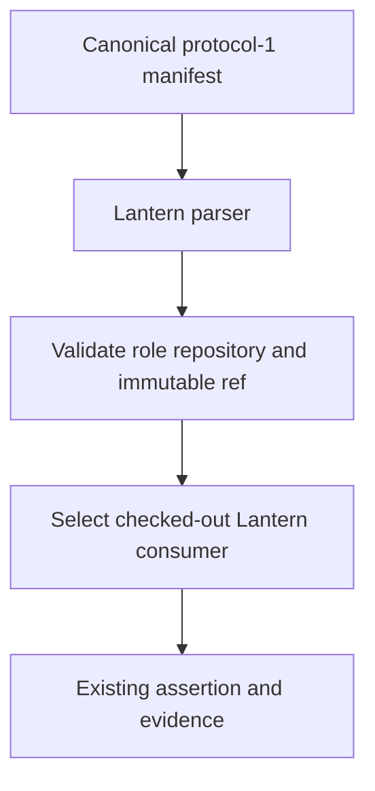
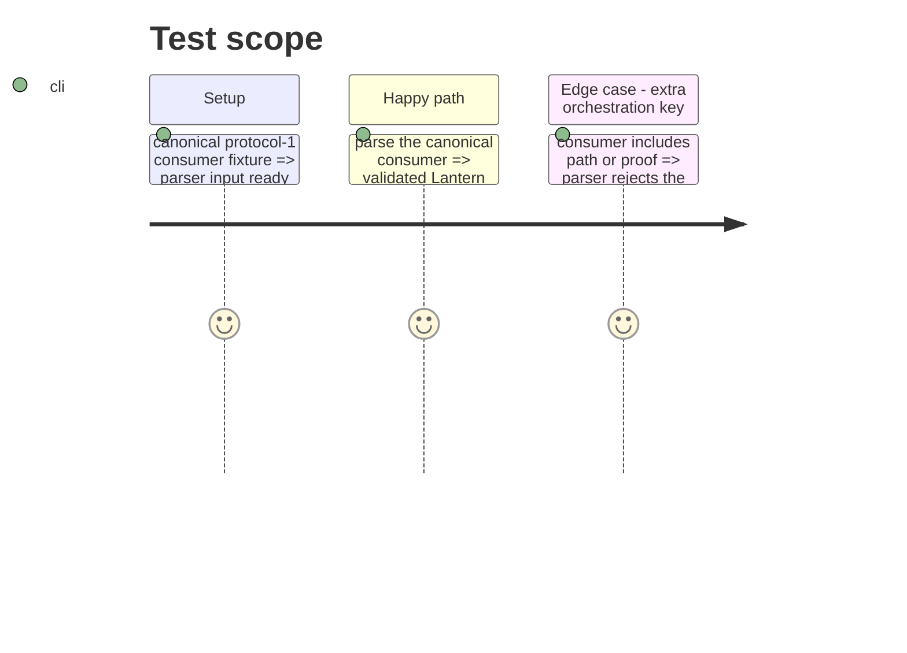

# Instruction: Canonical consumer parser

## Architecture projection

> Tree of the final files. ✅ create · ✏️ modify · ❌ delete

```txt
tools/
└── release-train-protocol.mjs ✏️ validate only public protocol-1 consumer identity fields
```

## User Journey



## Test Scope



## Tasks to do

### `1)` Narrow the consumer protocol boundary

> Validate the consumer manifest against its public three-field contract.

1. Change consumer key validation to exactly `role`, `repository`, and `ref`.
2. Preserve the canonical role-to-repository mapping and immutable full-SHA checks.
3. Keep checked-out Lantern ref verification and assertion evidence construction unchanged.

## Test acceptance criteria

| Task | Acceptance criteria |
| --- | --- |
| 1 | A protocol-1 consumer containing exactly role, repository, and ref is accepted. |
| 1 | Consumers carrying path or proof are rejected as non-canonical. |
| 1 | Lantern still rejects a manifest whose Lantern ref differs from its checked-out commit. |
