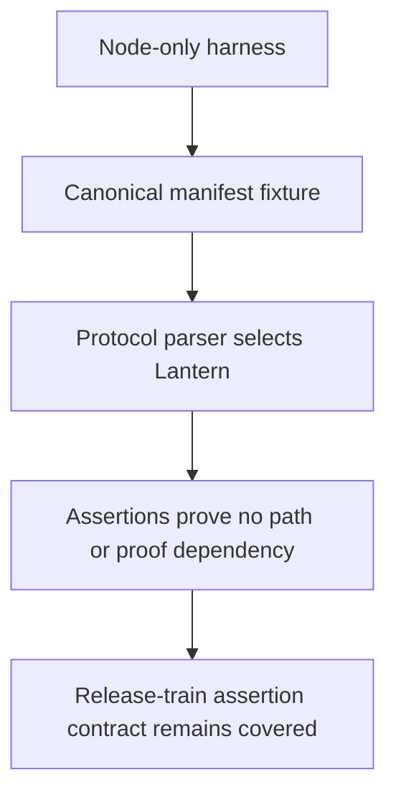
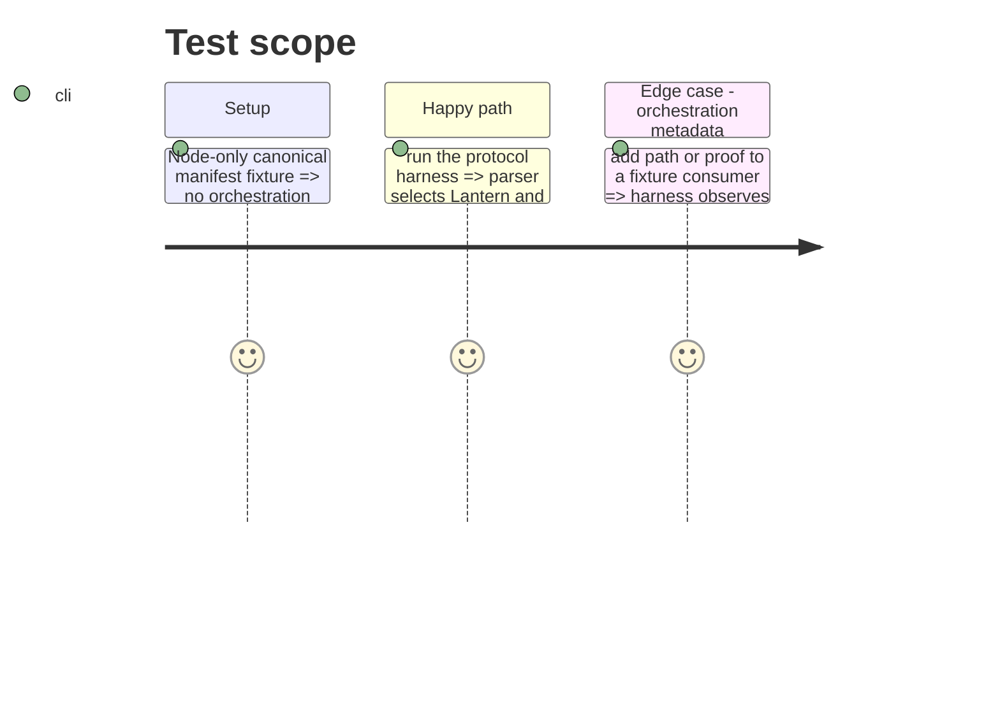

# Instruction: Canonical-envelope regression

## Architecture projection

> Tree of the final files. ✅ create · ✏️ modify · ❌ delete

```txt
tools/
└── release-train-protocol.harness.mjs ✏️ construct and assert the canonical consumer envelope
```

## User Journey



## Test Scope



## Tasks to do

### `1)` Cover the canonical wire contract

> Make future reintroduction of runner-only consumer metadata fail locally.

1. Rewrite the harness manifest fixture with three-key consumers only.
2. Keep its selection, frozen-install-command, and evidence assertions.
3. Add a negative assertion for a consumer augmented with path or proof.
4. Run the existing release-train harness; after the Lantern merge, hand its immutable SHA to schema-pbta for the `lantern.ref` manifest update, then dispatch one train using the canonical runner envelope.

## Test acceptance criteria

| Task | Acceptance criteria |
| --- | --- |
| 1 | The harness passes with canonical consumers containing only role, repository, and ref. |
| 1 | The harness fails if path or proof enters the consumer-owned manifest. |
| 1 | The regression remains Node-only and does not download a candidate archive. |
| 1 | The post-merge train manifest pins the merged Lantern SHA before its single dispatch. |
